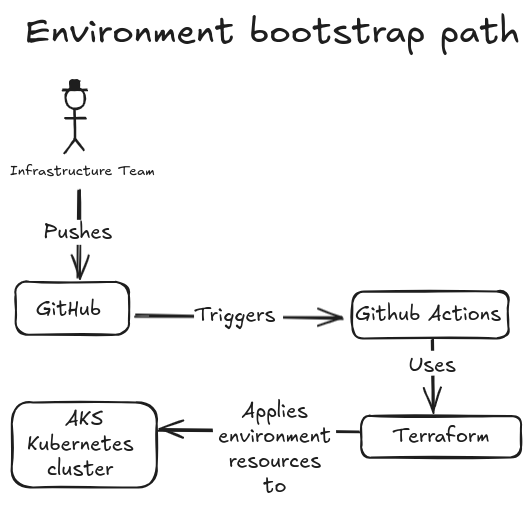
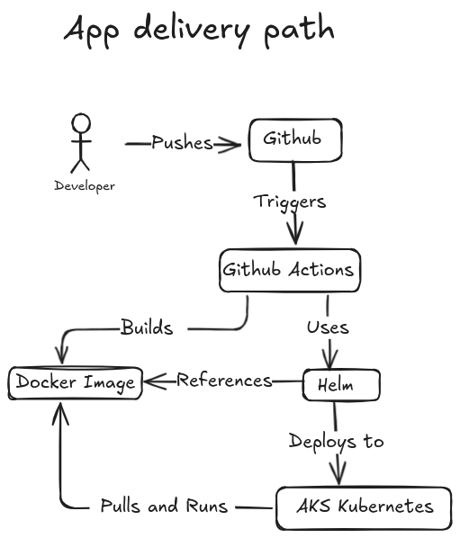

# Stage 1 on 3 - Java microservice backend deployed in AKS Kubernetes using IaC Terraform, GitHub Actions, Helm and Docker container. 

Java Spring Boot microservice packaged with Docker and deployed with Helm to AKS (Azure Kubernetes Service) using GitHub Actions and OIDC. The project includes operational checks, observability, and simulated failure scenarios with documented troubleshooting. Responsibility is clearly split between the infrastructure team and the application team.

Important: this project uses a remote Terraform backend in Azure Storage so local runs and CI/CD executions share the same infrastructure state instead of relying on local Terraform state files.




## 1. ENVIRONMENT BOOTSTRAP PATH MANAGED BY THE INFRASTRUCTURE TEAM 

```text
[Infrastructure Team]
      │
      │ pushes platform bootstrap code
      ▼
┌──────────────────────────────────────────────┐
│            GitHub                            │
│----------------------------------------------│
│ infrastructure/                              │
│ - terraform/                                 │
│ - docs/                                      │
│ - GitHub Actions workflow for terraform/     │
└──────────────────────────────────────────────┘
      │
      │ triggers
      ▼
┌──────────────────────────────┐
│        GitHub Actions        │
│------------------------------│
│ Runs Terraform plan/apply    │
│ for platform-owned resources │
└──────────────────────────────┘
      │
      │ bootstraps environment in
      ▼
┌──────────────────────────────────────────────────────────────┐
│                   AKS  Kubernetes Cluster                    │
│--------------------------------------------------------------│
│ Namespace: document-processing-stage1                        │
│                                                              │
│  Platform-owned resources:                                   │
│  ┌──────────────────────────────┐                            │
│  │ Namespace                    │                            │
│  └──────────────────────────────┘                            │
│                                                              │
│  ┌──────────────────────────────┐                            │
│  │ ServiceAccount               │                            │
│  └──────────────────────────────┘                            │
│                                                              │
│  ┌──────────────────────────────┐                            │
│  │ Role                         │                            │
│  └──────────────────────────────┘                            │
│                                                              │
│  ┌──────────────────────────────┐                            │
│  │ RoleBinding                  │                            │
│  └──────────────────────────────┘                            │
│                                                              │
│  ┌──────────────────────────────┐                            │
│  │ Baseline ConfigMap           │                            │
│  │------------------------------│                            │
│  │ Shared platform convention   │                            │
│  │ example: ENV_NAME, LOG_LEVEL │                            │
│  └──────────────────────────────┘                            │
└──────────────────────────────────────────────────────────────┘
```

## 2. APP DELIVERY PATH USED BY THE APPLICATION TEAM 


```text
[Application Developer]
      │
      │ pushes app code / Helm changes
      ▼
┌──────────────────────────────┐
│            GitHub            │
│------------------------------│
│ application-team/            │
│ - Spring Boot app            │
│ - Dockerfile                 │
│ - Helm chart                 │
│ - app docs                   │
│ - workflow for app delivery  │
└──────────────────────────────┘
      │
      │ triggers
      ▼
┌────────────────────────────────────────────┐
│            GitHub Actions Pipeline         │
│--------------------------------------------│
│ 1. Checkout code                           │
│ 2. Build Spring Boot app                   │
│ 3. Run tests                               │
│ 4. Package JAR                             │
│ 5. Build Docker image                      │
│ 6. Validate Helm chart                     │
│ 7. Deploy with Helm                        │
│ 8. Post-deploy validation                  │
└────────────────────────────────────────────┘
      │
      ├───────────────────────────────┐
      │                               │
      │ builds                        │ uses
      ▼                               ▼
┌──────────────────────────────┐   ┌──────────────────────────────┐
│         Docker Image         │   │             Helm             │
│------------------------------│   │------------------------------│
│ Spring Boot microservice     │   │ App deployment package       │
│                              │   │ Templates Kubernetes objects │
└──────────────────────────────┘   └──────────────────────────────┘
              ▲                                │
(by reference)│ Pulls and runs                 │ deploys to
              │                                ▼
┌──────────────────────────────────────────────────────────────┐
│                 AKS Kubernetes Cluster                       │
│--------------------------------------------------------------│
│ Namespace: document-processing-stage1                        │
│                                                              │
│ App-team-owned resources:                                    │
│  ┌──────────────────────────────┐                            │
│  │ Deployment                   │                            │
│  │------------------------------│                            │
│  │ Spring Boot Pod(s)           │                            │
│  │ - image from pipeline        │                            │
│  │ - readiness probe            │                            │
│  │ - liveness probe             │                            │
│  │ - requests/limits            │                            │
│  │ - env from ConfigMap/Secret  │                            │
│  │ - uses ServiceAccount        │                            │
│  └──────────────────────────────┘                            │
│                                                              │
│  ┌──────────────────────────────┐                            │
│  │ Service                      │                            │
│  └──────────────────────────────┘                            │
│                                                              │
│  ┌──────────────────────────────┐                            │
│  │ App ConfigMap                │                            │
│  │------------------------------│                            │
│  │ App-specific config          │                            │
│  │ example: PROCESSING_MODE     │                            │
│  └──────────────────────────────┘                            │
│                                                              │
│  ┌──────────────────────────────┐                            │
│  │ Secret                       │                            │
│  │------------------------------│                            │
│  │ Placeholder secret pattern   │                            │
│  └──────────────────────────────┘                            │
└──────────────────────────────────────────────────────────────┘
```

## 3. APPLICATION RUNTIME

```text
Client
  │
  ├── GET /api/status
  │      -> service status, version, processing mode
  │
  ├── GET /api/documents/{id}
  │      -> fake document state
  │         RECEIVED / VALIDATING / PROCESSED / REJECTED
  │
  ├── GET /api/config-check
  │      -> config validation result
  │
  └── /actuator/*
         -> health / info / prometheus
```

## 4. OBSERVABILITY PATH

```text
Kubernetes / Application
      │
      ├── health checks
      ├── logs
      └── metrics
             │
             ▼
┌──────────────────────────────┐
│         Prometheus           │
│------------------------------│
│ Scrapes /actuator/prometheus │
│ Collects service metrics     │
└──────────────────────────────┘
             │
             ▼
┌──────────────────────────────┐
│           Grafana            │
│------------------------------│
│ Dashboard examples:          │
│ - app up/down                │
│ - request count              │
│ - response time              │
│ - JVM / memory basics        │
│ - health trend               │
└──────────────────────────────┘
```

## 5. Repo architecture
The structure below represents the current Stage 1 repository architecture:
```
kubernetes-platform-case/
├── .github/
│   └── workflows/
│       ├── azure-provision.yml
│       ├── azure-destroy.yml
│       ├── kubernetes-resources.yml
│       └── app-delivery.yml
│
├── infrastructure/
│   ├── .env
│   ├── .env.example
│   ├── provision_platform.sh
│   ├── destroy_platform.sh
│   ├── terraform-backend/
│   │   ├── create_remote_backend.sh
│   │   ├── destroy_remote_backend.sh
│   │   ├── terraform/
│   │   │   ├── main.tf
│   │   │   ├── variables.tf
│   │   │   ├── outputs.tf
│   │   │   ├── providers.tf
│   │   │   └── versions.tf
│   │   └── docs/
│   │       └── README.md
│   │
│   ├── azure/
│   │   ├── create_azure_resources.sh
│   │   ├── destroy_azure_resources.sh
│   │   ├── terraform/
│   │   │   ├── main.tf
│   │   │   ├── variables.tf
│   │   │   ├── outputs.tf
│   │   │   ├── providers.tf
│   │   │   ├── backend.tf
│   │   │   └── versions.tf
│   │   ├── oidc/
│   │   │   ├── create_az_oidc.sh
│   │   │   ├── destroy_az_oidc.sh
│   │   │   ├── github-oidc-credential.template.json
│   │   │   └── github-oidc-credential.json
│   │   ├── scripts/
│   │   │   ├── create_aks_cluster_and_connect_with_kubectl.sh
│   │   │   └── delete_azure_resource_group_manually.sh
│   │   └── docs/
│   │       └── README.md
│   │
│   ├── kubernetes-resources/
│   │   ├── apply_kubernetes_resources.sh
│   │   ├── destroy_kubernetes_resources.sh
│   │   ├── terraform/
│   │   │   ├── main.tf
│   │   │   ├── variables.tf
│   │   │   ├── outputs.tf
│   │   │   ├── providers.tf
│   │   │   ├── backend.tf
│   │   │   └── versions.tf
│   │   ├── scripts/
│   │   │   └── validate-cluster-access.sh
│   │   └── docs/
│   │       └── README.md
│   │
│   └── docs/
│       └── README.md
│
├── application/
│   ├── app/
│   │   ├── src/
│   │   ├── pom.xml
│   │   └── README.md
│   │
│   ├── docker/
│   │   └── Dockerfile
│   │
│   ├── helm/
│   │   └── document-processing-status/
│   │       ├── Chart.yaml
│   │       ├── values.yaml
│   │       └── templates/
│   │           ├── deployment.yaml
│   │           ├── service.yaml
│   │           ├── configmap.yaml
│   │           └── serviceaccount.yaml
│   │
│   ├── scripts/
│   │   ├── smoke-test.sh
│   │   ├── validate-helm.sh
│   │   └── debug-rollout.sh
│   │
│   └── docs/
│       ├── README.md
│       ├── runbook.md
│       ├── failure-scenarios.md
│       └── case-study-stage1.md
│
├── observability/
│   ├── prometheus/
│   ├── grafana/
│   └── docs/
│       └── README.md
│
├── docs/
│   ├── executive-summary.md
│   ├── stage1.md
│   ├── stage2.md
│   ├── stage3.md
│   └── interview-notes.md
```

## 6. Infrastructure layer responsability
| Layer                                 | Purpose                                                              | Owner            |
| ------------------------------------- | -------------------------------------------------------------------- | ---------------- |
| `infrastructure/terraform-backend`    | Creates the shared Azure Storage backend for Terraform state         | Platform team    |
| `infrastructure/azure`                | Creates Azure resources such as the resource group and AKS cluster   | Platform team    |
| `infrastructure/kubernetes-resources` | Creates namespace, service account, RBAC, and baseline config in AKS | Platform team    |
| `application/`                        | Builds and deploys the Spring Boot service                           | Application team |

## 7. Shared environment file

The infrastructure scripts use a shared environment file at:

```bash
infrastructure/.env
```

Create it from:

```bash
cp infrastructure/.env.example infrastructure/.env
```

## 8. Local platform automation

Provision the full platform locally:

```bash
./infrastructure/provision_platform.sh
```

Destroy the full platform locally:

```bash
./infrastructure/destroy_platform.sh
```

## 9. FAILURE SCENARIOS

Scenario 1 - Bad readiness probe
- application is healthy
- readiness probe path/port is wrong
- pod stays unready
- rollout affected
- diagnosed via events, describe, health endpoint

Scenario 2 - Bad app config
- PROCESSING_MODE missing or invalid
- app fails startup or becomes unhealthy
- diagnosed via logs, config inspection, pod status


## 10. OWNERSHIP MODEL

Infrastructure team owns:
- Terraform
- namespace
- service account
- role / rolebinding
- baseline ConfigMap convention
- environment standards

Application team owns:
- Spring Boot code
- Dockerfile
- Helm chart
- Deployment / Service
- app ConfigMap values
- app Secret usage pattern
- application rollout
- app-level runbook notes
