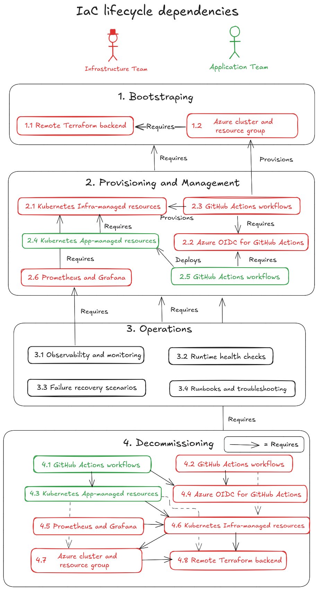

# Stage 1 of 3 - Delivery foundation for an internal payment review service on AKS with Terraform, GitHub Actions, Helm, and Docker

This delivery foundation provides a reusable pattern for an internal Java Spring Boot service deployed to Azure Kubernetes Service (AKS). It follows industry practices commonly used in highly regulated organizations to separate infrastructure bootstrap from application delivery through Infrastructure as Code (IaC) with Terraform, GitHub Actions, Docker, Helm, observability, and realistic troubleshooting scenarios.

Structured as a practical platform pattern, this foundation is designed to evolve across later stages.

> **Important:** This delivery foundation uses a remote Terraform backend in Azure Storage so local executions and CI/CD pipelines share the same infrastructure state instead of relying on local Terraform state files.


## Summary for recruiters and hiring managers

Internal teams in a regulated organization may urgently need a secure custom service to support payment review. In practice, the infrastructure work behind that service often takes several weeks across design, bootstrap, provisioning, and operations. This delivery foundation reduces that effort by reusing industry practices already adopted in highly regulated environments.

Delivering that kind of service usually involves more than writing application code. It also requires environment design, infrastructure bootstrap, CI/CD setup, deployment standards, observability, and operational support. In many organizations, that foundation can take weeks to prepare before the application team can deliver safely.

This delivery foundation is built to reduce that setup effort through a reusable and supportable operating model:

- the infrastructure team bootstraps AKS environment resources with Terraform
- the application team builds and deploys the microservice through GitHub Actions, Docker, and Helm
- the service exposes health checks, configuration validation, and Prometheus metrics
- rollout and configuration failure scenarios are documented to demonstrate realistic troubleshooting

This stage focuses on the delivery model behind the service: clear ownership boundaries, deployment safety, observability, incident diagnosis, and repeatable platform practices for regulated environments.

Key capabilities illustrated in this technological environment:

- hands-on work with AKS, Terraform, GitHub Actions, Docker, Helm, and Azure OIDC federation
- a clear separation between infrastructure ownership and application delivery
- practical judgment around deployment safety, observability, and incident diagnosis
- a reusable foundation aligned with Platform Engineer, DevOps, SRE, and Solutions Architect responsibilities in regulated organizations

## 0. HOW TO USE IT?

### 0.1 Setup the environment file

The infrastructure scripts use a shared environment file at `infrastructure/.env`:

Create it from:

```bash
cp infrastructure/.env.example infrastructure/.env
```

Fill these values in the `.env`:

| Variable | Required | Example / default | Description |
| --- | --- | --- | --- |
| `REPO_OWNER` | Yes | `MarvinAmine` | GitHub user or organization that owns the repository. Used by the Azure OIDC scripts to build the federated credential subject for GitHub Actions. |
| `SUBSCRIPTION_ID` | Yes | `<your-azure-subscription-id>` | Azure subscription ID used by all local infrastructure scripts, Terraform layers, and the OIDC setup. |
| `RESOURCE_GROUP` | Yes for Azure and Kubernetes provisioning | `rg-stage1-aks` | Azure resource group name for the AKS platform resources. Passed into the Azure Terraform layer and reused by the Kubernetes validation scripts. |
| `REPO_NAME` | Yes for OIDC setup | `kubernetes-platform-case` | GitHub repository name used by `infrastructure/azure/oidc/create_az_oidc.sh` when it renders the GitHub federated credential. |
| `GITHUB_BRANCH` | Yes for OIDC setup | `main` | Git branch allowed to authenticate through the Azure federated credential. |
| `LOCATION` | Yes for backend and Azure provisioning | `canadacentral` | Azure region for the Terraform backend resource group and AKS infrastructure. This becomes `AKS_LOCATION` in GitHub Actions repo variables. |
| `APP_NAME` | Recommended | `sp-github-oidc-stage1-platform` | Display name for the Azure Entra application and service principal created for GitHub OIDC. |
| `ROLE_NAME` | Recommended | `Contributor` | Azure role assigned to the OIDC service principal at subscription scope. |
| `AKS_CLUSTER_NAME` | Yes for Azure and Kubernetes provisioning | `aks-stage1-platform` | AKS cluster name created by the Azure Terraform layer and later targeted by the Kubernetes resources layer. |
| `DNS_PREFIX` | Optional | `aks-stage1` | DNS prefix passed to the Azure Terraform layer for the AKS cluster. |
| `NODE_COUNT` | Optional | `1` | Initial AKS node count passed to Terraform. |
| `VM_SIZE` | Optional | `Standard_D2as_v6` | AKS node VM size used by local scripts. The GitHub workflow also supports the same value through a repository variable. |
| `TIER` | Optional | `Free` | AKS SKU tier passed to the Azure Terraform layer. |
| `TF_BACKEND_RESOURCE_GROUP` | Yes after the first backend bootstrap | `rg-stage1-tfstate` | Azure resource group that hosts the remote Terraform state storage account. Required by local scripts and GitHub Actions. |
| `TF_BACKEND_STORAGE_ACCOUNT` | Yes after the first backend bootstrap | `<real-storage-account-name>` | Azure Storage Account name used as the remote Terraform backend. This is intentionally blank in the template until the backend is created or known. |
| `TF_BACKEND_CONTAINER` | Yes after the first backend bootstrap | `tfstate` | Blob container name that stores the Terraform state files. |

Minimal first edit before the initial bootstrap:

```conf
REPO_OWNER=...
SUBSCRIPTION_ID=...
```

If you do not have an Azure subscription selected yet, follow the setup steps in [infrastructure/docs/README.md](infrastructure/docs/README.md).

### 0.2 Local platform provisioning

Provision the full platform locally:

```bash
# Use the flag '-s' for silence
./infrastructure/provision_platform.sh
```

See screen shoot example here: [provision_platform_screenshoots.md](infrastructure/docs/provision_platform_screenshoots.md)

### 0.3 Complete the environment values and GitHub configuration

On the first run, `infrastructure/provision_platform.sh` bootstraps the remote Terraform backend and prints the backend values that must be copied into `infrastructure/.env`.

Update `.env` with these real backend values:

| Variable | Required after first run | Description |
| --- | --- | --- |
| `TF_BACKEND_RESOURCE_GROUP` | Yes | Resource group that hosts the remote Terraform backend. |
| `TF_BACKEND_STORAGE_ACCOUNT` | Yes | Storage account that stores the Terraform state files. |
| `TF_BACKEND_CONTAINER` | Yes | Blob container inside the backend storage account, usually `tfstate`. |

Confirm these GitHub repository variables are also set:

| Repository variable | Required | Description |
| --- | --- | --- |
| `TF_BACKEND_RESOURCE_GROUP` | Yes | Mirrors `infrastructure/.env` so GitHub Actions can initialize the Terraform backend. |
| `TF_BACKEND_STORAGE_ACCOUNT` | Yes | Mirrors `infrastructure/.env` so GitHub Actions can reach the backend storage account. |
| `TF_BACKEND_CONTAINER` | Yes | Mirrors `infrastructure/.env` so GitHub Actions can select the Terraform state container. |
| `RESOURCE_GROUP` | Yes | Resource group expected by the Azure and Kubernetes workflows. Should match `RESOURCE_GROUP` in `infrastructure/.env`. |
| `AKS_LOCATION` | Yes | Azure region for the AKS layer. This should match `LOCATION` from `infrastructure/.env`. |
| `AKS_CLUSTER_NAME` | Yes | AKS cluster name expected by the Azure and Kubernetes workflows. Should match `AKS_CLUSTER_NAME` in `infrastructure/.env`. |
| `VM_SIZE` | Optional | Optional CI override for the AKS node size. If unset, workflows default to `Standard_D2as_v6`. |


If you also run the Azure OIDC setup, the script `infrastructure/azure/oidc/create_az_oidc.sh` prints the GitHub repository secrets to configure.

Confirm these GitHub repository secrets are set:

| Repository secret | Required | Description |
| --- | --- | --- |
| `AZURE_SUBSCRIPTION_ID` | Yes | Azure subscription used by GitHub Actions. Mirrors `SUBSCRIPTION_ID` from `infrastructure/.env`. |
| `AZURE_CLIENT_ID` | Yes | Application ID of the Azure Entra app created for GitHub OIDC. |
| `AZURE_TENANT_ID` | Yes | Azure tenant ID used by `azure/login@v2` during GitHub Actions authentication. |


### 0.4 GitHub Actions

> Requirements: 
> 1. The [remote Terraform backend](infrastructure/terraform-backend/docs/README.md) is created.
> 2. The [Azure OIDC credentials for GitHub Actions](infrastructure/azure/docs/OIDC.md) are created.
> 3. The 6 GitHub repository variables are set and valid. `VM_SIZE` is optional and defaults to `Standard_D2as_v6`.
> 4. The 3 GitHub repository secrets are set and valid.

When changes are pushed to the tracked infrastructure paths, GitHub Actions automatically runs Terraform checks for the corresponding layer.

On `push`, the workflows run formatting, initialization, validation, and planning steps.

On `workflow_dispatch`, the Azure provisioning workflow can also run `terraform apply`.

### 0.5 Destroy the full platform

> It is important to destroy the resources after use. Azure services such as AKS and VMs can generate ongoing costs if they are left running.

You can destroy the platform with this command:
```bash
./infrastructure/destroy_platform.sh
```

It destroys:
1. Kubernetes resources
2. Azure infrastructure
3. The remote Terraform backend
4. The Azure OIDC integration, if you choose to remove it




## 1. INFRASTRUCTURE BOOTSTRAP PATH MANAGED BY THE INFRASTRUCTURE TEAM 

```text
[Infrastructure Team]
      │
      │ pushes platform bootstrap code
      ▼
┌──────────────────────────────────────────────┐
│            GitHub                            │
│----------------------------------------------│
│ infrastructure/                              │
│ - terraform/                                 │
│ - docs/                                      │
│ - GitHub Actions workflow for terraform/     │
└──────────────────────────────────────────────┘
      │
      │ triggers
      ▼
┌──────────────────────────────┐
│        GitHub Actions        │
│------------------------------│
│ Runs Terraform plan/apply    │
│ for platform-owned resources │
└──────────────────────────────┘
      │
      │ bootstraps environment in
      ▼
┌──────────────────────────────────────────────────────────────┐
│                   AKS  Kubernetes Cluster                    │
│--------------------------------------------------------------│
│ Namespace: payment-exception-review-stage1                   │
│                                                              │
│  Platform-owned resources:                                   │
│  ┌──────────────────────────────┐                            │
│  │ Namespace                    │                            │
│  └──────────────────────────────┘                            │
│                                                              │
│  ┌──────────────────────────────┐                            │
│  │ ServiceAccount               │                            │
│  └──────────────────────────────┘                            │
│                                                              │
│  ┌──────────────────────────────┐                            │
│  │ Role                         │                            │
│  └──────────────────────────────┘                            │
│                                                              │
│  ┌──────────────────────────────┐                            │
│  │ RoleBinding                  │                            │
│  └──────────────────────────────┘                            │
│                                                              │
│  ┌──────────────────────────────┐                            │
│  │ Baseline ConfigMap           │                            │
│  │------------------------------│                            │
│  │ Shared platform convention   │                            │
│  │ example: ENV_NAME, LOG_LEVEL │                            │
│  └──────────────────────────────┘                            │
└──────────────────────────────────────────────────────────────┘
```

## 2. APP DELIVERY PATH USED BY THE APPLICATION TEAM 


```text
[Application Developer]
      │
      │ pushes app code / Helm changes
      ▼
┌──────────────────────────────┐
│            GitHub            │
│------------------------------│
│ application-team/            │
│ - Spring Boot app            │
│ - Dockerfile                 │
│ - Helm chart                 │
│ - app docs                   │
│ - workflow for app delivery  │
└──────────────────────────────┘
      │
      │ triggers
      ▼
┌────────────────────────────────────────────┐
│            GitHub Actions Pipeline         │
│--------------------------------------------│
│ 1. Checkout code                           │
│ 2. Build Spring Boot app                   │
│ 3. Run tests                               │
│ 4. Package JAR                             │
│ 5. Build Docker image                      │
│ 6. Validate Helm chart                     │
│ 7. Deploy with Helm                        │
│ 8. Post-deploy validation                  │
└────────────────────────────────────────────┘
      │
      ├───────────────────────────────┐
      │                               │
      │ builds                        │ uses
      ▼                               ▼
┌──────────────────────────────┐   ┌──────────────────────────────┐
│         Docker Image         │   │             Helm             │
│------------------------------│   │------------------------------│
│ Spring Boot microservice     │   │ App deployment package       │
│                              │   │ Templates Kubernetes objects │
└──────────────────────────────┘   └──────────────────────────────┘
              ▲                                │
(by reference)│ Pulls and runs                 │ deploys to
              │                                ▼
┌──────────────────────────────────────────────────────────────┐
│                 AKS Kubernetes Cluster                       │
│--------------------------------------------------------------│
│ Namespace: payment-exception-review-stage1                   │
│                                                              │
│ App-team-owned resources:                                    │
│  ┌──────────────────────────────┐                            │
│  │ Deployment                   │                            │
│  │------------------------------│                            │
│  │ Spring Boot Pod(s)           │                            │
│  │ - image from pipeline        │                            │
│  │ - readiness probe            │                            │
│  │ - liveness probe             │                            │
│  │ - requests/limits            │                            │
│  │ - env from ConfigMap/Secret  │                            │
│  │ - uses ServiceAccount        │                            │
│  └──────────────────────────────┘                            │
│                                                              │
│  ┌──────────────────────────────┐                            │
│  │ Service                      │                            │
│  └──────────────────────────────┘                            │
│                                                              │
│  ┌──────────────────────────────┐                            │
│  │ App ConfigMap                │                            │
│  │------------------------------│                            │
│  │ App-specific config          │                            │
│  │ example: VALIDATION_MODE     │                            │
│  └──────────────────────────────┘                            │
│                                                              │
│  ┌──────────────────────────────┐                            │
│  │ Secret                       │                            │
│  │------------------------------│                            │
│  │ Placeholder secret pattern   │                            │
│  └──────────────────────────────┘                            │
└──────────────────────────────────────────────────────────────┘
```

## 3. APPLICATION RUNTIME

```text
Client / Internal Consumer
  │
  ├── GET /api/payment-exceptions/service-status
  │      -> service status, version, validation mode
  │
  ├── GET /api/payment-exceptions/{id}/status
  │      -> fake payment exception lifecycle state
  │         RECEIVED / VALIDATING / PENDING_REVIEW /
  │         APPROVED / REJECTED / ESCALATED
  │
  ├── GET /api/payment-exceptions/config-check
  │      -> config validation result
  │
  └── /actuator/*
         -> health / info / prometheus
```


## 4. OBSERVABILITY PATH

```text
Kubernetes / Application
      │
      ├── health checks
      ├── logs
      └── metrics
             │
             ▼
┌──────────────────────────────┐
│         Prometheus           │
│------------------------------│
│ Scrapes /actuator/prometheus │
│ Collects service metrics     │
└──────────────────────────────┘
             │
             ▼
┌──────────────────────────────┐
│           Grafana            │
│------------------------------│
│ Dashboard examples:          │
│ - service availability       │
│ - request volume             │
│ - response latency           │
│ - pod restarts               │
│ - validation failures        │
│ - escalation count           │
│ - app up/down                │
│ - request count              │
│ - response time              │
│ - JVM / memory basics        │
│ - health trend               │
└──────────────────────────────┘
```

## 5. Repo architecture
The structure below represents the current Stage 1 repository architecture:
```
kubernetes-platform-case/
├── .github/
│   └── workflows/
│       ├── azure-provision.yml
│       ├── azure-destroy.yml
│       ├── kubernetes-resources-provision.yml
│       ├── kubernetes-resources-destroy.yml
│       └── app-delivery.yml
│
├── infrastructure/
│   ├── .env
│   ├── .env.example
│   ├── provision_platform.sh
│   ├── destroy_platform.sh
│   ├── terraform-backend/
│   │   ├── create_remote_backend.sh
│   │   ├── destroy_remote_backend.sh
│   │   ├── terraform/
│   │   │   ├── main.tf
│   │   │   ├── variables.tf
│   │   │   ├── outputs.tf
│   │   │   ├── providers.tf
│   │   │   └── versions.tf
│   │   └── docs/
│   │       └── README.md
│   │
│   ├── azure/
│   │   ├── create_azure_resources.sh
│   │   ├── destroy_azure_resources.sh
│   │   ├── terraform/
│   │   │   ├── main.tf
│   │   │   ├── variables.tf
│   │   │   ├── outputs.tf
│   │   │   ├── providers.tf
│   │   │   ├── backend.tf
│   │   │   └── versions.tf
│   │   ├── oidc/
│   │   │   ├── create_az_oidc.sh
│   │   │   ├── destroy_az_oidc.sh
│   │   │   ├── github-oidc-credential.template.json
│   │   │   └── github-oidc-credential.json
│   │   ├── scripts/
│   │   │   ├── create_aks_cluster_and_connect_with_kubectl.sh
│   │   │   └── delete_azure_resource_group_manually.sh
│   │   └── docs/
│   │       └── README.md
│   │
│   ├── kubernetes-resources/
│   │   ├── apply_kubernetes_resources.sh
│   │   ├── destroy_kubernetes_resources.sh
│   │   ├── terraform/
│   │   │   ├── main.tf
│   │   │   ├── variables.tf
│   │   │   ├── outputs.tf
│   │   │   ├── providers.tf
│   │   │   ├── backend.tf
│   │   │   └── versions.tf
│   │   ├── scripts/
│   │   │   └── validate-cluster-access.sh
│   │   └── docs/
│   │       └── README.md
│   │
│   └── docs/
│       └── README.md
│
├── application/
│   ├── app/
│   │   ├── src/
│   │   ├── pom.xml
│   │   └── README.md
│   │
│   ├── docker/
│   │   └── Dockerfile
│   │
│   ├── helm/
│   │   └── payment-exception-review-status/
│   │       ├── Chart.yaml
│   │       ├── values.yaml
│   │       └── templates/
│   │           ├── deployment.yaml
│   │           ├── service.yaml
│   │           ├── configmap.yaml
│   │           └── serviceaccount.yaml
│   │
│   ├── scripts/
│   │   ├── smoke-test.sh
│   │   ├── validate-helm.sh
│   │   └── debug-rollout.sh
│   │
│   └── docs/
│       ├── README.md
│       ├── runbook.md
│       ├── failure-scenarios.md
│       └── case-study-stage1.md
│
├── observability/
│   ├── prometheus/
│   ├── grafana/
│   └── docs/
│       └── README.md
│
├── docs/
│   ├── executive-summary.md
│   ├── stage1.md
│   ├── stage2.md
│   ├── stage3.md
│   └── interview-notes.md
```

## 6. Infrastructure layer responsability
| Layer                                 | Purpose                                                              | Owner            |
| ------------------------------------- | -------------------------------------------------------------------- | ---------------- |
| `infrastructure/terraform-backend`    | Creates the shared Azure Storage backend for Terraform state         | Platform team    |
| `infrastructure/azure`                | Creates Azure resources such as the resource group and AKS cluster   | Platform team    |
| `infrastructure/kubernetes-resources` | Creates namespace, service account, RBAC, and baseline config in AKS | Platform team    |
| `application/`                        | Builds and deploys the Spring Boot service                           | Application team |


## 7. FAILURE SCENARIOS

### Scenario 1 - Bad readiness probe
- application starts correctly
- readiness probe path or port is wrong
- pod stays unready
- rollout appears broken
- service is not available through standard routing
- diagnosed through events, `kubectl describe`, rollout status, and health endpoint verification

### Scenario 2 - Bad business configuration
- the app receives an invalid validation configuration
- example: `VALIDATION_MODE=AGGRESSIVE` when only `STRICT` or `STANDARD` are supported
- startup validation fails or the application becomes unhealthy
- issue is visible through logs, pod status, and config-check endpoint
- demonstrates config governance and safe startup behavior in a regulated service


## 8. OWNERSHIP MODEL

Infrastructure team owns:
- Terraform
- namespace
- service account
- role / rolebinding
- baseline ConfigMap convention
- environment standards

Application team owns:
- Spring Boot code
- Dockerfile
- Helm chart
- Deployment / Service
- app ConfigMap values
- app Secret usage pattern
- application rollout
- app-level runbook notes
 
## 9. THREE-STAGE EVOLUTION

### Stage 1 - Platform bootstrap and controlled delivery
Focus:
- AKS
- Terraform
- GitHub Actions
- Docker
- Helm
- Spring Boot microservice
- probes, config validation, and observability

Outcome:
A platform team bootstraps a governed Kubernetes environment, and an application team deploys the Payment Exception Review Status API into it through a controlled path.

### Stage 2 - Security, identity, and GitOps hardening
Planned focus:
- ArgoCD
- Vault
- identity federation
- stronger AppSec controls
- policy and governance
- deeper observability with logs and security posture

Outcome:
The platform evolves from controlled delivery to controlled and secured delivery.

### Stage 3 - Enterprise expansion and hybrid credibility
Planned focus:
- hybrid Azure + AWS
- OpenShift or OKD orientation
- advanced observability
- stronger production governance
- multi-environment promotion
- enterprise-grade operations narrative

Outcome:
The platform becomes a broader enterprise platform case aligned with highly regulated environments.

