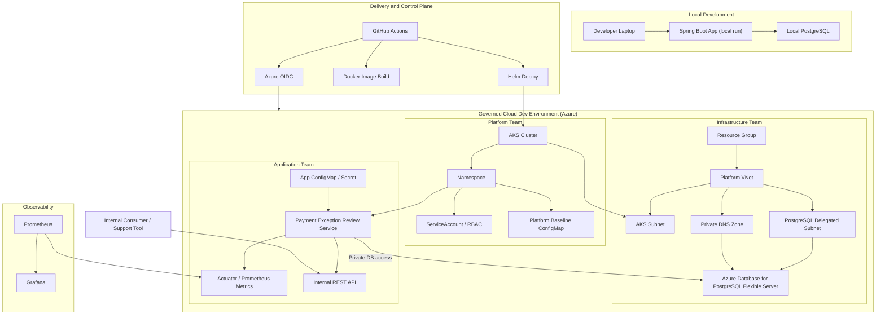

# Application Architecture

This document describes the Stage 1 application architecture for the **Payment Exception Review Service**.

The goal is to show how one Spring Boot service fits into the governed platform boundary already created by the infrastructure team.

## High-level architecture


```text
Internal Consumer / Support Tool / Internal System
                    │
                    │ HTTP
                    ▼
      Payment Exception Review Service (Spring Boot)
      ├── REST API
      │   ├── GET /api/payment-exceptions/{id}/status
      │   ├── GET /api/payment-exceptions/service-status
      │   └── GET /api/payment-exceptions/config-check
      ├── Actuator
      │   ├── /actuator/health
      │   ├── /actuator/info
      │   └── /actuator/prometheus
      ├── Domain / validation logic
      └── Persistence layer
                    │
                    │ JPA / PostgreSQL driver over private network
                    ▼
     Azure Database for PostgreSQL Flexible Server
     ├── Private DNS
     └── Delegated subnet


GitHub Actions
    │
    ├── build
    ├── test
    ├── package
    ├── Docker image build
    └── Helm deploy
                │
                ▼
AKS Namespace: payment-exception-review-stage1
    ├── Deployment
    ├── Service
    ├── App ConfigMap
    ├── Secret
    ├── Platform baseline ConfigMap
    └── Platform-managed ServiceAccount
                │
                ▼
AKS attached to platform VNet
    └── private connectivity to PostgreSQL

Prometheus
    │
    └── scrapes /actuator/prometheus
                │
                ▼
             Grafana
```



## Interpretation

This architecture separates the local developer path from the governed cloud path.

- Local development uses a local Spring Boot runtime and local PostgreSQL.
- The governed Azure `dev` environment uses AKS plus Azure Database for PostgreSQL Flexible Server.
- The cloud database is private and is reached through the AKS runtime path, not directly from a developer laptop.
- Infrastructure owns the VNet, subnets, private DNS, AKS foundation, and managed PostgreSQL.
- Platform owns the Kubernetes application boundary.
- Application owns the Spring Boot service and its persistence behavior.

## Main components

### Spring Boot application

Owns:

- REST API
- business validation
- startup validation
- configuration exposure
- PostgreSQL-backed read behavior
- Actuator health and metrics

### PostgreSQL

Owns:

- persisted payment exception review records
- private cloud-side database access for the application path

This makes the service stateful and more credible than a purely in-memory demo implementation.

### AKS runtime

Owns:

- container scheduling
- readiness and liveness probing
- service exposure
- runtime restart behavior
- private application-to-database connectivity inside the governed environment

### GitHub Actions delivery path

Owns:

- build and test automation
- image packaging
- image publishing to GHCR
- deployment automation
- rollout validation

## Ownership split

### Platform-owned

- namespace
- service account
- role and rolebinding
- baseline ConfigMap
- cluster and Terraform foundation

### Application-owned

- Spring Boot code
- PostgreSQL integration
- Dockerfile
- Helm chart
- app ConfigMap values
- app Secret usage pattern
- application delivery workflow

## Why this architecture is enough for Stage 1

This architecture is intentionally small but still demonstrates:

- controlled delivery into AKS
- stateful service realism
- platform/application ownership boundaries
- observability and health exposure
- credible operational support behavior
- private cloud database access instead of a public database endpoint

It does not yet attempt to prove:

- multi-service orchestration
- advanced event-driven architecture
- enterprise identity flows
- multi-region resilience
