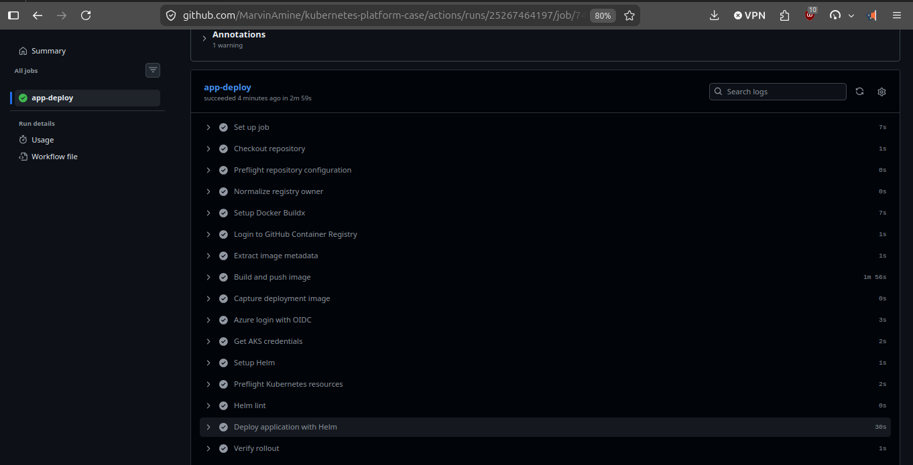
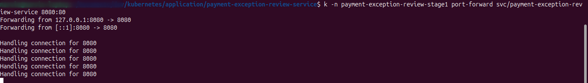
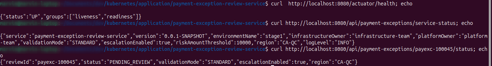

# Payment Exception Review Service Helm Chart

This chart deploys the application workload for the Payment Exception Review Service into the platform-managed Kubernetes namespace.

## Scope

This chart creates:

- a `Deployment`
- a `Service`

This chart intentionally does **not** create:

- the namespace
- the runtime service account
- the platform baseline ConfigMap
- the database password secret

Those resources are owned by the platform or infrastructure layers and must already exist before the chart is installed.

## Expected existing resources

- namespace: `payment-exception-review-stage1`
- service account: `app-runtime-sa`
- ConfigMap: `platform-baseline-config`
- Secret: `payment-review-db`
  - key: `POSTGRES_ADMIN_PASSWORD`

## Install example

From `application/payment-exception-review-service`:

```bash
helm upgrade --install payment-exception-review-service \
  ./helm \
  --namespace payment-exception-review-stage1 \
  --set image.tag=<image-tag> \
  --set database.host=<postgres-host> \
  --set database.username=<postgres-username>
```

If the secret name or key differs, override:

```bash
helm upgrade --install payment-exception-review-service \
  ./helm \
  --namespace payment-exception-review-stage1 \
  --set database.existingSecret=<secret-name> \
  --set database.passwordKey=<secret-key>
```

## Override model

The chart keeps safe defaults and placeholders in `values.yaml`.

Real deployment values are expected to be injected at deploy time, especially for:

- `image.repository`
- `image.tag`
- `database.host`
- `database.name`
- `database.username`
- `database.existingSecret`
- `database.passwordKey`

In this repository, `app-deploy.yml` performs those runtime overrides through `helm upgrade --install ... --set ...`.

That means:

- `values.yaml` is the default chart contract
- GitHub Actions provides the real environment-specific values during deployment

## Local validation before remote deployment

Before pushing or running the remote deployment flow, validate the chart locally:

```bash
helm lint application/payment-exception-review-service/helm
helm template payment-exception-review-service application/payment-exception-review-service/helm
```

`helm lint` validates chart structure and template syntax.

`helm template` shows the rendered Kubernetes manifests using the current chart defaults.

## Deployment preflight checklist

Before `app-deploy.yml` runs a real deployment, confirm:

- AKS exists
- namespace `payment-exception-review-stage1` exists
- service account `app-runtime-sa` exists
- ConfigMap `platform-baseline-config` exists
- Secret `payment-review-db` exists
- the secret contains key `POSTGRES_ADMIN_PASSWORD`
- GitHub repository variables are populated for:
  - `RESOURCE_GROUP`
  - `AKS_CLUSTER_NAME`
  - `POSTGRES_SERVER_NAME`
  - `POSTGRES_DATABASE_NAME`
  - `POSTGRES_ADMIN_USERNAME`
- GitHub repository secrets are populated for:
  - `AZURE_CLIENT_ID`
  - `AZURE_TENANT_ID`
  - `AZURE_SUBSCRIPTION_ID`
  - `POSTGRES_ADMIN_PASSWORD`

## Post-deploy verification

After `app-deploy.yml` succeeds, verify the deployed workload from a workstation with AKS access.

Deployment workflow example:



### 1. Check namespace and workload objects

```bash
kubectl get ns
kubectl get deploy,rs,pods,svc -n payment-exception-review-stage1
```

Expected signals:

- namespace `payment-exception-review-stage1` exists
- deployment `payment-exception-review-service` is `READY 1/1`
- pod is `Running`
- service `payment-exception-review-service` exists

### 2. Check application logs

```bash
kubectl -n payment-exception-review-stage1 logs deployment/payment-exception-review-service
```

Expected log signals:

- datasource startup completes
- Flyway validates and applies migrations
- Tomcat starts on port `8080`
- no secret or database connectivity errors appear

### 3. Access the service locally through port-forward

The chart creates a `ClusterIP` service, so the application is not directly reachable from your laptop.

You must port-forward before calling `localhost`:

```bash
kubectl -n payment-exception-review-stage1 port-forward svc/payment-exception-review-service 8080:80
```

Port-forward example:



Then from another terminal:

```bash
curl http://localhost:8080/actuator/health
curl http://localhost:8080/api/payment-exceptions/service-status
curl http://localhost:8080/api/payment-exceptions/payexc-100045/status
```

Port-forward plus curl verification example:



Expected results:

- `/actuator/health` returns `UP`
- `/api/payment-exceptions/service-status` returns runtime metadata
- `/api/payment-exceptions/payexc-100045/status` returns the seeded review with `PENDING_REVIEW`

### 4. Common verification pitfalls

- `curl http://localhost:8080/...` fails if `kubectl port-forward` is not running
- the service is exposed on `80` inside the cluster but the application container still listens on `8080`
- a wrong review id such as `payexc-10045` returns an application error because the seeded row is `payexc-100045`

## Values ownership

The chart follows the Stage 1 operating model:

- infrastructure owns the managed PostgreSQL foundation
- platform owns the namespace, service account, RBAC, and baseline ConfigMap
- the application chart owns the application workload configuration

Application-team values typically include:

- image tag
- validation mode
- escalation flag
- business threshold
- region

Platform-owned values should normally remain aligned with the platform layer:

- namespace
- runtime service account name
- baseline ConfigMap name
- database secret name and secret key convention

## Secret handling

The chart does not carry database credentials in `values.yaml`.

Instead, it expects the platform flow to inject a Kubernetes Secret into the application namespace and the chart only references that existing secret:

- Secret name: `payment-review-db`
- Secret key: `POSTGRES_ADMIN_PASSWORD`

This keeps the application chart aligned with the Stage 1 ownership model:

- infrastructure owns the managed database foundation
- platform injects runtime secrets into the governed namespace
- application delivery consumes those existing runtime secrets

If the platform secret is missing, Helm can still install the release manifest, but the application pod will fail to start correctly because the runtime secret reference cannot be resolved.

## Why the chart is scoped this way

The repository separates responsibilities intentionally.

This chart deploys only the application workload so it can reuse the paved road created earlier by the infrastructure and platform layers.
