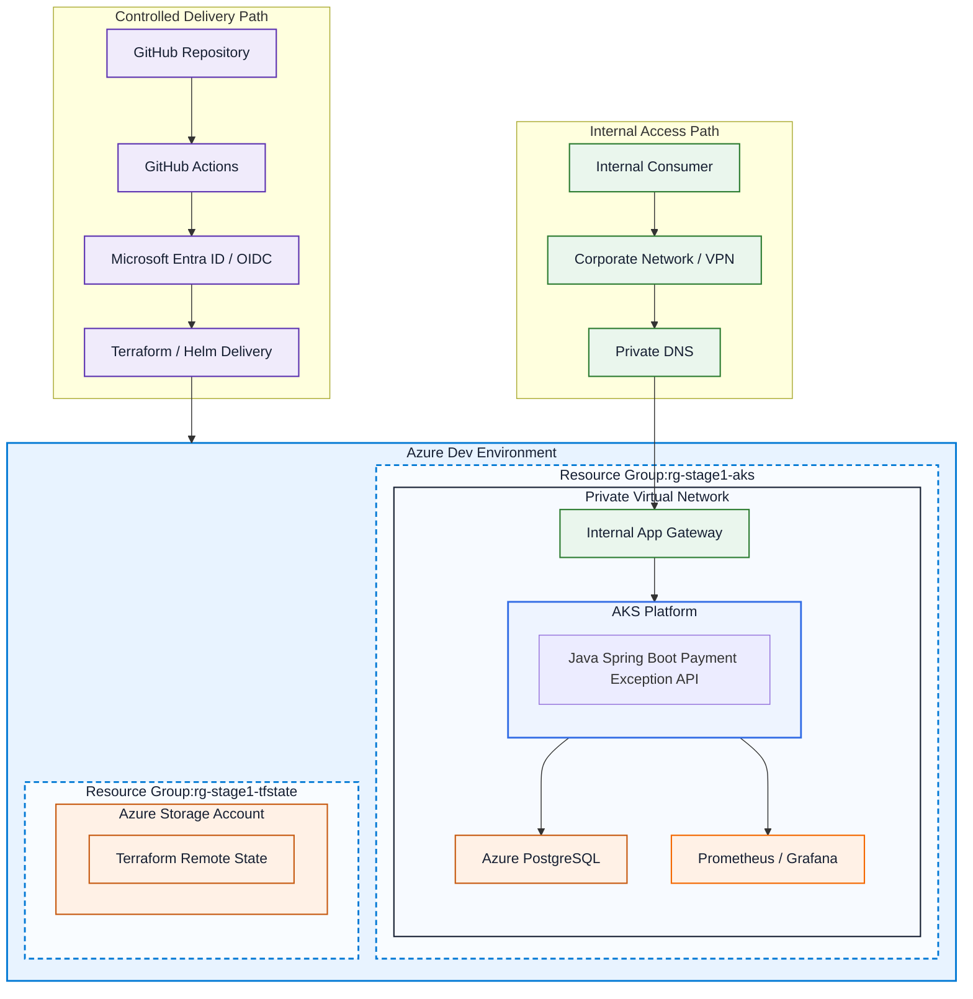
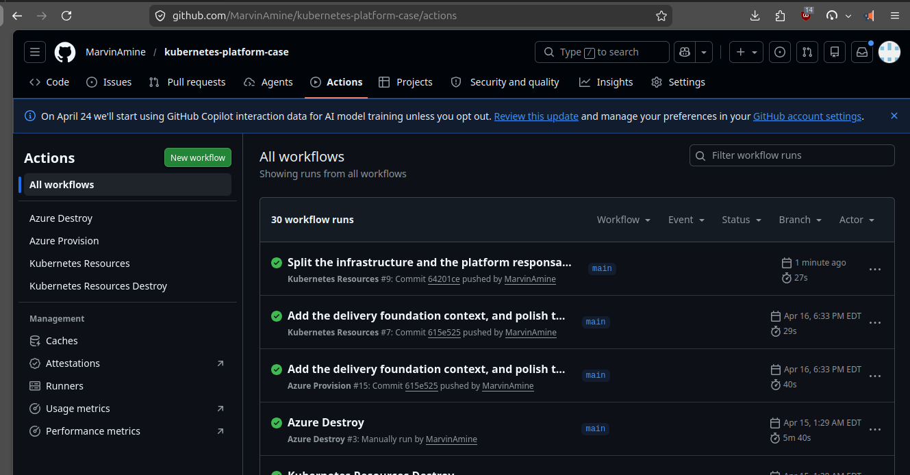

# Stage 1 of 3 - Governed AKS delivery foundation for an internal payment review service

"Kubernetes delivery foundation on AKS for an internal payment review service. The goal was to reflect a realistic operating model where an infrastructure team bootstraps the resource group, AKS cluster, remote Terraform backend, and managed PostgreSQL foundation with Terraform, a platform team provisions the governed Kubernetes application boundary and shared observability services such as Prometheus and Grafana on top of that foundation, and an application team deploys a Spring Boot service through GitHub Actions, Docker, and Helm. I also designed the service around PostgreSQL persistence, health probes, observability, and failure scenarios so the repeatable operating model demonstrates delivery, observability, and troubleshooting instead of only deployment."



## Detailed version:
Production-oriented Kubernetes delivery foundation for highly regulated environments, where internal service delivery is often slowed by infrastructure setup, deployment standards, observability requirements, and operational risk.

Stage 1 focuses on one expensive problem: turning governed internal service delivery from a fragile, manual, multi-team effort into a repeatable operating model.

This stage uses a clear 3-team model:

- **Infrastructure team** bootstraps the resource group, AKS cluster, remote Terraform backend, and managed PostgreSQL foundation with **Terraform (IaC)**
- **Platform team** provisions the governed Kubernetes application boundary, runtime conventions, and shared observability services such as **Prometheus** and **Grafana** on top of that foundation
- **Application team** builds and deploys a **Spring Boot** microservice through **GitHub Actions**, **Docker**, and **Helm**

For the detailed responsibilities and role boundaries inside each team, see
[project_team_ownership_model.md](./project_team_ownership_model.md).


The operating model foundation delivers:

- **governed AKS delivery foundation**
- **postgreSQL-backed internal payment review service**
- **controlled GitHub Actions CI/CD path**
- **observable runtime path** through health checks, configuration validation, and Grafana Prometheus metrics
- **documented rollout and misconfiguration failure scenarios** to demonstrate realistic incident diagnosis

### Observability model

The observability direction is a shared platform-level monitoring stack per
cluster or environment boundary, not a separate monitoring stack per
application.

The intended production model is:

- shared `kube-prometheus-stack`
- Grafana behind SSO
- network isolation around monitoring components and scrape surfaces
- controlled RBAC
- persistent Grafana
- governed Alertmanager routing
- Thanos for long-term retention and global query when broader enterprise scale
  requires it

This is the better default for regulated fintech-style environments because it
preserves strong governance while avoiding unnecessary duplication of
Prometheus, Grafana, Alertmanager, dashboards, upgrade work, and storage. A
separate monitoring stack per application is treated as an exception that
should be justified by a hard compliance, tenancy, or data-separation
requirement.

What this demonstrates:

- repeatable infrastructure provisioning and controlled application delivery
- clear separation between infrastructure, platform, and application ownership
- support for stateful services with database dependencies
- enough observability to support safe operations and recurring troubleshooting scenarios
- hands-on experience aligned with **Platform Engineer, DevOps, SRE, and CI/CD platform roles** in regulated environments

> **Important:** This delivery foundation uses a **remote Terraform backend in Azure Storage** so local executions and CI/CD pipelines share the same infrastructure state instead of relying on local Terraform state files.

This foundation later evolves toward stronger GitOps, security, secrets management, policy enforcement, and hybrid-cloud platform credibility.

For the cross-stage team structure used in this repository, see [project_team_ownership_model.md](./project_team_ownership_model.md).

For a reusable non-project-specific reference, see [generic_team_ownership_model.md](./generic_team_ownership_model.md).

For root-level platform-case decisions, see [Architecture Decision Records](./adrs/README.md).

For the observability boundary between the current shared monitoring baseline
and the later enterprise direction, see
[observability-tradeoffs.md](./observability-tradeoffs.md).


## 0. HOW TO USE IT?

### 0.1 Setup the environment file

The infrastructure and platform scripts use a shared environment file at the repository root: `.env`

Create it from:

```bash
cp .env.example .env
```

The full variable reference lives here:

- [Configuration reference](./configuration-reference.md)

Minimal first edit before the initial bootstrap:

```conf
REPO_OWNER=...
SUBSCRIPTION_ID=...
```

If you do not have an Azure subscription selected yet, follow the setup steps in [infrastructure/docs/README.md](infrastructure/docs/README.md).

### 0.2 Local platform provisioning

Provision the full platform locally:

```bash
# Use the flag '-s' for silence
./bootstrap_infrastructure_and_provision_platform.sh
```

See screen shoot example here: [provision_platform_screenshoots.md](infrastructure/docs/provision_platform_screenshoots.md)

### 0.3 Complete the environment values and GitHub configuration

On the first run, `bootstrap_infrastructure_and_provision_platform.sh` bootstraps the remote Terraform backend and prints the backend values that must be copied into `.env`.

Update `.env` with the real backend values described in:

- [Configuration reference](./configuration-reference.md#repository-root-env)

Confirm these GitHub repository variables are also set:

- [Configuration reference](./configuration-reference.md#github-repository-variables)


If you also run the Azure OIDC setup, the script `infrastructure/azure/oidc/create_az_oidc.sh` prints the GitHub repository secrets to configure.

Confirm these GitHub repository secrets are set:

- [Configuration reference](./configuration-reference.md#github-repository-secrets)


### 0.4 GitHub Actions

> Requirements: 
> 1. The [remote Terraform backend](infrastructure/terraform-backend/docs/README.md) is created.
> 2. The [Azure OIDC credentials for GitHub Actions](infrastructure/azure/docs/OIDC.md) are created.
> 3. The required GitHub repository variables from [Configuration reference](./configuration-reference.md#github-repository-variables) are set and valid.
> 4. The required GitHub repository secrets from [Configuration reference](./configuration-reference.md#github-repository-secrets) are set and valid.

When changes are pushed to the tracked infrastructure paths, GitHub Actions automatically runs Terraform checks for the corresponding layer.

On `push`, the workflows run formatting, initialization, validation, and planning steps.

On `workflow_dispatch`, the Azure provisioning workflow can also run `terraform apply`.


### 0.5 Destroy the full platform

> It is important to destroy the resources after use. Azure services such as AKS and VMs can generate ongoing costs if they are left running.

You can destroy the platform with this command:
```bash
./destroy_infrastructure_and_platform.sh
```

It destroys:
1. Kubernetes resources
2. Azure infrastructure
3. The remote Terraform backend
4. The Azure OIDC integration, if you choose to remove it


## 1. INFRASTRUCTURE BOOTSTRAP PATH MANAGED BY THE INFRASTRUCTURE TEAM 

```text
[Infrastructure Team]
      │
      │ pushes platform bootstrap code
      ▼
┌──────────────────────────────────────────────┐
│            GitHub                            │
│----------------------------------------------│
│ infrastructure/                              │
│ - terraform/                                 │
│ - docs/                                      │
│ - GitHub Actions workflow for terraform/     │
└──────────────────────────────────────────────┘
      │
      │ triggers
      ▼
┌──────────────────────────────┐
│        GitHub Actions        │
│------------------------------│
│ Runs Terraform plan/apply    │
│ for platform-owned resources │
└──────────────────────────────┘
      │
      │ bootstraps environment in
      ▼
┌──────────────────────────────────────────────────────────────┐
│                   AKS  Kubernetes Cluster                    │
│--------------------------------------------------------------│
│ Namespace: payment-exception-review-stage1                   │
│                                                              │
│  Platform-owned resources:                                   │
│  ┌──────────────────────────────┐                            │
│  │ Namespace                    │                            │
│  └──────────────────────────────┘                            │
│                                                              │
│  ┌──────────────────────────────┐                            │
│  │ ServiceAccount               │                            │
│  └──────────────────────────────┘                            │
│                                                              │
│  ┌──────────────────────────────┐                            │
│  │ Role                         │                            │
│  └──────────────────────────────┘                            │
│                                                              │
│  ┌──────────────────────────────┐                            │
│  │ RoleBinding                  │                            │
│  └──────────────────────────────┘                            │
│                                                              │
│  ┌──────────────────────────────┐                            │
│  │ Baseline ConfigMap           │                            │
│  │------------------------------│                            │
│  │ Shared platform convention   │                            │
│  │ example: ENV_NAME, LOG_LEVEL │                            │
│  └──────────────────────────────┘                            │
└──────────────────────────────────────────────────────────────┘
```

## 2. APP DELIVERY PATH USED BY THE APPLICATION TEAM 


```text
[Application Developer]
      │
      │ pushes app code / Helm changes
      ▼
┌──────────────────────────────┐
│            GitHub            │
│------------------------------│
│ application-team/            │
│ - Spring Boot app            │
│ - Dockerfile                 │
│ - Helm chart                 │
│ - app docs                   │
│ - workflow for app delivery  │
└──────────────────────────────┘
      │
      │ triggers
      ▼
┌────────────────────────────────────────────┐
│            GitHub Actions Pipeline         │
│--------------------------------------------│
│ 1. Checkout code                           │
│ 2. Build Spring Boot app                   │
│ 3. Run tests                               │
│ 4. Run database migration validation       │
│ 5. Package JAR                             │
│ 6. Build Docker image                      │
│ 7. Validate Helm chart                     │
│ 8. Deploy with Helm                        │
│ 9. Post-deploy validation                  │
└────────────────────────────────────────────┘
      │
      ├──────────────────────────────────────────────────────┐
      │                                                      │
      |      ┌──────────────────────────────────────┐        │
      |      │ Azure Database for PostgreSQL        │        │
      |      │--------------------------------------│        │
      |      │ Stores payment review records        │        │
      |      │ Persistent relational data store     │        │
      |      └──────────────────────────────────────┘        │
      |                   ▲                                  │
      |                   |                                  │
      │ builds            | connects to                      │ uses
      ▼                   |                                  ▼
┌──────────────────────────────┐   ┌──────────────────────────────┐
│         Docker Image         │   │             Helm             │
│------------------------------│   │------------------------------│
│ Spring Boot microservice     │   │ App deployment package       │
│                              │   │ Templates Kubernetes objects │
└──────────────────────────────┘   └──────────────────────────────┘
              ▲                                │
(by reference)│ Pulls and runs                 │ deploys to
              │                                ▼
┌──────────────────────────────────────────────────────────────┐
│                 AKS Kubernetes Cluster                       │
│--------------------------------------------------------------│
│ Namespace: payment-exception-review-stage1                   │
│                                                              │
│ App-team-owned resources:                                    │
│  ┌──────────────────────────────┐                            │
│  │ Deployment                   │                            │
│  │------------------------------│                            │
│  │ Spring Boot Pod(s)           │                            │
│  │ - image from pipeline        │                            │
│  │ - readiness probe            │                            │
│  │ - liveness probe             │                            │
│  │ - requests/limits            │                            │
│  │ - env from ConfigMap/Secret  │                            │
│  │ - uses ServiceAccount        │                            │
│  └──────────────────────────────┘                            │
│                                                              │
│  ┌──────────────────────────────┐                            │
│  │ Service                      │                            │
│  └──────────────────────────────┘                            │
│                                                              │
│  ┌──────────────────────────────┐                            │
│  │ App ConfigMap                │                            │
│  │------------------------------│                            │
│  │ App-specific config          │                            │
│  │ example: VALIDATION_MODE     │                            │
│  └──────────────────────────────┘                            │
│                                                              │
│  ┌──────────────────────────────┐                            │
│  │ Secret                       │                            │
│  │------------------------------│                            │
│  │ Placeholder secret pattern   │                            │
│  └──────────────────────────────┘                            │
└──────────────────────────────────────────────────────────────┘
```

### 2.1 Data persistence used by the service

The Stage 1 service is backed by PostgreSQL so the workload behaves like a real internal enterprise service rather than a stateless API shell.

The database stores payment review records such as:

- payment reference
- review status
- review reason
- source system
- assigned queue
- timestamps

This makes Stage 1 more credible for regulated environments because the service must validate, persist, expose, and troubleshoot a real dependency.

## 3. APPLICATION RUNTIME

```text
Client / Internal Consumer
  │
  ├── GET /api/payment-exceptions/service-status
  │      -> service status, version, validation mode
  │
  ├── GET /api/payment-exceptions/{id}/status
  │      -> fake payment exception lifecycle state
  │         RECEIVED / VALIDATING / PENDING_REVIEW /
  │         APPROVED / REJECTED / ESCALATED
  │
  ├── GET /api/payment-exceptions/config-check
  │      -> config validation result
  │
  └── /actuator/*
         -> health / info / prometheus
```


## 4. OBSERVABILITY PATH

```text
Kubernetes / Application
      │
      ├── health checks
      ├── logs
      └── metrics
             │
             ▼
┌──────────────────────────────┐
│         Prometheus           │
│------------------------------│
│ Scrapes /actuator/prometheus │
│ Collects service metrics     │
└──────────────────────────────┘
             │
             ▼
┌──────────────────────────────┐
│           Grafana            │
│------------------------------│
│ Dashboard examples:          │
│ - service availability       │
│ - request volume             │
│ - response latency           │
│ - pod restarts               │
│ - validation failures        │
│ - escalation count           │
│ - app up/down                │
│ - request count              │
│ - response time              │
│ - JVM / memory basics        │
│ - health trend               │
└──────────────────────────────┘
```

## 5. Repo architecture
The structure below represents the current Stage 1 repository architecture:
```
kubernetes-platform-case/
├── .github/
│   └── workflows/
│       ├── azure-provision.yml
│       ├── azure-destroy.yml
│       ├── kubernetes-resources-provision.yml
│       ├── kubernetes-resources-destroy.yml
│       └── app-delivery.yml
│
├── .env.example
├── bootstrap_infrastructure_and_provision_platform.sh
├── destroy_infrastructure_and_platform.sh
├── commons/
│   └── scripts/
│       ├── common_logging.sh
│       └── wait_for_backend_access.sh
├── logs/
│
├── infrastructure/
│   ├── terraform-backend/
│   │   ├── create_remote_backend.sh
│   │   ├── destroy_remote_backend.sh
│   │   ├── terraform/
│   │   │   ├── main.tf
│   │   │   ├── variables.tf
│   │   │   ├── outputs.tf
│   │   │   ├── providers.tf
│   │   │   └── versions.tf
│   │   └── docs/
│   │       └── README.md
│   │
│   ├── azure/
│   │   ├── create_azure_resources.sh
│   │   ├── destroy_azure_resources.sh
│   │   ├── terraform/
│   │   │   ├── resource-group.tf
│   │   │   ├── aks.tf
│   │   │   ├── postgresql.tf
│   │   │   ├── variables.tf
│   │   │   ├── outputs.tf
│   │   │   ├── providers.tf
│   │   │   ├── backend.tf
│   │   │   └── versions.tf
│   │   ├── oidc/
│   │   │   ├── create_az_oidc.sh
│   │   │   ├── destroy_az_oidc.sh
│   │   │   ├── github-oidc-credential.template.json
│   │   │   └── github-oidc-credential.json
│   │   ├── scripts/
│   │   │   ├── create_aks_cluster_and_connect_with_kubectl.sh
│   │   │   └── delete_azure_resource_group_manually.sh
│   │   └── docs/
│   │       ├── OIDC.md
│   │       └── README.md
│
├── platform/
│   └── kubernetes-resources/
│       ├── apply_kubernetes_resources.sh
│       ├── destroy_kubernetes_resources.sh
│       ├── terraform/
│       │   ├── main.tf
│       │   ├── variables.tf
│       │   ├── outputs.tf
│       │   ├── providers.tf
│       │   ├── backend.tf
│       │   └── versions.tf
│       ├── scripts/
│       │   └── validate-cluster-access.sh
│       └── docs/
│           └── README.md
│
├── application/
│   ├── payment-exception-review-service/
│   │   ├── src/
│   │   ├── pom.xml
│   │   └── README.md
│   │
│   ├── docker/
│   │   └── Dockerfile
│   │
│   ├── helm/
│   │   └── payment-exception-review-service-status/
│   │       ├── Chart.yaml
│   │       ├── values.yaml
│   │       └── templates/
│   │           ├── deployment.yaml
│   │           ├── service.yaml
│   │           ├── configmap.yaml
│   │           └── serviceaccount.yaml
│   │
│   ├── scripts/
│   │   ├── smoke-test.sh
│   │   ├── validate-helm.sh
│   │   └── debug-rollout.sh
│   │
│   └── docs/
│       ├── README.md
│       ├── runbook.md
│       ├── failure-scenarios.md
│       └── case-study-stage1.md
│
├── observability/
│   ├── prometheus/
│   ├── grafana/
│   └── docs/
│       └── README.md
│
├── docs/
│   ├── executive-summary.md
│   ├── stage1.md
│   ├── stage2.md
│   ├── stage3.md
│   └── interview-notes.md
```

## 6. Infrastructure layer responsibility
| Layer                                 | Responsibility                                                       | Owner            |
| ------------------------------------- | -------------------------------------------------------------------- | ---------------- |
| `infrastructure/terraform-backend`    | Creates the shared Azure Storage backend for Terraform state         | Infrastructure team |
| `infrastructure/azure`                | Provisions Azure resources such as the resource group and AKS cluster| Infrastructure team |
| `platform/kubernetes-resources` | Bootstraps namespace, service account, RBAC, and baseline config     | Platform team    |
| `application/`                        | Builds, packages, and deploys the Spring Boot service                | Application team |


## 7. FAILURE SCENARIOS USED TO DEMONSTRATE OPERATIONAL TROUBLESHOOTING

**Operational skills demonstrated**

- reasoning about observability, probes, and deployment safety
- diagnosing rollout failures in Kubernetes
- validating application health and runtime configuration
- reading and structuring Terraform layers
- understanding ownership boundaries between infrastructure, platform, and application teams
- handling a service with a real database dependency

#### Scenario 1 - Bad readiness probe
- application starts correctly
- readiness probe path or port is wrong
- pod stays unready
- rollout appears broken
- service is not available through standard routing
- diagnosed through events, `kubectl describe`, rollout status, and health endpoint verification

#### Scenario 2 - Bad business configuration
- the app receives an invalid validation configuration
- example: `VALIDATION_MODE=AGGRESSIVE` when only `STRICT` or `STANDARD` are supported
- startup validation fails or the application becomes unhealthy
- issue is visible through logs, pod status, and config-check endpoint
- demonstrates config governance and safe startup behavior in a regulated service


## 8. OWNERSHIP MODEL

**Infrastructure team owns:**
- Azure resource group
- Terraform backend
- AKS cluster provisioning
- managed Azure PostgreSQL service
- network and infrastructure prerequisites
- infrastructure-level foundation standards

**Platform team owns:**
- Kubernetes bootstrap layer
- namespace bootstrap
- service account
- role and rolebinding
- baseline ConfigMap convention
- shared observability services such as Prometheus and Grafana
- runtime standards for app consumption of DB, secrets, and metrics
- governed runtime standards

**Application team owns:**
- Spring Boot code
- database schema usage and persistence logic
- actuator endpoints and custom metrics
- Dockerfile
- Helm chart
- Deployment and Service manifests
- application ConfigMap values
- application Secret usage pattern
- application rollout behavior
- application runbook notes
 
## 9. THREE-STAGE PLATFORM EVOLUTION

For the fuller technology progression and stage-by-stage stack rationale, see
[tech_stack_evolution.md](./tech_stack_evolution.md).

### Stage 1 — Governed delivery foundation
Focus:
- **Azure AKS**, **Kubernetes**, and **Azure OIDC / federated CI authentication**: governed cloud delivery foundation
- **Terraform** and **Azure Storage remote backend for Terraform state**: repeatable infrastructure bootstrap
- **GitHub Actions** and **GitHub**: controlled CI/CD path
- **Docker** and **Helm**: application packaging and deployment
- **Java Spring Boot**: internal microservice runtime
- **PostgreSQL** (Azure and Local): stateful service credibility
- **Prometheus** and **Grafana**: probes, config validation, observability, and troubleshooting signals

Outcome:
An infrastructure team bootstraps the foundation, a platform team provisions a governed Kubernetes environment on top of it, and an application team deploys the Payment Exception Review Status API into it through a controlled path.

### Stage 2 — Governance, security, and shared-platform hardening
Planned focus:
- all Stage 1 technologies, plus:
- **OpenShift**, **ArgoCD**, **HashiCorp Vault**, and **Ansible**: stronger platform controls, GitOps discipline, and shared-platform standards
- **OpenShift**, **Kubernetes**, and **HashiCorp Vault**: stronger AppSec controls and secret-aware hardening
- **Elasticsearch** and **Kibana**: deeper observability with logs and security posture
- **Linux / Red Hat or Ubuntu**: more enterprise-oriented platform operations

Outcome:
The platform evolves from controlled delivery to controlled and secured delivery, with Security and IAM becoming an explicit part of the operating model.

### Stage 3 — Enterprise hybrid platform expansion
Planned focus:
- all Stage 2 technologies, plus:
- **AWS**, **Azure**, **OpenShift**, and **OnPrem**: multi-cloud hybrid platform direction for stronger production governance
- **DataDog**, **Thanos**, **Prometheus**, and **Grafana**: advanced observability for SRE / Production Engineering visibility
- **Okta**: stronger enterprise identity and access alignment
- **local**, **dev**, and **prod**: multi-environment promotion across hybrid platform boundaries
- **AWS EKS**, **Azure AKS**, **Okta**, **Ansible**, and **GitHub Actions**: enterprise-grade operations narrative

Outcome:
The platform becomes a broader enterprise platform case aligned with highly regulated environments.
