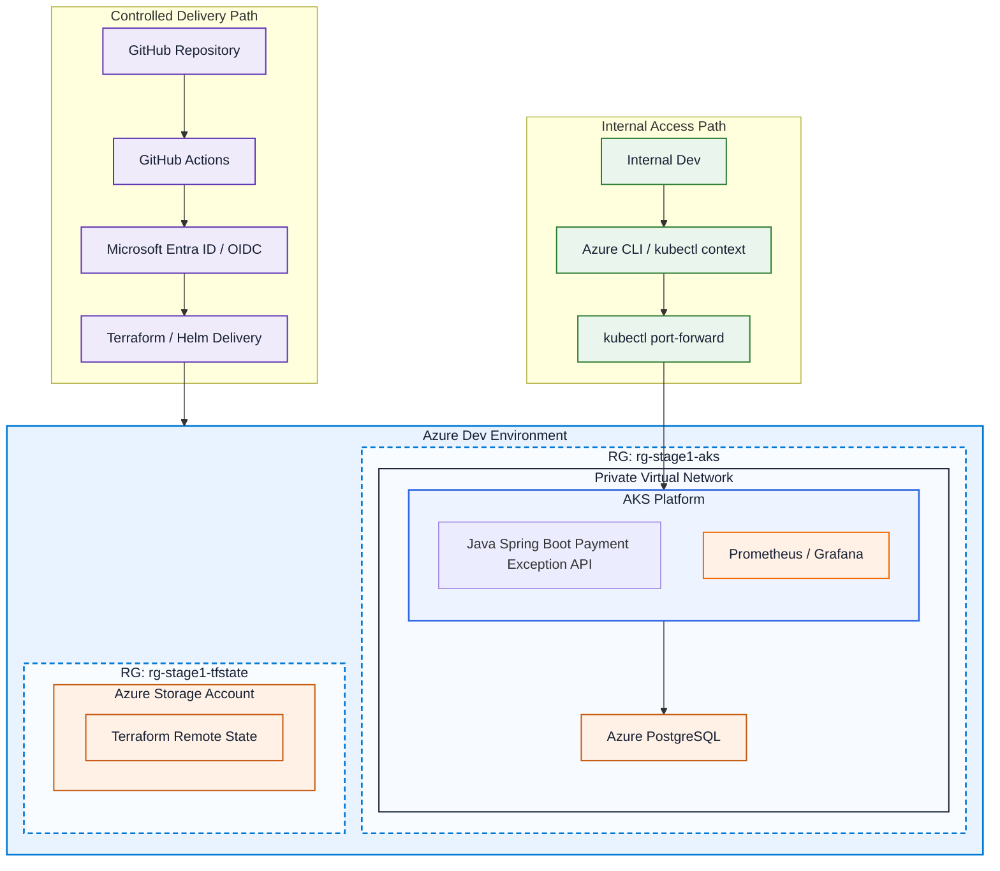
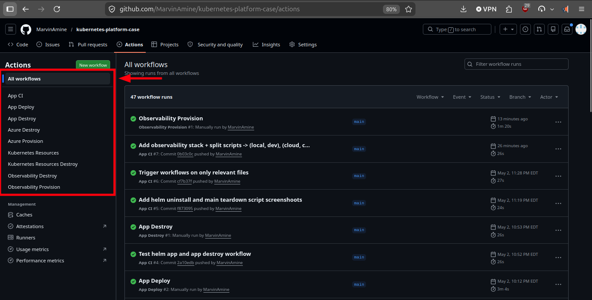
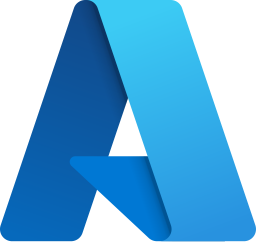
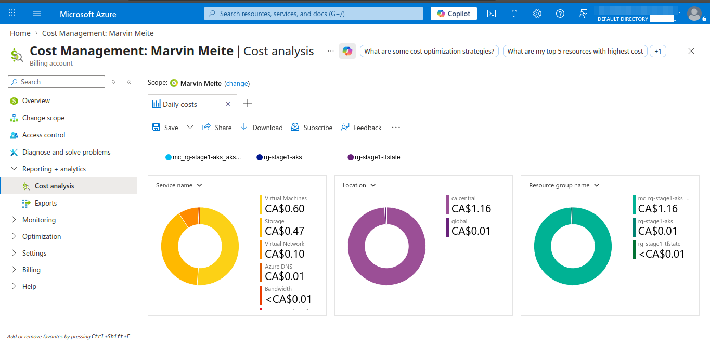
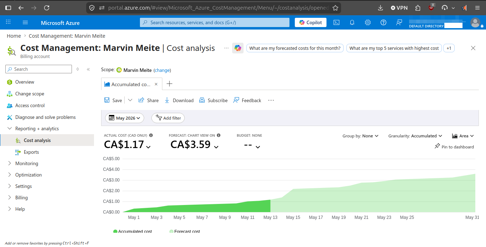
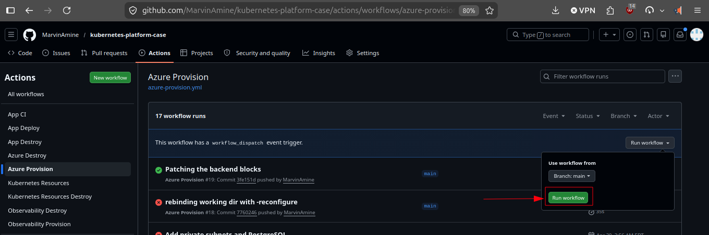

<p align="left">
  <a href="https://github.com/MarvinAmine/kubernetes-platform-case/actions/workflows/infrastructure-azure-provision.yml"></a>
  <a href="https://github.com/MarvinAmine/kubernetes-platform-case/actions/workflows/infrastructure-azure-destroy.yml"></a>
  <a href="https://github.com/MarvinAmine/kubernetes-platform-case/actions/workflows/platform-kubernetes-resources-provision.yml"></a>
  <a href="https://github.com/MarvinAmine/kubernetes-platform-case/actions/workflows/platform-kubernetes-resources-destroy.yml"></a>
  <a href="https://github.com/MarvinAmine/kubernetes-platform-case/actions/workflows/platform-observability-provision.yml"></a>
  <a href="https://github.com/MarvinAmine/kubernetes-platform-case/actions/workflows/platform-observability-destroy.yml"></a>
  <a href="https://github.com/MarvinAmine/kubernetes-platform-case/actions/workflows/platform-observability-validate.yml"></a>
  <a href="https://github.com/MarvinAmine/kubernetes-platform-case/actions/workflows/reliability-observability-dashboard-validate.yml"></a>
  <a href="https://github.com/MarvinAmine/kubernetes-platform-case/actions/workflows/application-app-ci.yml"></a>
  <a href="https://github.com/MarvinAmine/kubernetes-platform-case/actions/workflows/application-app-deploy.yml"></a>
  <a href="https://github.com/MarvinAmine/kubernetes-platform-case/actions/workflows/application-app-destroy.yml"></a>
  <a href="https://github.com/MarvinAmine/kubernetes-platform-case/pkgs/container/payment-exception-review-service"></a>
</p>

# Stage 1 of 3 - Governed AKS delivery foundation for an internal payment review service

Kubernetes delivery foundation on AKS for an internal payment review service.

This stage reflects a realistic operating model where an Infrastructure team bootstraps the resource group, AKS cluster, remote Terraform backend, and managed PostgreSQL foundation with Terraform.

A Platform team provisions the governed Kubernetes application boundary and shared Prometheus/Grafana observability baseline. An Application team deploys a Spring Boot service through GitHub Actions, GHCR, Docker, and Helm.

The service includes PostgreSQL persistence, health probes, observability, and documented failure scenarios so the platform demonstrates delivery, runtime operations, and troubleshooting instead of only deployment.

This repository is also a market-positioning artifact. After recruiter conversations and Montreal job-market analysis, the recurring signal was that regulated teams increasingly expect Azure, Kubernetes, CI/CD, observability, and platform ownership from day one. Stage 1 turns that signal into a concrete AKS delivery foundation with proof, not only a certificate or tutorial.

**Outcomes:** 
- ~20 min full bootstrap from Terraform backend to AKS platform baseline
- ~13 min full teardown path to stop cloud cost after demos
- < CA$4/month Azure forecast for the Stage 1 demo footprint
- 1 main bootstrap script and 1 main teardown script for the full cloud path
- 125h34 recorded Stage 1 build effort compressed into a replayable platform path
- 3-team operating model with clear Infrastructure, Platform, and Application ownership
- 11 GitHub Actions workflows covering infrastructure, platform, observability, and application delivery
- AKS + managed PostgreSQL + Azure Storage remote state provisioned as a repeatable Terraform foundation
- Prometheus/Grafana delivered as shared observability with dashboards as code
- 7 documented troubleshooting scenarios with symptoms, diagnosis, root cause, and fix path



## Detailed version:

Stage 1 video walkthroughs:

<table>
  <tr>
    <td width="50%">
      <a href="https://www.youtube.com/watch?v=AldbfGGDvjE">
        
      </a>
      <br>
      <strong>Global presentation - governed AKS delivery foundation</strong>
    </td>
    <td width="50%">
      <a href="https://www.youtube.com/watch?v=uNUSJL7OH0I">
        
      </a>
      <br>
      <strong>Demo - bootstrap, runtime proof, Grafana, and teardown</strong>
    </td>
  </tr>
</table>

For a shorter stakeholder-facing version of this project, see
[executive-summary.md](./executive-summary.md).

Production-oriented Kubernetes delivery foundation for highly regulated environments, where internal service delivery is often slowed by infrastructure setup, deployment standards, observability requirements, and operational risk.

Stage 1 focuses on one expensive problem: turning governed internal service delivery from a fragile, manual, multi-team effort into a repeatable operating model.

This stage uses a clear 3-team model:

- **Infrastructure team** bootstraps the resource group, AKS cluster, remote Terraform backend, and managed PostgreSQL foundation with **Terraform (IaC)**
- **Platform team** provisions the governed Kubernetes application boundary, runtime conventions, and shared observability services such as **Prometheus** and **Grafana** on top of that foundation
- **Application team** builds and deploys a **Spring Boot** microservice through **GitHub Actions**, **GHCR**, **Docker**, and **Helm**

For the detailed responsibilities and role boundaries inside each team, see
[project_team_ownership_model.md](./project_team_ownership_model.md).


The operating model foundation delivers:

- **governed AKS delivery foundation**
- **postgreSQL-backed internal payment review service**
- **controlled GitHub Actions CI/CD path**
- **observable runtime path** through health checks, configuration validation, and Grafana Prometheus metrics
- **documented rollout and misconfiguration failure scenarios** to demonstrate realistic incident diagnosis

This repository demonstrates repeatable infrastructure provisioning, controlled
application delivery, clear ownership boundaries between infrastructure,
platform, and application teams, and enough observability to support recurring
troubleshooting scenarios. It is built as a hands-on platform case aligned
with **Platform Engineer, DevOps, SRE, and CI/CD platform roles** in regulated
environments.

GitHub Actions workflow landscape:



For root-level platform-case decisions, see
[Architecture Decision Records](./adrs/README.md).

For the versioned Stage 1 snapshot, Git tag convention, GitHub Release process,
and hosted presentation link, see [release-management.md](./release-management.md).

## Three-Stage Platform Evolution

For the fuller technology progression and stage-by-stage stack rationale, see
[tech_stack_evolution.md](./tech_stack_evolution.md).

### Stage 1 — Governed delivery foundation
| Area | Technologies | Purpose |
| --- | --- | --- |
| Cloud foundation | Azure AKS, Kubernetes, Azure OIDC / federated CI authentication | Governed cloud delivery foundation |
| Infrastructure | Terraform, Azure Storage remote backend for Terraform state | Repeatable infrastructure bootstrap |
| Delivery | GitHub Actions, GitHub, GHCR, GitHub Releases | Controlled CI/CD path, package publishing, and versioned release evidence |
| Packaging | Docker, Helm, Kustomize | Application packaging, image publishing, deployment, and Kubernetes-native dashboard resource generation |
| Application runtime | Java Spring Boot | Internal microservice runtime |
| Data | PostgreSQL (Azure and Local) | Stateful service credibility |
| Operations | Prometheus, Grafana | Probes, config validation, observability, and troubleshooting signals |

Outcome:
An infrastructure team bootstraps the foundation, a platform team provisions a governed Kubernetes environment on top of it, and an application team deploys the Payment Exception Review Status API into it through a controlled path.

<p align="left">
  
  
  
  
  
  
  
  
  
  
  
  
  
</p>

### Stage 2 — Governance, security, and shared-platform hardening
| Additive scope | Technologies | Purpose |
| --- | --- | --- |
| Inheritance | All Stage 1 technologies | Keep the governed delivery base |
| Governance | OpenShift, ArgoCD, HashiCorp Vault, Ansible | Stronger platform controls, GitOps discipline, and shared-platform standards |
| Security and dependency governance | OpenShift, Kubernetes, HashiCorp Vault, Dependabot | Stronger AppSec controls, secret-aware hardening, and automated dependency update visibility |
| Deferred next-step mesh | OpenShift Service Mesh (Istio-based) | Enterprise traffic governance and mTLS when the platform grows beyond Stage 2 core scope |
| Observability | Elasticsearch, Kibana | Deeper observability with logs and security posture |
| Operations | Linux / Red Hat or Ubuntu | More enterprise-oriented platform operations |

Outcome:
The platform evolves from controlled delivery to controlled and secured delivery, with Security, IAM, and dependency governance becoming explicit parts of the operating model.

<p align="left">
  
  
  
  
  
  
  
  
</p>

### Stage 3 — Enterprise hybrid platform expansion
| Additive scope | Technologies | Purpose |
| --- | --- | --- |
| Inheritance | All Stage 2 technologies | Keep the governed shared-platform base |
| Hybrid platform | AWS, Azure, OpenShift, OnPrem | Multi-cloud hybrid platform direction for stronger production governance |
| Service mesh | OpenShift Service Mesh (Istio-based) | Enterprise east-west traffic governance, mTLS, and mesh-level policy |
| Terraform orchestration | Terragrunt | Reduce repeated Terraform structure and coordinate more complex multi-environment stacks |
| Observability | DataDog, Thanos, Prometheus, Grafana | Advanced observability for SRE / Production Engineering visibility |
| Identity | Okta | Stronger enterprise identity and access alignment |
| Promotion model | local, dev, prod | Multi-environment promotion across hybrid platform boundaries |
| Operations | AWS EKS, Azure AKS, Okta, Ansible, GitHub Actions | Enterprise-grade operations narrative |

Outcome:
The platform becomes a broader enterprise platform case aligned with highly regulated environments.

<p align="left">
  
  
  
  
  
  
  
  
  
  
  
</p>

## FinOps and Cost Control

Stage 1 applies a simple FinOps model: use local validation first, keep Azure
costs visible, and tear down cloud resources when they are not needed.

The FinOps model is:

- use the local `kind` path as much as possible for fast iteration
- use Azure AKS when managed-cloud proof matters
- destroy unused Azure runtime resources after validation
- keep the remote Terraform backend because its daily cost is negligible
- document both the default node size and a lower-cost fallback

Observed Stage 1 cost signals from the Azure view:

| Cost signal | Value |
| --- | --- |
| AKS-managed runtime cost | about `CA$1.16/day` |
| Terraform backend cost | less than `CA$0.01/day` |
| Monthly Azure forecast shown during validation | about `CA$3.59` |
| Virtual machines | about `CA$0.60` |
| Storage | about `CA$0.47` |
| Virtual network | about `CA$0.10` |
| Azure DNS | about `CA$0.01` |

The default AKS node size remains `Standard_D2als_v6` for a stable Stage 1
baseline. `Standard_B2als_v2` is documented as the lower-cost fallback when it
is available in the subscription and region.

Current Azure Retail Prices API values for Canada Central Linux node compute:

| AKS node VM size | Hourly estimate | Monthly estimate at 730h | Cost note |
| --- | ---: | ---: | --- |
| `Standard_B2als_v2` | about `$0.0418/hour` | about `$30.51/month` | lower-cost fallback |
| `Standard_D2als_v6` | about `$0.0896/hour` | about `$65.41/month` | default Stage 1 baseline |

Using `Standard_B2als_v2` instead of `Standard_D2als_v6` can reduce AKS node
compute by about **53%**, or about **$34.89/month per node**, before disks,
networking, PostgreSQL, and other Azure resources are counted.

For the node-size decision, see
[ADR-009 - Default to Standard_D2als_v6 While Documenting Standard_B2als_v2 as the Lower-Cost Fallback](./adrs/ADR-009-default-to-standard-d2als-v6-while-documenting-standard-b2als-v2-as-the-lower-cost-fallback.md).

The Stage 1 presentation includes the supporting cost screenshots:

```text
https://marvinmeite.cloud/payment-exception-review-stage-1/
```





## 0. HOW TO USE IT?

### 0.1 Setup the environment file

The infrastructure and platform scripts use a shared environment file at the repository root: `.env`

Create it from:

```bash
cp .env.example .env
```

The full variable reference lives here:

- [Configuration reference](./configuration-reference.md)

Minimal first edit before the initial bootstrap:

```conf
REPO_OWNER=...
SUBSCRIPTION_ID=...
```

If you do not have an Azure subscription selected yet, follow the setup steps in [infrastructure/docs/README.md](infrastructure/docs/README.md).

### 0.2 Local platform provisioning

Provision the full platform locally:

```bash
# Use the flag '-s' for silence
./bootstrap_infrastructure_and_provision_platform.sh
```

See screen shoot example here: [provision_platform_screenshoots.md](infrastructure/docs/provision_platform_screenshoots.md)

For a local-only validation path that avoids Azure cost and provisioning time,
see [local-platform-and-app-validation.md](./local-platform-and-app-validation.md).

### 0.3 Complete the environment values and GitHub configuration

On the first run, `bootstrap_infrastructure_and_provision_platform.sh` bootstraps the remote Terraform backend and prints the backend values that must be copied into `.env`.

> **Important:** This delivery foundation uses a **remote Terraform backend in Azure Storage** so local executions and CI/CD pipelines share the same infrastructure state instead of relying on local Terraform state files.

Update `.env` with the real backend values described in:

- [Configuration reference](./configuration-reference.md#repository-root-env)

Confirm these GitHub repository variables are also set:

- [Configuration reference](./configuration-reference.md#github-repository-variables)


If you also run the Azure OIDC setup, the script `infrastructure/azure/oidc/create_az_oidc.sh` prints the GitHub repository secrets to configure.

Confirm these GitHub repository secrets are set:

- [Configuration reference](./configuration-reference.md#github-repository-secrets)


### 0.4 GitHub Actions

> Requirements: 
> 1. The [remote Terraform backend](infrastructure/terraform-backend/docs/README.md) is created.
> 2. The [Azure OIDC credentials for GitHub Actions](infrastructure/azure/docs/OIDC.md) are created.
> 3. The required GitHub repository variables from [Configuration reference](./configuration-reference.md#github-repository-variables) are set and valid.
> 4. The required GitHub repository secrets from [Configuration reference](./configuration-reference.md#github-repository-secrets) are set and valid.

When changes are pushed to the tracked infrastructure paths, GitHub Actions automatically runs Terraform checks for the corresponding layer.

On `push`, the workflows run formatting, initialization, validation, and planning steps.

On `workflow_dispatch`, the Azure provisioning workflow can also run `terraform apply`.



- `./bootstrap_infrastructure_and_provision_platform.sh` has created or
  reconciled:
  - the remote Terraform backend
  - the Azure foundation
  - the Kubernetes resources
  - the shared observability stack

The remaining standard GitHub Actions path is:
| Layer | Already created by the bootstrap script? | Remaining to create from GitHub Actions? | Workflow | Why it still matters |
| --- | --- | --- | --- | --- |
| Remote Terraform backend | Yes | No | none | it is a bootstrap prerequisite before the normal cloud workflows can use remote Terraform state |
| Azure foundation | Yes | Usually no | `infrastructure-azure-provision.yml` | use later when you want the standard Infrastructure team reconciliation path from GitHub Actions |
| Kubernetes resources | Yes | Usually no | `platform-kubernetes-resources-provision.yml` | use later when you want the standard Platform team reconciliation path from GitHub Actions |
| Shared observability | Yes | Usually no | `platform-observability-provision.yml` | use later when you want the standard Platform team observability reconciliation path from GitHub Actions |
| Application | No | Yes | `application-app-deploy.yml` | this is usually the main remaining GitHub Actions step after a successful full bootstrap |

Important exceptions:
- the remote Terraform backend is still a bootstrap concern and is not part of
  the normal GitHub Actions workflow chain
- after a successful full bootstrap, the main remaining GitHub Actions action
  is usually `application-app-deploy.yml`
- `platform-observability-provision.yml` and `application-app-deploy.yml` are manual
  `workflow_dispatch` workflows

The detailed workflow matrix, destroy order, and credential paths are in:
- [github-actions-workflows.md](./github-actions-workflows.md) 

### 0.5 Destroy the full platform

> It is important to destroy the resources after use. Azure services such as AKS and VMs can generate ongoing costs if they are left running.

You can destroy the platform with this command:
```bash
./destroy_infrastructure_and_platform.sh
```

It destroys:
1. Kubernetes resources
2. Azure infrastructure
3. The remote Terraform backend
4. The Azure OIDC integration, if you choose to remove it


<details>
<summary><strong>1. Ownership and layer responsibilities</strong></summary>

## 1. OWNERSHIP AND LAYER RESPONSIBILITIES

For the cross-stage team structure used in this repository, see
[project_team_ownership_model.md](./project_team_ownership_model.md).

For a reusable non-project-specific reference, see
[generic_team_ownership_model.md](./generic_team_ownership_model.md).

| Layer | Responsibility | Owner |
| --- | --- | --- |
| `infrastructure/terraform-backend` | Creates the shared Azure Storage backend for Terraform state | Infrastructure team |
| `infrastructure/azure` | Provisions Azure resources such as the resource group, AKS cluster, and managed PostgreSQL foundation | Infrastructure team |
| `platform/kubernetes-resources` | Bootstraps the namespace, service account, RBAC, baseline config, runtime secret pattern, and shared observability services | Platform team |
| `application/` | Builds, packages, deploys, and operates the Spring Boot service workload | Application team |

**Infrastructure team owns:**
- Azure resource group
- Terraform backend
- AKS cluster provisioning
- managed Azure PostgreSQL service
- network and infrastructure prerequisites
- infrastructure-level foundation standards

**Platform team owns:**
- Kubernetes bootstrap layer
- namespace bootstrap
- service account
- role and rolebinding
- baseline ConfigMap convention
- shared observability services such as Prometheus and Grafana
- runtime standards for app consumption of DB, secrets, and metrics
- governed runtime standards

**Application team owns:**
- Spring Boot code
- database schema usage and persistence logic
- actuator endpoints and custom metrics
- Dockerfile
- Helm chart
- Deployment and Service manifests
- application ConfigMap values
- application Secret usage pattern
- application rollout behavior
- application runbook notes

</details>

<details>
<summary><strong>2. Azure foundation path managed by the Infrastructure team</strong></summary>

## 2. AZURE FOUNDATION PATH MANAGED BY THE INFRASTRUCTURE TEAM

```text
[Infrastructure Team]
      │
      │ pushes Azure foundation code
      ▼
┌─────────────────────────────────────────────────────────────┐
│            GitHub                                           │
│-------------------------------------------------------------│
│ infrastructure/azure/terraform/                             │
│ .github/workflows/infrastructure-azure-provision.yml        │
└─────────────────────────────────────────────────────────────┘
      │
      │ triggers
      ▼
┌──────────────────────────────┐
│        GitHub Actions        │
│------------------------------│
│ Runs Terraform plan/apply    │
│ for Azure foundation         │
└──────────────────────────────┘
      │
      │ provisions
      ▼
┌──────────────────────────────────────────────────────────────┐
│                   Azure foundation                           │
│--------------------------------------------------------------│
│  ┌────────────────────────────────────────────────────────┐  │
│  │ Resource Group                                         │  │
│  │--------------------------------------------------------│  │
│  │                                                        │  │
│  │  ┌──────────────────────────────┐                      │  │
│  │  │ Network Foundation           │                      │  │
│  │  │------------------------------│                      │  │
│  │  │ VNet                         │                      │  │
│  │  │ AKS subnet                   │                      │  │
│  │  │ PostgreSQL subnet            │                      │  │
│  │  │ private DNS / connectivity   │                      │  │
│  │  └──────────────────────────────┘                      │  │
│  │                                                        │  │
│  │  ┌──────────────────────────────┐                      │  │
│  │  │ AKS Cluster                  │                      │  │
│  │  │ uses: AKS subnet             │                      │  │
│  │  └──────────────────────────────┘                      │  │
│  │                                                        │  │
│  │  ┌──────────────────────────────┐                      │  │
│  │  │ Azure Database for           │                      │  │
│  │  │ PostgreSQL                   │                      │  │
│  │  │ uses: PostgreSQL subnet      │                      │  │
│  │  └──────────────────────────────┘                      │  │
│  └────────────────────────────────────────────────────────┘  │
└──────────────────────────────────────────────────────────────┘
```

This layer is represented by:

- `./infrastructure/azure/create_azure_resources.sh`
- `.github/workflows/infrastructure-azure-provision.yml`

</details>

<details>
<summary><strong>3. Kubernetes bootstrap path managed by the Platform team</strong></summary>

## 3. KUBERNETES BOOTSTRAP PATH MANAGED BY THE PLATFORM TEAM

```text
[Platform Team]
      │
      │ pushes platform bootstrap code
      ▼
┌──────────────────────────────────────────────┐
│            GitHub                            │
│----------------------------------------------│
│ platform/kubernetes-resources/terraform/     │
│ .github/workflows/kubernetes-resources-      │
│ provision.yml                                │
└──────────────────────────────────────────────┘
      │
      │ triggers
      ▼
┌──────────────────────────────┐
│        GitHub Actions        │
│------------------------------│
│ Runs Terraform plan/apply    │
│ for Kubernetes bootstrap     │
└──────────────────────────────┘
      │
      │ bootstraps inside
      ▼
┌──────────────────────────────────────────────────────────────┐
│                   AKS Kubernetes Cluster                     │
│--------------------------------------------------------------│
│  ┌────────────────────────────────────────────────────────┐  │
│  │ Namespace: payment-exception-review-stage1             │  │
│  │--------------------------------------------------------│  │
│  │                                                        │  │
│  │ Platform-owned resources:                              │  │
│  │  ┌──────────────────────────────┐                      │  │
│  │  │ ServiceAccount               │                      │  │
│  │  └──────────────────────────────┘                      │  │
│  │                                                        │  │
│  │  ┌──────────────────────────────┐                      │  │
│  │  │ Role                         │                      │  │
│  │  └──────────────────────────────┘                      │  │
│  │                                                        │  │
│  │  ┌──────────────────────────────┐                      │  │
│  │  │ RoleBinding                  │                      │  │
│  │  └──────────────────────────────┘                      │  │
│  │                                                        │  │
│  │  ┌──────────────────────────────┐                      │  │
│  │  │ Baseline ConfigMap           │                      │  │
│  │  │------------------------------│                      │  │
│  │  │ Shared platform convention   │                      │  │
│  │  │ example: ENV_NAME, LOG_LEVEL │                      │  │
│  │  └──────────────────────────────┘                      │  │
│  │                                                        │  │
│  │  ┌──────────────────────────────┐                      │  │
│  │  │ Runtime DB Secret Injection  │                      │  │
│  │  │------------------------------│                      │  │
│  │  │ Secret: payment-review-db    │                      │  │
│  │  │ Key: POSTGRES_ADMIN_PASSWORD │                      │  │
│  │  └──────────────────────────────┘                      │  │
│  └────────────────────────────────────────────────────────┘  │
└──────────────────────────────────────────────────────────────┘
```

This layer is represented by:

- `./platform/kubernetes-resources/apply_dev_kubernetes_resources.sh`
- `.github/workflows/platform-kubernetes-resources-provision.yml`

</details>

<details>
<summary><strong>4. App delivery path used by the Application team</strong></summary>

## 4. APP DELIVERY PATH USED BY THE APPLICATION TEAM 


```text
[Application Developer]
      │
      │ pushes app code / Helm changes
      ▼
┌──────────────────────────────┐
│            GitHub            │
│------------------------------│
│ application/payment-         │
│ exception-review-service/    │
│ - Spring Boot app            │
│ - Dockerfile                 │
│ - Helm chart                 │
│ - app docs                   │
│ .github/workflows/           │
│ - application-app-ci.yml     │
│ - application-app-deploy.yml │
│ - application-app-destroy.yml│
└──────────────────────────────┘
      │
      │ triggers
      ▼
┌────────────────────────────────────────────┐
│            GitHub Actions Pipeline         │
│--------------------------------------------│
│ 1. Checkout code                           │
│ 2. Build Spring Boot app                   │
│ 3. Package JAR                             │
│ 4. Build and push Docker image             │
│ 5. Azure login with OIDC                   │
│ 6. Get AKS credentials                     │
│ 7. Validate Helm chart                     │
│ 8. Deploy with Helm                        │
│ 9. Verify rollout and startup              │
└────────────────────────────────────────────┘
      │
      ├──────────────────────────────────────────────────────┐
      │                                                      │
      |      ┌──────────────────────────────────────┐        │
      |      │ Azure Database for PostgreSQL        │        │
      |      │--------------------------------------│        │
      |      │ Stores payment review records        │        │
      |      │ Persistent relational data store     │        │
      |      └──────────────────────────────────────┘        │
      |                   ▲                                  │
      |                   |                                  │
      │ builds            | connects to                      │ uses
      ▼                   |                                  ▼
┌──────────────────────────────┐   ┌──────────────────────────────┐
│         Docker Image         │   │             Helm             │
│------------------------------│   │------------------------------│
│ Spring Boot microservice     │   │ App deployment package       │
│                              │   │ Templates Kubernetes objects │
└──────────────────────────────┘   └──────────────────────────────┘
              ▲                                │
(by reference)│ Pulls and runs                 │ deploys to
              │                                ▼
┌──────────────────────────────────────────────────────────────┐
│                 AKS Kubernetes Cluster                       │
│--------------------------------------------------------------│
│  ┌────────────────────────────────────────────────────────┐  │
│  │ Namespace: payment-exception-review-stage1             │  │
│  │--------------------------------------------------------│  │
│  │                                                        │  │
│  │ App-team-owned resources:                              │  │
│  │  ┌──────────────────────────────┐                      │  │
│  │  │ Deployment                   │                      │  │
│  │  │------------------------------│                      │  │
│  │  │ Spring Boot Pod(s)           │                      │  │
│  │  │ - image from pipeline        │                      │  │
│  │  │ - readiness probe            │                      │  │
│  │  │ - liveness probe             │                      │  │
│  │  │ - requests/limits            │                      │  │
│  │  │ - env from ConfigMap         │                      │  │
│  │  │ - uses ServiceAccount        │                      │  │
│  │  │ - Flyway validates/applies   │                      │  │
│  │  │   migrations at startup      │                      │  │
│  │  └──────────────────────────────┘                      │  │
│  │                                                        │  │
│  │  ┌──────────────────────────────┐                      │  │
│  │  │ Service                      │                      │  │
│  │  └──────────────────────────────┘                      │  │
│  │                                                        │  │
│  │  ┌──────────────────────────────┐                      │  │
│  │  │ App ConfigMap                │                      │  │
│  │  │------------------------------│                      │  │
│  │  │ App-specific config          │                      │  │
│  │  │ example: VALIDATION_MODE     │                      │  │
│  │  └──────────────────────────────┘                      │  │
│  │                                                        │  │
│  │  ┌──────────────────────────────┐                      │  │
│  │  │ Platform DB Secret Usage     │                      │  │
│  │  │------------------------------│                      │  │
│  │  │ Secret: payment-review-db    │                      │  │
│  │  │ Key: POSTGRES_ADMIN_PASSWORD │                      │  │
│  │  │ consumed by Helm values      │                      │  │
│  │  └──────────────────────────────┘                      │  │
│  └────────────────────────────────────────────────────────┘  │
└──────────────────────────────────────────────────────────────┘
```

### 4.1 Data persistence used by the service

The Stage 1 service is backed by PostgreSQL so the workload behaves like a real internal enterprise service rather than a stateless API shell.

The database stores payment review records such as:

- payment reference
- review status
- review reason
- source system
- assigned queue
- timestamps

This makes Stage 1 more credible for regulated environments because the service must validate, persist, expose, and troubleshoot a real dependency.

</details>

<details>
<summary><strong>5. Application runtime</strong></summary>

## 5. APPLICATION RUNTIME

```text
Client / Internal Consumer
  │
  ├── GET /api/payment-exceptions/service-status
  │      -> service status, version, validation mode
  │
  ├── GET /api/payment-exceptions/{id}/status
  │      -> fake payment exception lifecycle state
  │         RECEIVED / VALIDATING / PENDING_REVIEW /
  │         APPROVED / REJECTED / ESCALATED
  │
  ├── GET /api/payment-exceptions/config-check
  │      -> config validation result
  │
  └── /actuator/*
         -> health / info / prometheus
```

</details>

<details>
<summary><strong>6. Observability path</strong></summary>

## 6. OBSERVABILITY PATH

```text
Kubernetes / Application
      │
      ├── health checks
      ├── logs
      └── metrics
             │
             ▼
┌──────────────────────────────┐
│         Prometheus           │
│------------------------------│
│ Scrapes /actuator/prometheus │
│ Collects service metrics     │
└──────────────────────────────┘
             │
             ▼
┌──────────────────────────────┐
│           Grafana            │
│------------------------------│
│ Dashboard examples:          │
│ - service availability       │
│ - request volume             │
│ - response latency           │
│ - pod restarts               │
│ - validation failures        │
│ - escalation count           │
│ - app up/down                │
│ - request count              │
│ - response time              │
│ - JVM / memory basics        │
│ - health trend               │
└──────────────────────────────┘
```

### Observability model

The observability direction is a shared platform-level monitoring stack per
cluster or environment boundary, not a separate monitoring stack per
application.

The intended production model is:

- shared `kube-prometheus-stack`
- Grafana behind SSO
- network isolation around monitoring components and scrape surfaces
- controlled RBAC
- persistent Grafana
- governed Alertmanager routing
- Thanos for long-term retention and global query when broader enterprise scale
  requires it

This is the better default for regulated fintech-style environments because it
preserves strong governance while avoiding unnecessary duplication of
Prometheus, Grafana, Alertmanager, dashboards, upgrade work, and storage. A
separate monitoring stack per application is treated as an exception that
should be justified by a hard compliance, tenancy, or data-separation
requirement.

For the observability boundary between the current shared monitoring baseline
and the later enterprise direction, see
[observability-tradeoffs.md](./observability-tradeoffs.md).

</details>

<details>
<summary><strong>7. Repo architecture</strong></summary>

## 7. Repo architecture

The structure below represents the current Stage 1 repository architecture:
```
kubernetes-platform-case/
├── .github/
│   └── workflows/
│       ├── infrastructure-azure-provision.yml
│       ├── infrastructure-azure-destroy.yml
│       ├── platform-observability-provision.yml
│       ├── platform-observability-destroy.yml
│       ├── platform-kubernetes-resources-provision.yml
│       ├── platform-kubernetes-resources-destroy.yml
│       ├── application-app-ci.yml
│       ├── application-app-deploy.yml
│       └── application-app-destroy.yml
│
├── .env
├── .env.example
├── bootstrap_infrastructure_and_provision_platform.sh
├── destroy_infrastructure_and_platform.sh
├── create_local_platform_and_app.sh
├── destroy_local_platform_and_app.sh
├── commons/
│   └── scripts/
│       ├── common_logging.sh
│       ├── load_terraform_env.sh
│       └── wait_for_backend_access.sh
│
├── infrastructure/
│   ├── terraform-backend/
│   │   ├── # bootstrap Terraform only
│   │   ├── # example: remote Terraform backend
│   │   ├── create_remote_backend.sh
│   │   ├── destroy_remote_backend.sh
│   │   ├── terraform/
│   │   │   └── *.tf
│   │   └── docs/
│   │       └── README.md
│   │
│   ├── azure/
│   │   ├── create_azure_resources.sh
│   │   ├── destroy_azure_resources.sh
│   │   ├── terraform/
│   │   │   ├── # Infrastructure team Azure foundation Terraform
│   │   │   ├── # examples: resource group, AKS, PostgreSQL, networking
│   │   │   └── *.tf
│   │   ├── oidc/
│   │   │   ├── create_az_oidc.sh
│   │   │   ├── destroy_az_oidc.sh
│   │   │   └── github-oidc-credential.template.json
│   │   ├── scripts/
│   │   │   └── create_aks_cluster_and_connect_with_kubectl.sh
│   │   └── docs/
│   │       ├── OIDC.md
│   │       ├── README.md
│   │       └── networking-design.md
│   └── docs/
│       ├── README.md
│       ├── provision_platform_screenshoots.md
│       └── troubleshooting/
│
├── platform/
│   └── kubernetes-resources/
│       ├── apply_dev_kubernetes_resources.sh
│       ├── create_local_platform.sh
│       ├── destroy_dev_kubernetes_resources.sh
│       ├── destroy_local_platform.sh
│       ├── terraform/
│       │   ├── # Platform team Kubernetes bootstrap Terraform
│       │   ├── # examples: namespace, RBAC, baseline ConfigMap
│       │   └── *.tf
│       ├── scripts/
│       │   ├── cloud/
│       │   │   ├── validate_dev_cluster_access.sh
│       │   │   └── validate_dev_aks_cluster_access.sh
│       │   └── cluster/
│       │       ├── apply_platform_runtime_boundary.sh
│       │       ├── apply_runtime_db_secret.sh
│       │       ├── deploy_local_postgres.sh
│       │       ├── destroy_local_postgres.sh
│       │       └── remove_runtime_db_secret.sh
│       ├── observability/
│       │   ├── install_local_observability_stack.sh
│       │   ├── destroy_local_observability_stack.sh
│       │   ├── install_dev_observability_stack.sh
│       │   ├── destroy_dev_observability_stack.sh
│       │   ├── troubleshooting.md
│       │   ├── prometheus/
│       │   ├── grafana/
│       │   ├── alertmanager/
│       │   ├── README.md
│       │   └── scripts/
│       │       └── cluster/
│       │           ├── install_shared_observability_stack.sh
│       │           └── destroy_shared_observability_stack.sh
│       └── docs/
│           └── README.md
│
├── application/
│   ├── docs/
│   │   ├── README.md
│   │   ├── architecture.md
│   │   ├── api-contract.md
│   │   ├── local-postgresql.md
│   │   ├── failure-scenarios.md
│   │   ├── failure-scenarios/
│   │   └── adrs/
│   │
│   └── payment-exception-review-service/
│       ├── Dockerfile
│       ├── compose.yaml
│       ├── pom.xml
│       ├── create_dev_app_with_helm.sh
│       ├── create_local_app_with_helm.sh
│       ├── destroy_dev_app_with_helm.sh
│       ├── destroy_local_app_with_helm.sh
│       ├── helm/
│       │   ├── Chart.yaml
│       │   ├── values.yaml
│       │   ├── README.md
│       │   └── templates/
│       ├── scripts/
│       │   └── cluster/
│       │       ├── deploy_app_with_helm.sh
│       │       └── destroy_app_with_helm.sh
│       └── src/
│           ├── main/
│           └── test/
│
├── assets/
│   └── *.png
│
├── docs/
│   ├── README.md
│   ├── executive-summary.md
│   ├── interview-notes.md
│   ├── github-actions-workflows.md
│   ├── configuration-reference.md
│   ├── local-platform-and-app-validation.md
│   ├── kubernetes-portability.md
│   ├── internal-access-future-direction.md
│   ├── observability-tradeoffs.md
│   ├── project_team_ownership_model.md
│   ├── generic_team_ownership_model.md
│   ├── stage1.md
│   ├── stage2.md
│   ├── stage3.md
│   ├── tech_stack_evolution.md
│   ├── architecture/
│   └── adrs/
```

</details>

<details>
<summary><strong>8. Failure scenarios used to demonstrate operational troubleshooting</strong></summary>

## 8. FAILURE SCENARIOS USED TO DEMONSTRATE OPERATIONAL TROUBLESHOOTING

Stage 1 does not only show a successful deployment. It captures real failure
modes that happened while building the platform and turns them into reusable
runbooks.

**Main troubleshooting catalogs**

- [Observability and platform troubleshooting](../platform/kubernetes-resources/observability/troubleshooting/README.md)
- [Application and runtime failure scenarios](../application/docs/failure-scenarios/README.md)
- [Presentation troubleshooting walkthrough](https://marvinmeite.cloud/payment-exception-review-stage-1/troubleshooting/)

**Operational skills demonstrated**

- reasoning about observability, probes, and deployment safety
- diagnosing rollout failures in Kubernetes
- validating application health and runtime configuration
- separating application issues from platform and observability issues
- understanding ownership boundaries between infrastructure, platform, and application teams
- handling a service with a real database dependency

**Most relevant Stage 1 scenarios**

| Area | Scenario | Why it matters |
| --- | --- | --- |
| Helm rollout | [`context deadline exceeded`](../platform/kubernetes-resources/observability/troubleshooting/scenario-1-helm-install-context-deadline-exceeded.md) | Shows how to distinguish a slow rollout from a blocked release and inspect the real pod state. |
| Grafana storage | [Local PVC permission failure](../platform/kubernetes-resources/observability/troubleshooting/scenario-4-local-grafana-pvc-permission-failure.md) | Shows root-cause analysis from `Init:CrashLoopBackOff` to durable local environment design. |
| Grafana datasource | [`localhost` validation mismatch](../platform/kubernetes-resources/observability/troubleshooting/scenario-3-grafana-datasource-validation-fails-with-localhost.md) | Shows the difference between workstation assumptions and in-cluster service resolution. |
| Dashboard queries | [AKS panels empty because queries were hardcoded to local namespace](../platform/kubernetes-resources/observability/troubleshooting/scenario-7-aks-dashboard-panels-empty-because-queries-are-hardcoded-to-local-namespace.md) | Shows how empty dashboards can be caused by label and environment mismatch, not broken metrics. |
| Dashboard provisioning | [Grafana v2 JSON rejected by classic file provisioning](../platform/kubernetes-resources/observability/troubleshooting/scenario-6-grafana-classic-file-provisioning-rejects-v2-dashboard-json.md) | Shows how to identify schema mismatch instead of misdiagnosing the ConfigMap path. |
| Application config | [Invalid business configuration](../application/docs/failure-scenarios/scenario-2-invalid-business-configuration.md) | Shows safe startup validation for a regulated service with explicit configuration contracts. |
| Database dependency | [Private PostgreSQL connectivity validation from AKS](../application/docs/failure-scenarios/scenario-3-private-postgresql-connectivity-validation-from-aks.md) | Shows how to validate the application dependency path from AKS to managed PostgreSQL. |

These scenarios are practical: each one connects a visible
symptom to a diagnosis path, a root cause, and a fix or design decision.

</details>

[NEXT: Read the detailed Stage 1 document ->](./stage1.md)
