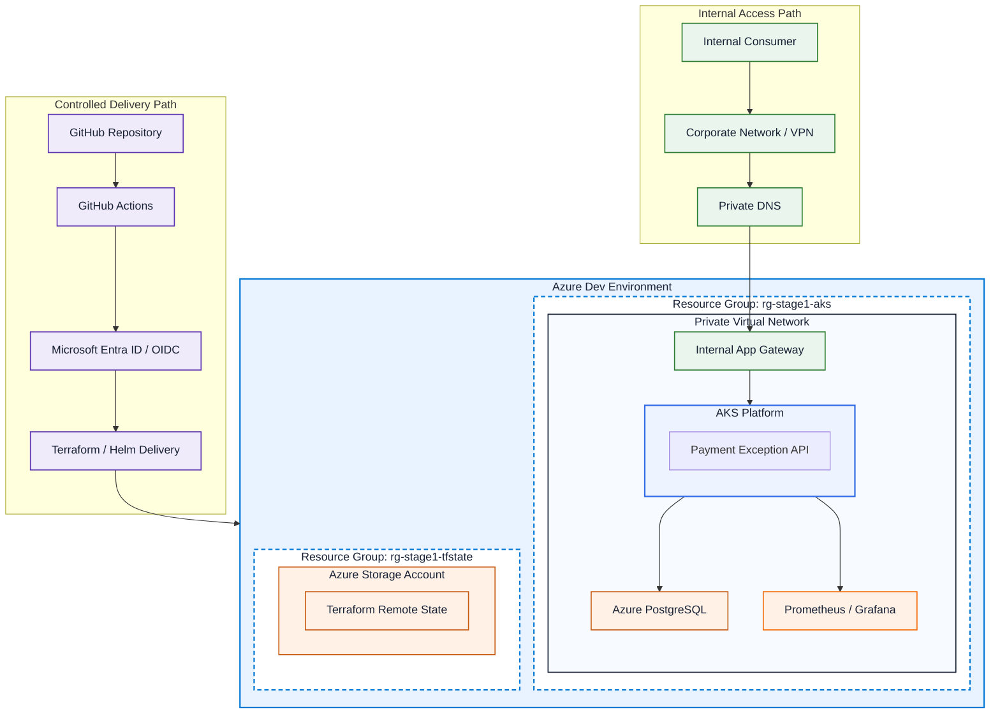

```mermaid
flowchart TB

  %% =========================
  %% External / Control Paths
  %% =========================

  subgraph DELIVERY["Controlled Delivery Path"]
    GH["GitHub Repository"]
    GHA["GitHub Actions"]
    ENTRA["Microsoft Entra ID / OIDC"]
    DELIVERY_PATH["Terraform / Helm Delivery"]

    GH --> GHA
    GHA --> ENTRA
    ENTRA --> DELIVERY_PATH
  end

  subgraph ACCESS["Internal Access Path"]
    CONSUMER["Internal Consumer"]
    CORP["Corporate Network / VPN"]
    DNS["Private DNS"]

    CONSUMER --> CORP
    CORP --> DNS
  end

  %% =========================
  %% Azure Environment
  %% =========================

  subgraph AZURE["Azure Dev Environment"]
    direction TB

    subgraph RG_AKS["Resource Group: rg-stage1-aks"]
      direction TB

      subgraph VNET["Private Virtual Network"]
        direction LR

        APPGW["Internal App Gateway"]

        subgraph AKS["AKS Platform"]
          direction TB
          API["Payment Exception API"]
        end

        POSTGRES["Azure PostgreSQL"]

        OBS["Prometheus / Grafana"]

        APPGW --> AKS
        AKS --> POSTGRES
        AKS --> OBS
      end
    end

    subgraph RG_TFSTATE["Resource Group: rg-stage1-tfstate"]
      direction TB

      subgraph STORAGE["Azure Storage Account"]
        TFSTATE["Terraform Remote State"]
      end
    end
  end

  %% =========================
  %% Path Entry Points
  %% =========================

  DELIVERY_PATH --> AZURE
  DNS --> APPGW

  %% =========================
  %% Styling
  %% =========================

  classDef azure fill:#e8f3ff,stroke:#0078d4,stroke-width:2px,color:#172033;
  classDef rg fill:#ffffff,stroke:#0078d4,stroke-width:2px,stroke-dasharray: 6 4,color:#172033;
  classDef vnet fill:#f7faff,stroke:#172033,stroke-width:1.5px,color:#172033;
  classDef aks fill:#eef4ff,stroke:#326ce5,stroke-width:2px,color:#172033;
  classDef delivery fill:#f0ebfb,stroke:#5e35b1,stroke-width:1.5px,color:#172033;
  classDef access fill:#eaf6ed,stroke:#2e7d32,stroke-width:1.5px,color:#172033;
  classDef data fill:#fff1e6,stroke:#c75b12,stroke-width:1.5px,color:#172033;
  classDef obs fill:#fff1e6,stroke:#f46800,stroke-width:1.5px,color:#172033;

  class AZURE azure;
  class RG_AKS,RG_TFSTATE rg;
  class VNET vnet;
  class AKS aks;
  class GH,GHA,ENTRA,DELIVERY_PATH delivery;
  class CONSUMER,CORP,DNS,APPGW access;
  class POSTGRES,STORAGE,TFSTATE data;
  class OBS obs;
```