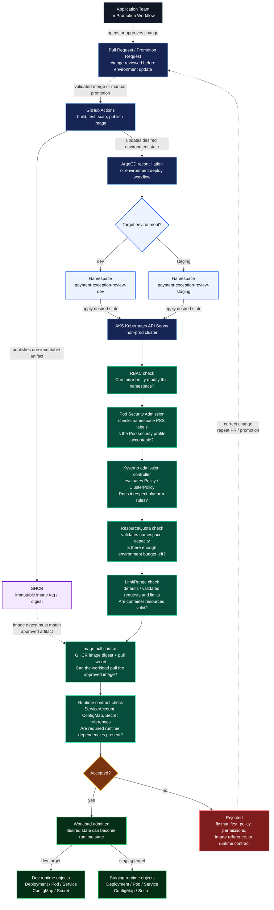

```mermaid
flowchart TD
  %% =========================================================
  %% STAGE 2 — AKS NON-PROD WORKLOAD ADMISSION GOVERNANCE FLOW
  %% =========================================================
  %% Scope:
  %% - Shows what happens before a workload is allowed to run in AKS non-prod.
  %% - Covers dev and staging promotion admission.
  %% - Complements the AKS non-prod runtime architecture diagram.
  %% - This is not HTTP/JDBC/runtime traffic.
  %% =========================================================

  ACTOR["Application Team<br/>or Promotion Workflow"]

  PR["Pull Request / Promotion Request<br/>change reviewed before environment update"]

  CI["GitHub Actions<br/>build, test, scan, publish image"]

  GHCR["GHCR<br/>immutable image tag / digest"]

  GITOPS["ArgoCD reconciliation<br/>or environment deploy workflow"]

  TARGET{"Target environment?"}

  DEV_NS["Namespace<br/>payment-exception-review-dev"]

  STAGING_NS["Namespace<br/>payment-exception-review-staging"]

  API["AKS Kubernetes API Server<br/>non-prod cluster"]

  RBAC["RBAC check<br/>Can this identity modify this namespace?"]

  PSA["Pod Security Admission<br/>checks namespace PSS labels<br/>Is the Pod security profile acceptable?"]

  KYVERNO["Kyverno admission controller<br/>evaluates Policy / ClusterPolicy<br/>Does it respect platform rules?"]

  QUOTA["ResourceQuota check<br/>validates namespace capacity<br/>Is there enough environment budget left?"]

  LIMITS["LimitRange check<br/>defaults / validates requests and limits<br/>Are container resources valid?"]

  IMAGE_PULL["Image pull contract<br/>GHCR image digest + pull secret<br/>Can the workload pull the approved image?"]

  SA_SECRET["Runtime contract check<br/>ServiceAccount, ConfigMap, Secret references<br/>Are required runtime dependencies present?"]

  DECISION{"Accepted?"}

  REJECT["Rejected<br/>fix manifest, policy, permissions,<br/>image reference, or runtime contract"]

  ADMITTED["Workload admitted<br/>desired state can become runtime state"]

  DEV_RUNTIME["Dev runtime objects<br/>Deployment / Pod / Service<br/>ConfigMap / Secret"]

  STAGING_RUNTIME["Staging runtime objects<br/>Deployment / Pod / Service<br/>ConfigMap / Secret"]

  %% =========================================================
  %% Promotion and admission flow
  %% =========================================================

  ACTOR -->|"opens or approves change"| PR
  PR -->|"validated merge or manual promotion"| CI
  CI -->|"publishes one immutable artifact"| GHCR
  CI -->|"updates desired environment state"| GITOPS

  GITOPS --> TARGET
  TARGET -->|"dev"| DEV_NS
  TARGET -->|"staging"| STAGING_NS

  DEV_NS -->|"apply desired state"| API
  STAGING_NS -->|"apply desired state"| API

  API --> RBAC
  RBAC --> PSA
  PSA --> KYVERNO
  KYVERNO --> QUOTA
  QUOTA --> LIMITS
  LIMITS --> IMAGE_PULL
  IMAGE_PULL --> SA_SECRET
  SA_SECRET --> DECISION

  GHCR -.->|"image digest must match<br/>approved artifact"| IMAGE_PULL

  DECISION -->|"yes"| ADMITTED
  ADMITTED -->|"dev target"| DEV_RUNTIME
  ADMITTED -->|"staging target"| STAGING_RUNTIME

  DECISION -->|"no"| REJECT
  REJECT -.->|"correct change<br/>repeat PR / promotion"| PR

  %% =========================================================
  %% Notes:
  %% - A single rejection branch keeps the diagram readable.
  %% - Any failed check can reject the request before the workload starts.
  %% - Dev and staging share the same governance chain, but use separate
  %%   namespaces, values, secrets, quotas, and promotion evidence.
  %% - Production approval belongs to the prod promotion flow, not this
  %%   non-prod admission diagram.
  %% =========================================================

  classDef actor fill:#111827,stroke:#ffffff,color:#ffffff,stroke-width:2px;
  classDef ci fill:#172554,stroke:#93c5fd,color:#ffffff,stroke-width:2px;
  classDef artifact fill:#f3e8ff,stroke:#7e22ce,color:#151922,stroke-width:2px;
  classDef env fill:#eef4ff,stroke:#2563eb,color:#151922,stroke-width:2px;
  classDef control fill:#064e3b,stroke:#34d399,color:#ffffff,stroke-width:2px;
  classDef decision fill:#78350f,stroke:#f59e0b,color:#ffffff,stroke-width:2px;
  classDef rejected fill:#7f1d1d,stroke:#f87171,color:#ffffff,stroke-width:2px;
  classDef runtime fill:#052e16,stroke:#22c55e,color:#ffffff,stroke-width:2px;

  class ACTOR actor;
  class PR,CI,GITOPS,API ci;
  class GHCR artifact;
  class TARGET,DEV_NS,STAGING_NS env;
  class RBAC,PSA,KYVERNO,QUOTA,LIMITS,IMAGE_PULL,SA_SECRET control;
  class DECISION decision;
  class REJECT rejected;
  class ADMITTED,DEV_RUNTIME,STAGING_RUNTIME runtime;
```
