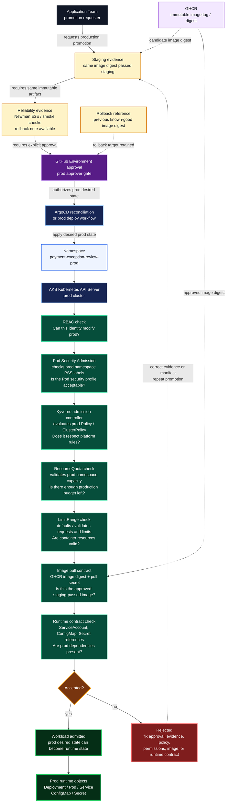

```mermaid
flowchart TD
  %% =========================================================
  %% STAGE 2 — AKS PROD WORKLOAD ADMISSION GOVERNANCE FLOW
  %% =========================================================
  %% Scope:
  %% - Shows what must happen before a workload is allowed to run in AKS prod.
  %% - Focuses on production promotion, approval, and admission controls.
  %% - Complements the AKS prod runtime architecture diagram.
  %% - This is not HTTP/JDBC/runtime traffic.
  %% =========================================================

  ACTOR["Application Team<br/>promotion requester"]

  STAGING["Staging evidence<br/>same image digest passed staging"]

  E2E["Reliability evidence<br/>Newman E2E / smoke checks<br/>rollback note available"]

  APPROVAL["GitHub Environment approval<br/>prod approver gate"]

  GHCR["GHCR<br/>immutable image tag / digest"]

  GITOPS["ArgoCD reconciliation<br/>or prod deploy workflow"]

  PROD_NS["Namespace<br/>payment-exception-review-prod"]

  API["AKS Kubernetes API Server<br/>prod cluster"]

  RBAC["RBAC check<br/>Can this identity modify prod?"]

  PSA["Pod Security Admission<br/>checks prod namespace PSS labels<br/>Is the Pod security profile acceptable?"]

  KYVERNO["Kyverno admission controller<br/>evaluates prod Policy / ClusterPolicy<br/>Does it respect platform rules?"]

  QUOTA["ResourceQuota check<br/>validates prod namespace capacity<br/>Is there enough production budget left?"]

  LIMITS["LimitRange check<br/>defaults / validates requests and limits<br/>Are container resources valid?"]

  IMAGE_PULL["Image pull contract<br/>GHCR image digest + pull secret<br/>Is this the approved staging-passed image?"]

  SECRET_CONTRACT["Runtime contract check<br/>ServiceAccount, ConfigMap, Secret references<br/>Are prod dependencies present?"]

  DECISION{"Accepted?"}

  REJECT["Rejected<br/>fix approval, evidence, policy,<br/>permissions, image, or runtime contract"]

  ADMITTED["Workload admitted<br/>prod desired state can become runtime state"]

  PROD_RUNTIME["Prod runtime objects<br/>Deployment / Pod / Service<br/>ConfigMap / Secret"]

  ROLLBACK["Rollback reference<br/>previous known-good image digest"]

  %% =========================================================
  %% Production promotion and admission flow
  %% =========================================================

  ACTOR -->|"requests production promotion"| STAGING
  STAGING -->|"requires same immutable artifact"| E2E
  E2E -->|"requires explicit approval"| APPROVAL
  APPROVAL -->|"authorizes prod desired state"| GITOPS

  GHCR -.->|"candidate image digest"| STAGING
  GHCR -.->|"approved image digest"| IMAGE_PULL
  ROLLBACK -.->|"rollback target retained"| APPROVAL

  GITOPS -->|"apply desired prod state"| PROD_NS
  PROD_NS --> API

  API --> RBAC
  RBAC --> PSA
  PSA --> KYVERNO
  KYVERNO --> QUOTA
  QUOTA --> LIMITS
  LIMITS --> IMAGE_PULL
  IMAGE_PULL --> SECRET_CONTRACT
  SECRET_CONTRACT --> DECISION

  DECISION -->|"yes"| ADMITTED
  ADMITTED --> PROD_RUNTIME

  DECISION -->|"no"| REJECT
  REJECT -.->|"correct evidence or manifest<br/>repeat promotion"| STAGING

  %% =========================================================
  %% Notes:
  %% - A single rejection branch keeps the diagram readable.
  %% - Any failed check can reject the request before the workload starts.
  %% - Prod promotion must reuse the image digest that passed staging.
  %% - Prod approval is modeled as a promotion gate before Kubernetes admission.
  %% - Break-glass access and emergency operations belong in separate runbooks.
  %% =========================================================

  classDef actor fill:#111827,stroke:#ffffff,color:#ffffff,stroke-width:2px;
  classDef evidence fill:#fef3c7,stroke:#d97706,color:#151922,stroke-width:2px;
  classDef approval fill:#581c87,stroke:#d8b4fe,color:#ffffff,stroke-width:2px;
  classDef artifact fill:#f3e8ff,stroke:#7e22ce,color:#151922,stroke-width:2px;
  classDef ci fill:#172554,stroke:#93c5fd,color:#ffffff,stroke-width:2px;
  classDef env fill:#eef4ff,stroke:#2563eb,color:#151922,stroke-width:2px;
  classDef control fill:#064e3b,stroke:#34d399,color:#ffffff,stroke-width:2px;
  classDef decision fill:#78350f,stroke:#f59e0b,color:#ffffff,stroke-width:2px;
  classDef rejected fill:#7f1d1d,stroke:#f87171,color:#ffffff,stroke-width:2px;
  classDef runtime fill:#052e16,stroke:#22c55e,color:#ffffff,stroke-width:2px;

  class ACTOR actor;
  class STAGING,E2E,ROLLBACK evidence;
  class APPROVAL approval;
  class GHCR artifact;
  class GITOPS,API ci;
  class PROD_NS env;
  class RBAC,PSA,KYVERNO,QUOTA,LIMITS,IMAGE_PULL,SECRET_CONTRACT control;
  class DECISION decision;
  class REJECT rejected;
  class ADMITTED,PROD_RUNTIME runtime;
```
