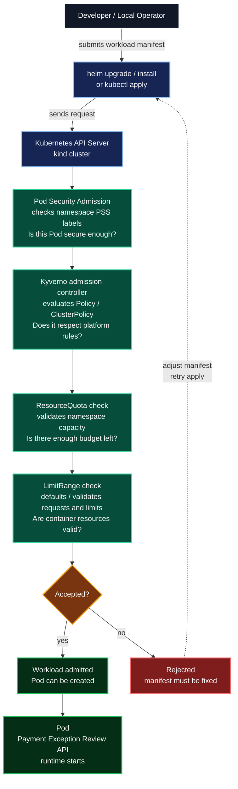

```mermaid
flowchart TD
  %% =========================================================
  %% STAGE 2 — LOCAL WORKLOAD ADMISSION FLOW
  %% =========================================================
  %% Scope:
  %% - Lightweight local rehearsal of Stage 2 governance.
  %% - Shows what happens before a workload is allowed to run.
  %% - Complements the local runtime architecture diagram.
  %% =========================================================

  DEV["Developer / Local Operator"]

  APPLY["helm upgrade / install<br/>or kubectl apply"]

  API["Kubernetes API Server<br/>kind cluster"]

  PSA["Pod Security Admission<br/>checks namespace PSS labels<br/>Is this Pod secure enough?"]

  KYVERNO["Kyverno admission controller<br/>evaluates Policy / ClusterPolicy<br/>Does it respect platform rules?"]

  QUOTA["ResourceQuota check<br/>validates namespace capacity<br/>Is there enough budget left?"]

  LIMITS["LimitRange check<br/>defaults / validates requests and limits<br/>Are container resources valid?"]

  DECISION{"Accepted?"}

  REJECT["Rejected<br/>manifest must be fixed"]

  RUN["Workload admitted<br/>Pod can be created"]

  APP_POD["Pod<br/>Payment Exception Review API<br/>runtime starts"]

  %% =========================================================
  %% Admission flow
  %% =========================================================

  DEV -->|"submits workload manifest"| APPLY
  APPLY -->|"sends request"| API
  API --> PSA
  PSA --> KYVERNO
  KYVERNO --> QUOTA
  QUOTA --> LIMITS
  LIMITS --> DECISION

  DECISION -->|"yes"| RUN
  RUN --> APP_POD

  DECISION -->|"no"| REJECT
  REJECT -.->|"adjust manifest<br/>retry apply"| APPLY

  %% =========================================================
  %% Notes:
  %% - This is not runtime traffic.
  %% - It happens before Service -> Pod or Pod -> PostgreSQL interactions.
  %% - securityContext is part of the Pod spec validated by admission controls.
  %% - A single rejection branch keeps the diagram readable; any failed check
  %%   can reject the request before the workload starts.
  %% =========================================================

  classDef actor fill:#111827,stroke:#ffffff,color:#ffffff,stroke-width:2px;
  classDef command fill:#172554,stroke:#93c5fd,color:#ffffff,stroke-width:2px;
  classDef control fill:#064e3b,stroke:#34d399,color:#ffffff,stroke-width:2px;
  classDef decision fill:#78350f,stroke:#f59e0b,color:#ffffff,stroke-width:2px;
  classDef rejected fill:#7f1d1d,stroke:#f87171,color:#ffffff,stroke-width:2px;
  classDef runtime fill:#052e16,stroke:#22c55e,color:#ffffff,stroke-width:2px;

  class DEV actor;
  class APPLY,API command;
  class PSA,KYVERNO,QUOTA,LIMITS control;
  class DECISION decision;
  class REJECT rejected;
  class RUN,APP_POD runtime;
```
