# Stage 2 Platform Control-Plane Architecture

This diagram shows the tools that manage desired state, infrastructure,
policies, secrets, and operational automation.

It is intentionally separated from the runtime diagrams. These tools influence
what runs on the platform, but they are not part of the normal HTTP request path
between a consumer, the Spring Boot service, and PostgreSQL.

```mermaid
flowchart LR
  %% =========================================================
  %% STAGE 2 — PLATFORM CONTROL-PLANE ARCHITECTURE
  %% =========================================================
  %% Scope:
  %% - Desired-state management.
  %% - Infrastructure provisioning.
  %% - GitOps reconciliation direction.
  %% - Secrets governance direction.
  %% - Policy/admission guardrails.
  %% - Operational automation.
  %% - Not a runtime request-flow diagram.
  %% =========================================================

  PLATFORM_TEAM["Platform Team"]
  INFRA_TEAM["Infrastructure Team"]
  APP_TEAM["Application Team"]
  SRE_TEAM["SRE / Production Engineering"]

  subgraph GIT["GitHub Repository<br/>single source of change"]
    direction TB

    INFRA_CODE["infrastructure/<br/>Terraform modules<br/>Terragrunt environment wiring"]
    PLATFORM_CODE["platform/<br/>Kubernetes resources<br/>Helm / Kustomize desired state"]
    APP_CODE["application/<br/>Spring Boot service<br/>Dockerfile / Helm chart"]
    RELIABILITY_CODE["reliability/<br/>runbooks, E2E, rollback evidence"]
    POLICY_CODE["policy direction<br/>Kyverno policies<br/>security guardrails"]
    SECRET_CONTRACTS["secret contracts<br/>Vault paths / Kubernetes Secret names"]
  end

  subgraph CI["GitHub Actions<br/>validation and orchestration"]
    direction TB

    PR_GATES["PR governance gates<br/>naming, reviews, issue link"]
    CI_PIPELINE["Application CI<br/>build, test, scan, publish image"]
    INFRA_PIPELINE["Infrastructure workflow<br/>Terraform / Terragrunt plan/apply"]
    PLATFORM_PIPELINE["Platform workflow<br/>validate / apply platform baseline"]
    PROMOTION_PIPELINE["Promotion workflow<br/>dev -> staging -> prod approval"]
  end

  subgraph REGISTRY["Artifact Registry"]
    direction TB

    GHCR["GHCR<br/>immutable image digest"]
  end

  subgraph INFRA_CP["Infrastructure Control Plane"]
    direction TB

    TERRAFORM["Terraform<br/>Azure resource provisioning"]
    TERRAGRUNT["Terragrunt direction<br/>environment state wiring"]
    AZURE["Azure<br/>resource groups, AKS, PostgreSQL,<br/>Private DNS, networking"]
  end

  subgraph PLATFORM_CP["Platform Control Plane"]
    direction TB

    ARGOCD["Argo CD direction<br/>GitOps reconciliation"]
    HELM["Helm<br/>package / release model"]
    KUSTOMIZE["Kustomize<br/>ConfigMaps, overlays, dashboard resources"]
    KUBE_API["Kubernetes API Server<br/>desired state admission point"]
    KYVERNO["Kyverno<br/>policy-as-code admission guardrails"]
    VAULT["HashiCorp Vault direction<br/>centralized secret governance"]
    SECRET_SYNC["External Secrets / Vault Agent direction<br/>secret delivery pattern"]
    ANSIBLE["Ansible direction<br/>bootstrap helpers / operational automation"]
  end

  subgraph TARGETS["Runtime Targets"]
    direction TB

    AKS_NONPROD["AKS non-prod<br/>dev + staging namespaces"]
    AKS_PROD["AKS prod<br/>prod namespace"]
    OPENSHIFT_SANDBOX["OpenShift Sandbox<br/>compatibility lab"]
    K8S_SECRETS["Kubernetes Secrets<br/>runtime secret objects"]
    POLICIED_WORKLOADS["Accepted workloads<br/>Pods, Services, Ingress, ConfigMaps"]
  end

  %% =========================================================
  %% Ownership and source flows
  %% =========================================================

  INFRA_TEAM -->|"owns cloud foundation changes"| INFRA_CODE
  PLATFORM_TEAM -->|"owns platform desired state"| PLATFORM_CODE
  PLATFORM_TEAM -->|"owns policy guardrails"| POLICY_CODE
  PLATFORM_TEAM -->|"defines secret delivery contracts"| SECRET_CONTRACTS
  APP_TEAM -->|"owns service source and chart"| APP_CODE
  SRE_TEAM -->|"owns operational evidence"| RELIABILITY_CODE

  INFRA_CODE --> INFRA_PIPELINE
  PLATFORM_CODE --> PLATFORM_PIPELINE
  APP_CODE --> CI_PIPELINE
  RELIABILITY_CODE --> PROMOTION_PIPELINE
  POLICY_CODE --> PLATFORM_PIPELINE
  SECRET_CONTRACTS --> PLATFORM_PIPELINE

  PR_GATES -->|"controls merge quality"| GIT
  CI_PIPELINE -->|"publishes immutable image"| GHCR
  PROMOTION_PIPELINE -->|"promotes same image digest"| GHCR

  %% =========================================================
  %% Infrastructure control-plane flows
  %% =========================================================

  INFRA_PIPELINE --> TERRAFORM
  INFRA_PIPELINE -.->|"environment wiring direction"| TERRAGRUNT
  TERRAGRUNT -.->|"selects env state / inputs"| TERRAFORM
  TERRAFORM -->|"provisions / updates"| AZURE
  AZURE -->|"hosts"| AKS_NONPROD
  AZURE -->|"hosts"| AKS_PROD

  %% =========================================================
  %% Platform desired-state flows
  %% =========================================================

  PLATFORM_PIPELINE -->|"validates manifests and policies"| KUBE_API
  PLATFORM_CODE -->|"desired state source"| ARGOCD
  ARGOCD -->|"reconciles desired state"| KUBE_API
  HELM -->|"renders releases"| KUBE_API
  KUSTOMIZE -->|"generates / overlays resources"| KUBE_API

  KUBE_API -->|"admission request"| KYVERNO
  KYVERNO -->|"accepts compliant resources"| POLICIED_WORKLOADS
  KYVERNO -.->|"rejects non-compliant resources"| PLATFORM_PIPELINE

  KUBE_API -->|"applies resources to"| AKS_NONPROD
  KUBE_API -->|"applies resources to"| AKS_PROD
  KUBE_API -.->|"compatibility apply / validation"| OPENSHIFT_SANDBOX

  %% =========================================================
  %% Secrets governance flows
  %% =========================================================

  VAULT -->|"governs secret values / policies"| SECRET_SYNC
  SECRET_CONTRACTS -.->|"defines names and expected keys"| SECRET_SYNC
  SECRET_SYNC -->|"creates or refreshes"| K8S_SECRETS
  K8S_SECRETS -->|"mounted / env consumed by"| POLICIED_WORKLOADS

  %% =========================================================
  %% Operational automation flows
  %% =========================================================

  ANSIBLE -.->|"bootstrap helper direction"| PLATFORM_PIPELINE
  ANSIBLE -.->|"runbook automation direction"| RELIABILITY_CODE
  PROMOTION_PIPELINE -->|"deploy / promote accepted image"| KUBE_API
  PROMOTION_PIPELINE -->|"requires staging evidence and prod approval"| RELIABILITY_CODE

  %% =========================================================
  %% Architecture notes
  %% =========================================================
  %% Argo CD, Vault, Kyverno, Ansible, Terraform, and Terragrunt are drawn here
  %% because they are control-plane tools. They should not be forced into the
  %% normal runtime diagram unless they are directly involved in that specific
  %% flow.
  %%
  %% Stage 2 does not need to implement every direction fully at the same time.
  %% This diagram shows the target control-plane shape used to place each
  %% technology in the correct architectural concern.
  %%
  %% Runtime diagrams answer "what calls what while the service is running".
  %% This diagram answers "what manages, validates, reconciles, provisions, or
  %% automates the platform".

  %% =========================================================
  %% Styles
  %% =========================================================

  classDef team fill:#111827,stroke:#ffffff,color:#ffffff,stroke-width:2px;
  classDef git fill:#f8fafc,stroke:#334155,color:#172033,stroke-width:2px;
  classDef ci fill:#eef2ff,stroke:#4f46e5,color:#172033,stroke-width:2px;
  classDef registry fill:#ecfeff,stroke:#0891b2,color:#172033,stroke-width:2px;
  classDef infra fill:#e8f3ff,stroke:#0078d4,color:#172033,stroke-width:2px;
  classDef platform fill:#f0fdf4,stroke:#16a34a,color:#172033,stroke-width:2px;
  classDef security fill:#fff7ed,stroke:#ea580c,color:#172033,stroke-width:2px;
  classDef target fill:#fefce8,stroke:#ca8a04,color:#172033,stroke-width:2px;

  class PLATFORM_TEAM,INFRA_TEAM,APP_TEAM,SRE_TEAM team;
  class GIT,INFRA_CODE,PLATFORM_CODE,APP_CODE,RELIABILITY_CODE,POLICY_CODE,SECRET_CONTRACTS git;
  class CI,PR_GATES,CI_PIPELINE,INFRA_PIPELINE,PLATFORM_PIPELINE,PROMOTION_PIPELINE ci;
  class REGISTRY,GHCR registry;
  class INFRA_CP,TERRAFORM,TERRAGRUNT,AZURE infra;
  class PLATFORM_CP,ARGOCD,HELM,KUSTOMIZE,KUBE_API,ANSIBLE platform;
  class KYVERNO,VAULT,SECRET_SYNC,K8S_SECRETS security;
  class TARGETS,AKS_NONPROD,AKS_PROD,OPENSHIFT_SANDBOX,POLICIED_WORKLOADS target;
```

