# Stage 2 Secrets Governance Flow

This diagram shows how Stage 2 should evolve from direct Kubernetes Secret usage
toward governed secret delivery with HashiCorp Vault.

It is separated from the runtime diagrams because secret governance is a
control-plane concern. The running application consumes a Kubernetes Secret at
runtime, but the ownership, rotation, and synchronization path belong to a
dedicated secrets architecture view.

```mermaid
flowchart LR
  %% =========================================================
  %% STAGE 2 — SECRETS GOVERNANCE FLOW
  %% =========================================================
  %% Scope:
  %% - Secret ownership and delivery direction.
  %% - Vault-centered governance.
  %% - Kubernetes runtime Secret consumption.
  %% - Not a normal HTTP request-flow diagram.
  %% =========================================================

  PLATFORM_TEAM["Platform Team"]
  SECURITY_IAM["Security / IAM Team"]
  APP_TEAM["Application Team"]
  SRE_TEAM["SRE / Production Engineering"]

  subgraph GOVERNANCE["Secret Governance"]
    direction TB

    SECRET_CONTRACT["Secret contract<br/>required keys, naming, env mapping"]
    VAULT_POLICY["Vault policy<br/>who can read/write which path"]
    ROTATION_RULE["Rotation rule<br/>frequency and emergency rotation direction"]
    AUDIT_TRAIL["Audit trail<br/>access and change evidence"]
  end

  subgraph VAULT_LAYER["HashiCorp Vault Direction"]
    direction TB

    VAULT["HashiCorp Vault<br/>central secret source of truth"]
    VAULT_PATH_DEV["Vault path<br/>stage2/dev/payment-review-db"]
    VAULT_PATH_STAGING["Vault path<br/>stage2/staging/payment-review-db"]
    VAULT_PATH_PROD["Vault path<br/>stage2/prod/payment-review-db"]
    K8S_AUTH["Kubernetes auth / workload identity direction<br/>cluster and namespace scoped access"]
  end

  subgraph SYNC_LAYER["Kubernetes Secret Delivery"]
    direction TB

    SECRET_SYNC["External Secrets Operator<br/>or Vault Agent direction"]
    DEV_K8S_SECRET["Kubernetes Secret<br/>payment-review-db-dev"]
    STG_K8S_SECRET["Kubernetes Secret<br/>payment-review-db-staging"]
    PROD_K8S_SECRET["Kubernetes Secret<br/>payment-review-db-prod"]
  end

  subgraph RUNTIME["Runtime Consumers"]
    direction TB

    DEV_APP["Application Pod<br/>dev runtime"]
    STG_APP["Application Pod<br/>staging runtime"]
    PROD_APP["Application Pod<br/>prod runtime"]
    AZURE_PG["Azure Database for PostgreSQL<br/>managed database dependency"]
  end

  subgraph OPERATIONS["Operational Use"]
    direction TB

    BREAK_GLASS["Break-glass direction<br/>exceptional access only"]
    ROTATION_RUNBOOK["Secret rotation runbook<br/>validate app restart / rollout"]
    INCIDENT_EVIDENCE["Incident evidence<br/>who changed what and when"]
  end

  %% =========================================================
  %% Ownership flows
  %% =========================================================

  APP_TEAM -->|"defines required runtime keys"| SECRET_CONTRACT
  PLATFORM_TEAM -->|"standardizes secret names and delivery pattern"| SECRET_CONTRACT
  SECURITY_IAM -->|"defines access policy"| VAULT_POLICY
  SECURITY_IAM -->|"defines rotation expectations"| ROTATION_RULE
  SRE_TEAM -->|"defines recovery evidence needed"| INCIDENT_EVIDENCE

  SECRET_CONTRACT -->|"maps expected keys to paths"| VAULT
  VAULT_POLICY -->|"restricts path access"| VAULT
  ROTATION_RULE -->|"drives secret lifecycle"| VAULT
  VAULT -->|"records access / changes"| AUDIT_TRAIL

  %% =========================================================
  %% Vault path separation
  %% =========================================================

  VAULT --> VAULT_PATH_DEV
  VAULT --> VAULT_PATH_STAGING
  VAULT --> VAULT_PATH_PROD
  K8S_AUTH -->|"authorizes namespace-scoped reads"| SECRET_SYNC

  VAULT_PATH_DEV -->|"syncs allowed keys"| SECRET_SYNC
  VAULT_PATH_STAGING -->|"syncs allowed keys"| SECRET_SYNC
  VAULT_PATH_PROD -->|"syncs allowed keys"| SECRET_SYNC

  %% =========================================================
  %% Runtime secret delivery
  %% =========================================================

  SECRET_SYNC -->|"creates / refreshes"| DEV_K8S_SECRET
  SECRET_SYNC -->|"creates / refreshes"| STG_K8S_SECRET
  SECRET_SYNC -->|"creates / refreshes"| PROD_K8S_SECRET

  DEV_K8S_SECRET -->|"env vars / mounted secret"| DEV_APP
  STG_K8S_SECRET -->|"env vars / mounted secret"| STG_APP
  PROD_K8S_SECRET -->|"env vars / mounted secret"| PROD_APP

  DEV_APP -->|"JDBC credentials used at runtime"| AZURE_PG
  STG_APP -->|"JDBC credentials used at runtime"| AZURE_PG
  PROD_APP -->|"JDBC credentials used at runtime"| AZURE_PG

  %% =========================================================
  %% Operations and rotation
  %% =========================================================

  BREAK_GLASS -.->|"exceptional access path"| VAULT_POLICY
  ROTATION_RUNBOOK -->|"updates / rotates secret value"| VAULT
  ROTATION_RUNBOOK -->|"validates rollout after refresh"| DEV_APP
  ROTATION_RUNBOOK -->|"validates rollout after refresh"| STG_APP
  ROTATION_RUNBOOK -->|"validates rollout after refresh"| PROD_APP
  AUDIT_TRAIL -->|"supports investigation"| INCIDENT_EVIDENCE

  %% =========================================================
  %% Architecture notes
  %% =========================================================
  %% Stage 1 used Kubernetes Secrets directly as the runtime object.
  %% Stage 2 keeps Kubernetes Secret as the runtime consumption object but adds
  %% a stronger governance direction around Vault, path separation, policy,
  %% synchronization, rotation, and audit evidence.
  %%
  %% The exact implementation can be External Secrets Operator or Vault Agent.
  %% The architecture intent is the same: the application does not own raw
  %% secret distribution. It consumes a runtime contract delivered by the
  %% platform/security model.
  %%
  %% This diagram intentionally does not show HTTP request traffic. The runtime
  %% diagrams already show the application using its Secret to connect to Azure
  %% PostgreSQL.

  %% =========================================================
  %% Styles
  %% =========================================================

  classDef team fill:#111827,stroke:#ffffff,color:#ffffff,stroke-width:2px;
  classDef governance fill:#f8fafc,stroke:#334155,color:#172033,stroke-width:2px;
  classDef vault fill:#fff7ed,stroke:#ea580c,color:#172033,stroke-width:2px;
  classDef secret fill:#fee2e2,stroke:#dc2626,color:#172033,stroke-width:2px;
  classDef runtime fill:#dcfce7,stroke:#16a34a,color:#172033,stroke-width:2px;
  classDef operations fill:#eef2ff,stroke:#4f46e5,color:#172033,stroke-width:2px;

  class PLATFORM_TEAM,SECURITY_IAM,APP_TEAM,SRE_TEAM team;
  class GOVERNANCE,SECRET_CONTRACT,VAULT_POLICY,ROTATION_RULE,AUDIT_TRAIL governance;
  class VAULT_LAYER,VAULT,VAULT_PATH_DEV,VAULT_PATH_STAGING,VAULT_PATH_PROD,K8S_AUTH vault;
  class SYNC_LAYER,SECRET_SYNC,DEV_K8S_SECRET,STG_K8S_SECRET,PROD_K8S_SECRET secret;
  class RUNTIME,DEV_APP,STG_APP,PROD_APP,AZURE_PG runtime;
  class OPERATIONS,BREAK_GLASS,ROTATION_RUNBOOK,INCIDENT_EVIDENCE operations;
```

