# Stage 2 Operational Architecture

This diagram shows how Stage 2 turns platform visibility into operational
evidence: SLO/SLI direction, metrics, logs, alerting, incident response,
rollback, MTTR measurement, and postmortem follow-up.

It is separated from runtime and promotion diagrams because the purpose is not
to show normal request traffic or CI/CD mechanics. The purpose is to show how
the service is observed, investigated, recovered, and improved.

```mermaid
flowchart LR
  %% =========================================================
  %% STAGE 2 — OPERATIONAL ARCHITECTURE
  %% =========================================================
  %% Scope:
  %% - SLO / SLI direction.
  %% - Metrics and log investigation.
  %% - Alert routing.
  %% - Incident response and rollback evidence.
  %% - MTTR and postmortem improvement loop.
  %% =========================================================

  CONSUMER["Internal Consumer<br/>or QA Tester"]
  SRE["SRE / Production Engineering"]
  APP_TEAM["Application Team"]
  PLATFORM_TEAM["Platform Team"]

  subgraph SERVICE["Payment Exception Review Service"]
    direction TB

    API["Spring Boot API<br/>runtime workload"]
    ACTUATOR["Actuator endpoints<br/>health, info, prometheus"]
    LOGS["Application logs<br/>stdout"]
    RUNTIME_EVENTS["Kubernetes events<br/>Pod restart, rollout, scheduling"]
  end

  subgraph SLO_MODEL["Service Reliability Model"]
    direction TB

    SLI_AVAILABILITY["Availability SLI<br/>health / successful requests direction"]
    SLI_LATENCY["Latency SLI<br/>p95 request latency direction"]
    SLI_ERRORS["Error SLI<br/>5xx / failed request direction"]
    SLO_TARGET["SLO target direction<br/>value decided by governance"]
    ERROR_BUDGET["Error budget direction<br/>future maturity"]
  end

  subgraph OBSERVABILITY["Observability Stack"]
    direction TB

    PROM["Prometheus<br/>metrics scrape and query"]
    ALERTMANAGER["Alertmanager<br/>alert routing"]
    GRAFANA["Grafana<br/>dashboards and SLO panels"]
    LOG_COLLECTOR["Log collector<br/>cluster log shipping"]
    ELASTIC["Elasticsearch<br/>log storage / search"]
    KIBANA["Kibana<br/>log investigation UI"]
  end

  subgraph INCIDENT["Incident Response"]
    direction TB

    ALERT["Alert<br/>symptom detected"]
    TRIAGE["Triage<br/>dashboard + logs + events"]
    RUNBOOK["Runbook<br/>diagnosis and mitigation steps"]
    ROLLBACK["Rollback action<br/>previous image / Helm release"]
    MTTR["MTTR measurement<br/>detect -> recover"]
    POSTMORTEM["Blameless postmortem<br/>timeline, cause, actions"]
    PREVENTION["Preventive action<br/>test, policy, alert, automation"]
  end

  subgraph EVIDENCE["Repository Evidence"]
    direction TB

    SLO_DOC["reliability/slos/<br/>service SLO notes"]
    ALERT_RULES["reliability/alerts/<br/>Prometheus rules"]
    RUNBOOK_DOCS["reliability/runbooks/<br/>rollback / investigation"]
    INCIDENT_DOCS["reliability/incidents/<br/>incident reports"]
    AUTOMATION["reliability/scripts/<br/>evidence collection / rollback"]
    E2E["reliability/testing/e2e/<br/>Postman + Newman staging evidence"]
  end

  %% =========================================================
  %% Runtime signal flows
  %% =========================================================

  CONSUMER -->|"uses service"| API
  API -->|"exposes"| ACTUATOR
  API -->|"writes"| LOGS
  API -->|"produces"| RUNTIME_EVENTS

  PROM -->|"scrapes /actuator/prometheus"| ACTUATOR
  PROM -->|"evaluates SLI queries"| SLI_AVAILABILITY
  PROM -->|"evaluates SLI queries"| SLI_LATENCY
  PROM -->|"evaluates SLI queries"| SLI_ERRORS

  SLI_AVAILABILITY --> SLO_TARGET
  SLI_LATENCY --> SLO_TARGET
  SLI_ERRORS --> SLO_TARGET
  SLO_TARGET -.->|"future budget tracking"| ERROR_BUDGET

  LOGS -->|"collected by"| LOG_COLLECTOR
  RUNTIME_EVENTS -.->|"investigated with kubectl / dashboards"| TRIAGE
  LOG_COLLECTOR -->|"ships logs"| ELASTIC
  KIBANA -->|"queries logs"| ELASTIC
  GRAFANA -->|"queries metrics"| PROM

  %% =========================================================
  %% Alert and incident flows
  %% =========================================================

  PROM -->|"fires alert rules"| ALERTMANAGER
  ALERTMANAGER -->|"routes alert"| ALERT
  ALERT -->|"notifies"| SRE

  SRE --> TRIAGE
  TRIAGE -->|"uses dashboards"| GRAFANA
  TRIAGE -->|"uses logs"| KIBANA
  TRIAGE -->|"checks runtime state"| RUNTIME_EVENTS
  TRIAGE --> RUNBOOK
  RUNBOOK --> ROLLBACK
  ROLLBACK -->|"restores known-good runtime"| API
  ROLLBACK --> MTTR
  MTTR --> POSTMORTEM
  POSTMORTEM --> PREVENTION

  %% =========================================================
  %% Ownership and evidence flows
  %% =========================================================

  PLATFORM_TEAM -->|"owns shared observability platform"| OBSERVABILITY
  SRE -->|"owns operational interpretation"| SLO_MODEL
  SRE -->|"owns runbooks and incident evidence"| EVIDENCE
  APP_TEAM -->|"owns application fixes"| PREVENTION
  PLATFORM_TEAM -->|"owns platform guardrail fixes"| PREVENTION

  SLO_MODEL -->|"documented in"| SLO_DOC
  PROM -->|"rules stored in"| ALERT_RULES
  RUNBOOK -->|"documented in"| RUNBOOK_DOCS
  POSTMORTEM -->|"stored in"| INCIDENT_DOCS
  PREVENTION -->|"may add automation"| AUTOMATION
  E2E -->|"promotion readiness evidence"| TRIAGE

  %% =========================================================
  %% Architecture notes
  %% =========================================================
  %% Stage 2 does not need final enterprise SLA/SLO numbers. Those values are
  %% usually provided by leadership, architecture, product ownership, or service
  %% governance. Stage 2 should document the SLI/SLO model, queries, evidence,
  %% and operational process.
  %%
  %% The strongest SRE portfolio signal is:
  %% incident -> SLI impact -> alert -> diagnosis -> recovery -> MTTR
  %% measurement -> postmortem -> preventive action.
  %%
  %% Postman/Newman staging E2E belongs under reliability because it is used as
  %% promotion evidence, while the application team still owns the API contract.

  %% =========================================================
  %% Styles
  %% =========================================================

  classDef actor fill:#111827,stroke:#ffffff,color:#ffffff,stroke-width:2px;
  classDef service fill:#dcfce7,stroke:#16a34a,color:#172033,stroke-width:2px;
  classDef slo fill:#fefce8,stroke:#ca8a04,color:#172033,stroke-width:2px;
  classDef obs fill:#ffedd5,stroke:#f97316,color:#172033,stroke-width:2px;
  classDef incident fill:#fee2e2,stroke:#dc2626,color:#172033,stroke-width:2px;
  classDef evidence fill:#eef2ff,stroke:#4f46e5,color:#172033,stroke-width:2px;

  class CONSUMER,SRE,APP_TEAM,PLATFORM_TEAM actor;
  class SERVICE,API,ACTUATOR,LOGS,RUNTIME_EVENTS service;
  class SLO_MODEL,SLI_AVAILABILITY,SLI_LATENCY,SLI_ERRORS,SLO_TARGET,ERROR_BUDGET slo;
  class OBSERVABILITY,PROM,ALERTMANAGER,GRAFANA,LOG_COLLECTOR,ELASTIC,KIBANA obs;
  class INCIDENT,ALERT,TRIAGE,RUNBOOK,ROLLBACK,MTTR,POSTMORTEM,PREVENTION incident;
  class EVIDENCE,SLO_DOC,ALERT_RULES,RUNBOOK_DOCS,INCIDENT_DOCS,AUTOMATION,E2E evidence;
```

