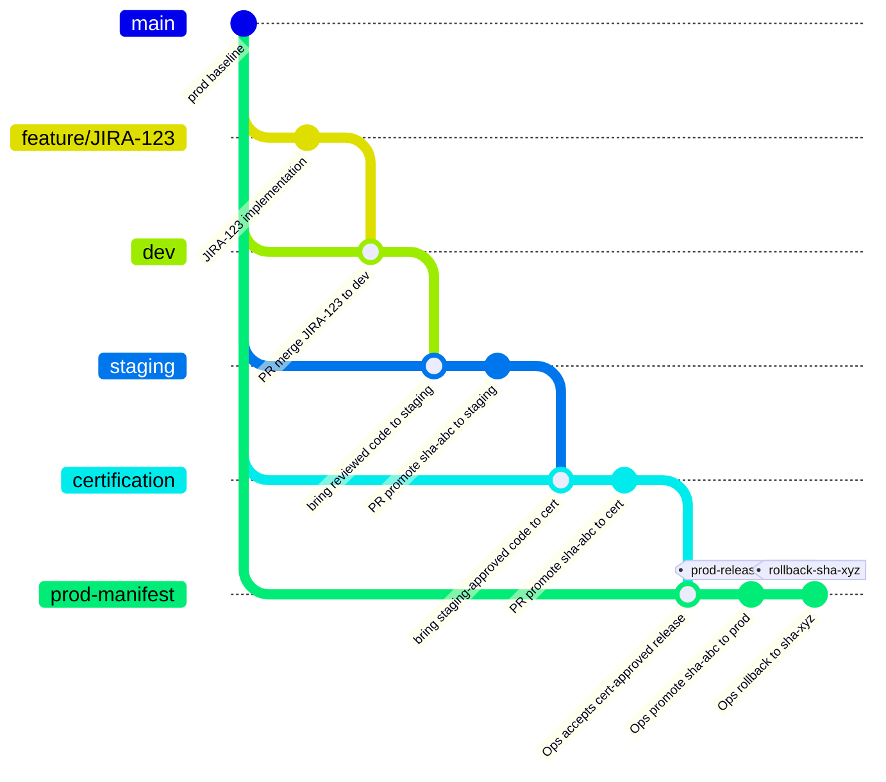

## Interpretation

This diagram represents the full governed promotion logic:

```text
dev -> staging -> certification -> prod-manifest
```

Stage 2 active path can still be:

```text
dev -> staging -> prod
```

because the `certification` environment is intentionally deferred to Stage 3.
The branch model keeps the future governance path visible without forcing Stage
2 to implement certification too early.

The production branch is intentionally shown as `prod-manifest`, not simply
`prod`, because production promotion is not treated as a developer pushing a
new application commit directly to production. Production is promoted by an Ops
or release owner through CI/CD by selecting an already-built image digest from
the container registry.

## Branch rules

- `feature/JIRA-123` contains the implementation commit.
- `dev` receives the implementation through a reviewed PR merge.
- `staging` receives the reviewed code plus a new promotion PR/commit that selects the staging image digest.
- `certification` receives the staging-approved code plus a new promotion PR/commit when the future certification environment exists.
- `prod-manifest` receives an Ops-controlled promotion commit that selects the approved image digest for production.
- Direct commits to `staging`, `certification`, and `prod` should be avoided.
- The application artifact is not rebuilt during promotion. The same GHCR image
  digest moves across environments.
- Production promotion is a deployment decision against the artifact, not a new
  application build.

## Gates attached to the promotion path

The following are promotion checks and evidence. They are not all Git commits:

- PR review and naming convention
- CI quality gates
- Checkmarx / Snyk / Trivy / Checkov / secret scanning
- GHCR immutable image digest
- QA demo and acceptance validation
- Newman E2E evidence on staging
- QA / PO approval
- GitHub Environment approval for production
- production smoke validation
- rollback digest retention

## Rollback model

Rollback is represented as a production manifest change back to the previous
known-good image digest:

```text
prod-manifest
  current:  sha-abc
  rollback: sha-xyz
```

That rollback should not rebuild the application. It should redeploy the
previous known-good image digest already stored in GHCR.

## Stage 2 shortcut

Until `certification` exists, Stage 2 can use:

```text
dev -> staging -> prod-manifest
```

with these controls:

- staging E2E evidence exists
- QA / PO approval exists
- GitHub Environment approval protects `prod`
- rollback target digest is retained
- release communication is captured
