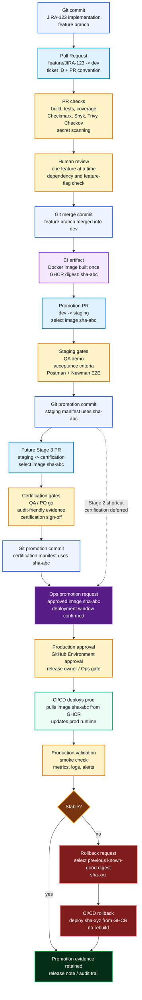

```mermaid
flowchart TD
  %% =========================================================
  %% STAGE 2 — GIT PR AND IMAGE PROMOTION FLOW
  %% =========================================================
  %% Scope:
  %% - Shows the difference between commits, pull requests, checks, merges,
  %%   image promotion, production deployment, and rollback.
  %% - Complements the gitGraph branch view.
  %% - This is a delivery governance flow, not runtime traffic.
  %% =========================================================

  FEATURE_COMMIT["Git commit<br/>JIRA-123 implementation<br/>feature branch"]

  DEV_PR["Pull Request<br/>feature/JIRA-123 -> dev<br/>ticket ID + PR convention"]

  DEV_CHECKS["PR checks<br/>build, tests, coverage<br/>Checkmarx, Snyk, Trivy, Checkov<br/>secret scanning"]

  DEV_REVIEW["Human review<br/>one feature at a time<br/>dependency and feature-flag check"]

  DEV_MERGE["Git merge commit<br/>feature branch merged into dev"]

  IMAGE["CI artifact<br/>Docker image built once<br/>GHCR digest: sha-abc"]

  STAGING_PR["Promotion PR<br/>dev -> staging<br/>select image sha-abc"]

  STAGING_CHECKS["Staging gates<br/>QA demo<br/>acceptance criteria<br/>Postman + Newman E2E"]

  STAGING_MERGE["Git promotion commit<br/>staging manifest uses sha-abc"]

  CERT_PR["Future Stage 3 PR<br/>staging -> certification<br/>select image sha-abc"]

  CERT_CHECKS["Certification gates<br/>QA / PO go<br/>audit-friendly evidence<br/>certification sign-off"]

  CERT_MERGE["Git promotion commit<br/>certification manifest uses sha-abc"]

  OPS_PROMOTION["Ops promotion request<br/>approved image sha-abc<br/>deployment window confirmed"]

  PROD_APPROVAL["Production approval<br/>GitHub Environment approval<br/>release owner / Ops gate"]

  PROD_DEPLOY["CI/CD deploys prod<br/>pulls image sha-abc from GHCR<br/>updates prod runtime"]

  PROD_VALIDATE["Production validation<br/>smoke check<br/>metrics, logs, alerts"]

  HEALTH{"Stable?"}

  ROLLBACK["Rollback request<br/>select previous known-good digest<br/>sha-xyz"]

  ROLLBACK_DEPLOY["CI/CD rollback<br/>deploy sha-xyz from GHCR<br/>no rebuild"]

  DONE["Promotion evidence retained<br/>release note / audit trail"]

  %% =========================================================
  %% Flow
  %% =========================================================

  FEATURE_COMMIT --> DEV_PR
  DEV_PR --> DEV_CHECKS
  DEV_CHECKS --> DEV_REVIEW
  DEV_REVIEW --> DEV_MERGE
  DEV_MERGE --> IMAGE

  IMAGE --> STAGING_PR
  STAGING_PR --> STAGING_CHECKS
  STAGING_CHECKS --> STAGING_MERGE

  STAGING_MERGE --> CERT_PR
  CERT_PR --> CERT_CHECKS
  CERT_CHECKS --> CERT_MERGE

  CERT_MERGE --> OPS_PROMOTION
  OPS_PROMOTION --> PROD_APPROVAL
  PROD_APPROVAL --> PROD_DEPLOY
  PROD_DEPLOY --> PROD_VALIDATE
  PROD_VALIDATE --> HEALTH

  HEALTH -->|"yes"| DONE
  HEALTH -->|"no"| ROLLBACK
  ROLLBACK --> ROLLBACK_DEPLOY
  ROLLBACK_DEPLOY --> DONE

  %% Stage 2 shortcut when certification is not implemented yet.
  STAGING_MERGE -.->|"Stage 2 shortcut<br/>certification deferred"| OPS_PROMOTION

  %% =========================================================
  %% Notes:
  %% - Rectangles labeled "Git commit" or "Git promotion commit" are commits.
  %% - Rectangles labeled "Pull Request" are PRs, not commits.
  %% - PR checks, QA gates, approvals, and evidence are controls.
  %% - Production promotion is Ops-controlled and deploys an existing GHCR
  %%   digest. It does not rebuild the application.
  %% - Rollback deploys a previous known-good digest from GHCR.
  %% =========================================================

  classDef commit fill:#eef4ff,stroke:#2563eb,color:#151922,stroke-width:2px;
  classDef pr fill:#e0f2fe,stroke:#0284c7,color:#151922,stroke-width:2px;
  classDef checks fill:#fef3c7,stroke:#d97706,color:#151922,stroke-width:2px;
  classDef artifact fill:#f3e8ff,stroke:#7e22ce,color:#151922,stroke-width:2px;
  classDef ops fill:#581c87,stroke:#d8b4fe,color:#ffffff,stroke-width:2px;
  classDef deploy fill:#ecfdf5,stroke:#059669,color:#151922,stroke-width:2px;
  classDef decision fill:#78350f,stroke:#f59e0b,color:#ffffff,stroke-width:2px;
  classDef rollback fill:#7f1d1d,stroke:#f87171,color:#ffffff,stroke-width:2px;
  classDef done fill:#052e16,stroke:#22c55e,color:#ffffff,stroke-width:2px;

  class FEATURE_COMMIT,DEV_MERGE,STAGING_MERGE,CERT_MERGE commit;
  class DEV_PR,STAGING_PR,CERT_PR pr;
  class DEV_CHECKS,DEV_REVIEW,STAGING_CHECKS,CERT_CHECKS,PROD_APPROVAL,PROD_VALIDATE checks;
  class IMAGE artifact;
  class OPS_PROMOTION ops;
  class PROD_DEPLOY deploy;
  class HEALTH decision;
  class ROLLBACK,ROLLBACK_DEPLOY rollback;
  class DONE done;
```
