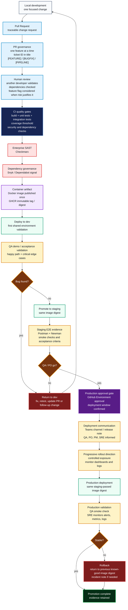

```mermaid
flowchart TD
  %% =========================================================
  %% STAGE 2 — PROMOTION GOVERNANCE FLOW
  %% =========================================================
  %% Scope:
  %% - Shows the controlled delivery path from local work to production.
  %% - Captures PR governance, CI/security gates, QA validation, approval,
  %%   rollout, rollback, and communication practices.
  %% - Complements runtime and admission diagrams.
  %% - This is not Kubernetes runtime traffic.
  %% =========================================================

  LOCAL["Local development<br/>one focused change"]

  PR["Pull Request<br/>traceable change request"]

  PR_RULES["PR governance<br/>one feature at a time<br/>ticket ID in title<br/>[FEATURE] / [BUGFIX] / [PIPELINE]"]

  REVIEW["Human review<br/>another developer validates<br/>dependencies checked<br/>feature flag considered when risk justifies it"]

  CI["CI quality gates<br/>build + unit tests + integration tests<br/>coverage threshold<br/>security and dependency checks"]

  SAST["Enterprise SAST<br/>Checkmarx"]

  SCA["Dependency governance<br/>Snyk / Dependabot signal"]

  IMAGE["Container artifact<br/>Docker image published once<br/>GHCR immutable tag / digest"]

  DEV["Deploy to dev<br/>first shared environment validation"]

  QA_DEMO["QA demo / acceptance validation<br/>happy path + critical edge cases"]

  BUG_DECISION{"Bug found?"}

  BACK_TO_DEV["Return to dev<br/>fix, retest, update PR or follow-up change"]

  STAGING["Promote to staging<br/>same image digest"]

  E2E["Staging E2E evidence<br/>Postman + Newman<br/>smoke checks and acceptance criteria"]

  QA_PO_GO{"QA / PO go?"}

  PROD_APPROVAL["Production approval gate<br/>GitHub Environment approval<br/>deployment window confirmed"]

  COMMS["Deployment communication<br/>Teams channel / release note<br/>QA, PO, PM, SRE informed"]

  CANARY["Progressive rollout direction<br/>controlled exposure<br/>monitor dashboards and logs"]

  PROD["Production deployment<br/>same staging-passed image digest"]

  PROD_VALIDATE["Production validation<br/>QA smoke check<br/>SRE monitors alerts, metrics, logs"]

  HEALTH_DECISION{"Stable?"}

  ROLLBACK["Rollback<br/>return to previous known-good image digest<br/>incident note if needed"]

  DONE["Promotion complete<br/>evidence retained"]

  %% =========================================================
  %% Flow
  %% =========================================================

  LOCAL --> PR
  PR --> PR_RULES
  PR_RULES --> REVIEW
  REVIEW --> CI

  CI --> SAST
  SAST --> SCA
  SCA --> IMAGE

  IMAGE --> DEV
  DEV --> QA_DEMO
  QA_DEMO --> BUG_DECISION

  BUG_DECISION -->|"yes"| BACK_TO_DEV
  BACK_TO_DEV --> LOCAL

  BUG_DECISION -->|"no"| STAGING
  STAGING --> E2E
  E2E --> QA_PO_GO

  QA_PO_GO -->|"no"| BACK_TO_DEV
  QA_PO_GO -->|"yes"| PROD_APPROVAL

  PROD_APPROVAL --> COMMS
  COMMS --> CANARY
  CANARY --> PROD
  PROD --> PROD_VALIDATE
  PROD_VALIDATE --> HEALTH_DECISION

  HEALTH_DECISION -->|"yes"| DONE
  HEALTH_DECISION -->|"no"| ROLLBACK
  ROLLBACK --> DONE

  %% =========================================================
  %% Notes:
  %% - Stage 2 uses dev -> staging -> prod.
  %% - Certification is intentionally deferred to Stage 3.
  %% - SonarQube from the original practice note is represented as Checkmarx
  %%   because Checkmarx is the selected Stage 2 enterprise SAST signal.
  %% - Canary is shown as a rollout direction, not as a fully implemented
  %%   traffic-splitting mechanism yet.
  %% - Kubernetes admission checks are detailed in separate admission diagrams.
  %% =========================================================

  classDef local fill:#f8fafc,stroke:#64748b,color:#151922,stroke-width:2px;
  classDef governance fill:#e0f2fe,stroke:#0284c7,color:#151922,stroke-width:2px;
  classDef ci fill:#172554,stroke:#93c5fd,color:#ffffff,stroke-width:2px;
  classDef security fill:#fee2e2,stroke:#dc2626,color:#151922,stroke-width:2px;
  classDef artifact fill:#f3e8ff,stroke:#7e22ce,color:#151922,stroke-width:2px;
  classDef env fill:#ecfdf5,stroke:#059669,color:#151922,stroke-width:2px;
  classDef qa fill:#fef3c7,stroke:#d97706,color:#151922,stroke-width:2px;
  classDef approval fill:#581c87,stroke:#d8b4fe,color:#ffffff,stroke-width:2px;
  classDef decision fill:#78350f,stroke:#f59e0b,color:#ffffff,stroke-width:2px;
  classDef rollback fill:#7f1d1d,stroke:#f87171,color:#ffffff,stroke-width:2px;
  classDef done fill:#052e16,stroke:#22c55e,color:#ffffff,stroke-width:2px;

  class LOCAL local;
  class PR,PR_RULES,REVIEW governance;
  class CI ci;
  class SAST,SCA security;
  class IMAGE artifact;
  class DEV,STAGING,PROD env;
  class QA_DEMO,E2E,PROD_VALIDATE,COMMS,CANARY qa;
  class PROD_APPROVAL approval;
  class BUG_DECISION,QA_PO_GO,HEALTH_DECISION decision;
  class BACK_TO_DEV,ROLLBACK rollback;
  class DONE done;
```
