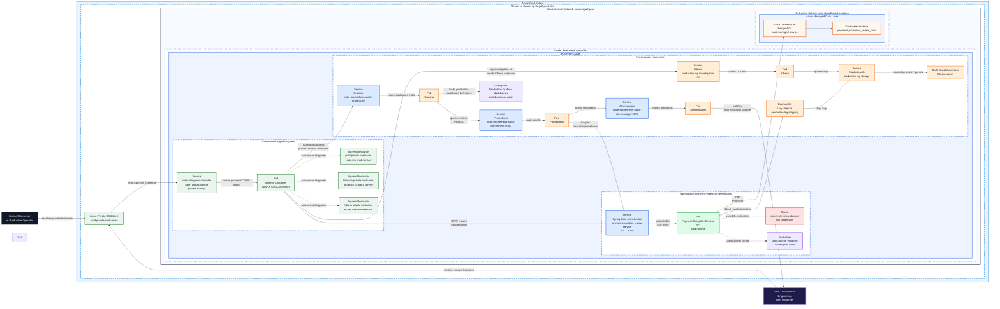

```mermaid
flowchart LR
  %% =========================================================
  %% STAGE 2 — AKS PROD HIGH-LEVEL RUNTIME ARCHITECTURE
  %% =========================================================
  %% Scope:
  %% - Runtime interactions only.
  %% - Shows the production AKS estate separately from non-prod.
  %% - Shows Azure PostgreSQL as the managed production database dependency.
  %% - Shows Azure resource group and private virtual network boundaries.
  %% - Excludes CI/CD promotion and admission governance flows.
  %% =========================================================

  CONSUMER["Internal Consumer<br/>or Production Operator"]
  SRE["SRE / Production Engineering<br/>alert responder"]

  subgraph AZURE["Azure Prod Estate"]
    direction LR

    subgraph RG_AKS["Resource Group: rg-stage2-prod-aks"]
      direction TB

      DNS_ZONE["Azure Private DNS Zone<br/>prod private hostnames"]

      subgraph VNET["Private Virtual Network: vnet-stage2-prod"]
        direction LR

        subgraph AKS_SUBNET["Subnet: snet-stage2-prod-aks"]
          direction TB

          subgraph AKS["AKS Prod Cluster"]
            direction TB

            subgraph INGRESS_NS["Namespace: ingress-system"]
              direction LR

              INGRESS_LB_SVC["Service<br/>internal ingress controller<br/>type: LoadBalancer<br/>private IP only"]
              INGRESS_CTRL_POD["Pod<br/>Ingress Controller<br/>NGINX / AGIC direction"]
              PROD_INGRESS["Ingress Resource<br/>prod private hostname<br/>routes to prod service"]
              GRAFANA_INGRESS["Ingress Resource<br/>Grafana private hostname<br/>routes to Grafana service"]
              KIBANA_INGRESS["Ingress Resource<br/>Kibana private hostname<br/>routes to Kibana service"]
            end

            subgraph PROD_NS["Namespace: payment-exception-review-prod"]
              direction LR

              PROD_APP_SVC["Service<br/>Spring Boot microservice<br/>payment-exception-review-service<br/>80 → 8080"]
              PROD_APP_POD["Pod<br/>Payment Exception Review API<br/>prod runtime"]
              PROD_SECRET["Secret<br/>payment-review-db-prod<br/>DB credentials"]
              PROD_CM["ConfigMap<br/>prod runtime variables<br/>values-prod.yaml"]
            end

            subgraph MON_NS["Namespace: monitoring"]
              direction LR

              PROM_SVC["Service<br/>Prometheus<br/>kube-prometheus-stack-prometheus:9090"]
              GRAFANA_SVC["Service<br/>Grafana<br/>kube-prometheus-stack-grafana:80"]
              PROM_POD["Pod<br/>Prometheus"]
              GRAFANA_POD["Pod<br/>Grafana"]
              DASH_CM["ConfigMap<br/>Production Grafana dashboards<br/>dashboards as code"]
              ALERT_SVC["Service<br/>Alertmanager<br/>kube-prometheus-stack-alertmanager:9093"]
              ALERT_POD["Pod<br/>Alertmanager"]
              LOG_AGENT["DaemonSet<br/>Log collector<br/>production log shipping"]
              ELASTIC_SVC["Service<br/>Elasticsearch<br/>production log storage"]
              ELASTIC_POD["Pod / Stateful workload<br/>Elasticsearch"]
              KIBANA_SVC["Service<br/>Kibana<br/>production log investigation UI"]
              KIBANA_POD["Pod<br/>Kibana"]
            end
          end
        end

        subgraph PG_SUBNET["Delegated Subnet: snet-stage2-prod-postgres"]
          direction TB

          subgraph DATA["Azure Managed Data Layer"]
            direction TB

            AZ_PG["Azure Database for PostgreSQL<br/>prod managed service"]
            PROD_DB["Database / schema<br/>payment_exception_review_prod"]
          end
        end
      end
    end
  end

  %% =========================================================
  %% Runtime request flows
  %% =========================================================

  CONSUMER -->|"resolves private hostname"| DNS_ZONE
  SRE -->|"resolves private hostname"| DNS_ZONE
  DNS_ZONE -->|"returns private ingress IP"| INGRESS_LB_SVC
  INGRESS_LB_SVC -->|"routes private HTTP(S) traffic"| INGRESS_CTRL_POD

  INGRESS_CTRL_POD -.->|"watches routing rules"| PROD_INGRESS
  INGRESS_CTRL_POD -.->|"watches routing rules"| GRAFANA_INGRESS
  INGRESS_CTRL_POD -.->|"watches routing rules"| KIBANA_INGRESS

  INGRESS_CTRL_POD -->|"HTTP request<br/>prod endpoint"| PROD_APP_SVC
  INGRESS_CTRL_POD -->|"dashboard access<br/>private Grafana hostname"| GRAFANA_SVC
  INGRESS_CTRL_POD -->|"log investigation UI<br/>private Kibana hostname"| KIBANA_SVC

  PROD_APP_SVC -->|"routes traffic<br/>TCP 8080"| PROD_APP_POD
  PROD_APP_POD -->|"JDBC<br/>TCP 5432"| AZ_PG
  AZ_PG --> PROD_DB

  %% =========================================================
  %% Configuration / secret dependencies
  %% Dashed lines = non-network dependency
  %% =========================================================

  PROD_APP_POD -.->|"uses DB credentials"| PROD_SECRET
  PROD_APP_POD -.->|"uses runtime config"| PROD_CM
  GRAFANA_POD -.->|"loads production dashboard definitions"| DASH_CM

  %% =========================================================
  %% Observability flows
  %% =========================================================

  GRAFANA_SVC -->|"routes dashboard traffic"| GRAFANA_POD
  GRAFANA_POD -->|"queries metrics<br/>PromQL"| PROM_SVC
  PROM_SVC -->|"routes traffic"| PROM_POD

  PROM_POD -->|"scrapes<br/>/actuator/prometheus"| PROD_APP_SVC
  PROM_POD -->|"sends firing alerts"| ALERT_SVC
  ALERT_SVC -->|"routes alert traffic"| ALERT_POD
  ALERT_POD -->|"notifies<br/>prod escalation channel"| SRE

  PROD_APP_POD -->|"stdout / application logs"| LOG_AGENT
  LOG_AGENT -->|"ships logs"| ELASTIC_SVC
  ELASTIC_SVC -->|"routes log writes / queries"| ELASTIC_POD
  KIBANA_SVC -->|"routes UI traffic"| KIBANA_POD
  KIBANA_POD -->|"queries logs"| ELASTIC_SVC

  %% =========================================================
  %% Architecture notes
  %% =========================================================
  %% Prod is intentionally separate from AKS non-prod. It should use a separate
  %% resource group, VNet/subnets, AKS cluster, PostgreSQL instance or database
  %% boundary, secrets, quotas, dashboards, and promotion approval path.
  %%
  %% Normal production access should not depend on kubectl port-forward.
  %% Port-forward is not drawn here because it is not the standard evidence path
  %% for production runtime access. Emergency break-glass access, if allowed,
  %% belongs in a separate operational access/runbook document.
  %%
  %% Stage 2 owns the platform-side private access resources: Azure Private DNS
  %% direction, internal ingress controller exposure, Kubernetes Ingress
  %% resources, and private AKS service exposure. Enterprise ZTNA/SASE/VPN
  %% products such as Palo Alto Prisma Access or GlobalProtect are Stage 3
  %% enterprise access architecture concerns.
  %%
  %% Grafana permissions protect UI actions, but they are not represented as a
  %% runtime Kubernetes component. Kubernetes RBAC and GitOps protect the source
  %% of truth: monitoring namespace resources, dashboard ConfigMaps,
  %% Prometheus rules, and reconciled desired state.
  %%
  %% Alertmanager is shown with a production escalation direction. The exact
  %% paging, ticketing, and SOC/ITSM integration belongs to later maturity work.
  %%
  %% Promotion, GitHub Actions, GHCR, Azure OIDC, Kyverno, PSS, ResourceQuota,
  %% and LimitRange are important Stage 2 controls, but they are not runtime
  %% HTTP/JDBC/observability interactions. They belong in separate delivery,
  %% admission, and promotion diagrams.

  %% =========================================================
  %% Styles
  %% =========================================================

  classDef actor fill:#111827,stroke:#ffffff,color:#ffffff,stroke-width:2px;
  classDef sre fill:#1e1b4b,stroke:#c4b5fd,color:#ffffff,stroke-width:2px;
  classDef access fill:#eaf6ed,stroke:#2e7d32,color:#172033,stroke-width:2px;
  classDef azure fill:#e8f3ff,stroke:#0078d4,color:#172033,stroke-width:2px;
  classDef rg fill:#ffffff,stroke:#0078d4,color:#172033,stroke-width:2px,stroke-dasharray: 8 4;
  classDef vnet fill:#f7faff,stroke:#172033,color:#172033,stroke-width:2px;
  classDef subnet fill:#ffffff,stroke:#64748b,color:#172033,stroke-width:1.5px,stroke-dasharray: 4 4;
  classDef cluster fill:#eef4ff,stroke:#326ce5,color:#172033,stroke-width:2px;
  classDef namespace fill:#ffffff,stroke:#326ce5,color:#172033,stroke-width:2px,stroke-dasharray: 6 4;
  classDef service fill:#dbeafe,stroke:#2563eb,color:#172033,stroke-width:2px;
  classDef pod fill:#dcfce7,stroke:#16a34a,color:#172033,stroke-width:2px;
  classDef data fill:#fff7ed,stroke:#ea580c,color:#172033,stroke-width:2px;
  classDef config fill:#ede9fe,stroke:#7c3aed,color:#172033,stroke-width:2px;
  classDef secret fill:#fee2e2,stroke:#dc2626,color:#172033,stroke-width:2px;
  classDef observability fill:#ffedd5,stroke:#f97316,color:#172033,stroke-width:2px;

  class CONSUMER actor;
  class SRE sre;
  class DNS_ZONE,INGRESS_LB_SVC,INGRESS_CTRL_POD,PROD_INGRESS,GRAFANA_INGRESS,KIBANA_INGRESS access;
  class AZURE azure;
  class RG_AKS rg;
  class VNET vnet;
  class AKS_SUBNET,PG_SUBNET subnet;
  class AKS cluster;
  class INGRESS_NS,PROD_NS,MON_NS namespace;
  class PROD_APP_SVC,PROM_SVC,GRAFANA_SVC,ALERT_SVC service;
  class PROD_APP_POD pod;
  class AZ_PG,PROD_DB data;
  class PROD_CM,DASH_CM config;
  class PROD_SECRET secret;
  class PROM_POD,GRAFANA_POD,ALERT_POD,LOG_AGENT,ELASTIC_SVC,ELASTIC_POD,KIBANA_SVC,KIBANA_POD observability;
```
