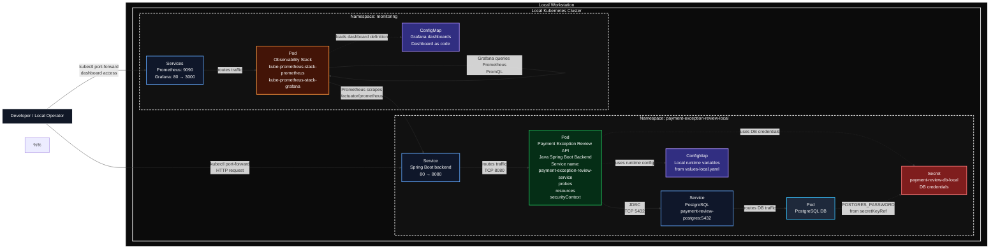

```mermaid
flowchart LR
  %% =========================================================
  %% STAGE 2 — LOCAL DEVELOPER RUNTIME TARGET ARCHITECTURE
  %% =========================================================
  %% Scope:
  %% - High-level developer-local runtime.
  %% - No dev/staging promotion rehearsal yet.
  %% - Keeps the Stage 1 runtime path readable.
  %% - Stage 2 guardrails are admission/deployment controls, not runtime traffic hops.
  %% =========================================================

  DEV["Developer / Local Operator"]

  subgraph WS["Local Workstation"]
    direction LR

    subgraph K8S["Local Kubernetes Cluster<br/>kind runtime"]
      direction TB

      subgraph APPNS["Namespace: payment-exception-review-local"]
        direction LR

        APP_SVC["Service<br/>Spring Boot backend<br/>80 → 8080"]

        APP_POD["Pod<br/>Payment Exception Review API<br/>Java Spring Boot Backend<br/>Service name:<br/>payment-exception-review-service<br/>probes<br/>resources<br/>securityContext"]

        PG_SVC["Service<br/>PostgreSQL<br/>payment-review-postgres:5432"]

        PG_POD["Pod<br/>PostgreSQL DB"]

        SECRET["Secret<br/>payment-review-db-local<br/>DB credentials"]

        APP_CM["ConfigMap<br/>Local runtime variables<br/>from values-local.yaml"]
      end

      subgraph MONNS["Namespace: monitoring"]
        direction LR

        MON_SVC["Services<br/>Prometheus: 9090<br/>Grafana: 80 → 3000"]

        OBS_POD["Pod<br/>Observability Stack<br/>kube-prometheus-stack-prometheus<br/>kube-prometheus-stack-grafana"]

        DASH_CM["ConfigMap<br/>Grafana dashboards<br/>Dashboard as code"]
      end
    end
  end

  %% =========================================================
  %% Runtime access flows
  %% =========================================================

  DEV -->|"kubectl port-forward<br/>HTTP request"| APP_SVC
  APP_SVC -->|"routes traffic<br/>TCP 8080"| APP_POD

  APP_POD -->|"JDBC<br/>TCP 5432"| PG_SVC
  PG_SVC -->|"routes DB traffic"| PG_POD

  DEV -->|"kubectl port-forward<br/>dashboard access"| MON_SVC
  MON_SVC -->|"routes traffic"| OBS_POD

  %% =========================================================
  %% Configuration / secret dependencies
  %% Dashed lines = non-network dependency
  %% =========================================================

  APP_POD -.->|"uses DB credentials"| SECRET
  PG_POD -.->|"POSTGRES_PASSWORD<br/>from secretKeyRef"| SECRET
  APP_POD -.->|"uses runtime config"| APP_CM

  OBS_POD -.->|"loads dashboard definition"| DASH_CM

  %% =========================================================
  %% Observability flows
  %% =========================================================

  OBS_POD -->|"Grafana queries Prometheus<br/>PromQL"| OBS_POD
  OBS_POD -->|"Prometheus scrapes<br/>/actuator/prometheus"| APP_SVC

  %% Existing Stage 1 platform boundary note:
  %% ServiceAccount, Role, and RoleBinding already exist in Stage 1.
  %% They are intentionally omitted from this high-level runtime view.
  %%
  %% Stage 2 guardrail note:
  %% Kyverno, ResourceQuota, LimitRange, Pod Security Standards labels,
  %% and securityContext hardening validate or constrain workload creation.
  %% They are not runtime HTTP/JDBC traffic hops, so they are documented
  %% outside this high-level runtime interaction diagram.
  %%
  %% Follow-up architecture note:
  %% This diagram is intentionally close to Stage 1 because the local runtime
  %% traffic path stays stable. The Stage 2 difference should be captured later
  %% in a separate admission / governance flow:
  %% helm or kubectl apply -> Kubernetes API server -> admission checks
  %% -> accepted workload -> runtime starts.

  %% =========================================================
  %% Styles
  %% =========================================================

  classDef actor fill:#111827,stroke:#ffffff,color:#ffffff,stroke-width:2px;
  classDef boundary fill:#0b0b0b,stroke:#ffffff,color:#ffffff,stroke-width:2px;
  classDef namespace fill:#111111,stroke:#ffffff,color:#ffffff,stroke-width:2px,stroke-dasharray: 6 4;
  classDef service fill:#0f172a,stroke:#60a5fa,color:#ffffff,stroke-width:2px;
  classDef pod fill:#052e16,stroke:#22c55e,color:#ffffff,stroke-width:2px;
  classDef db fill:#1e293b,stroke:#38bdf8,color:#ffffff,stroke-width:2px;
  classDef config fill:#312e81,stroke:#a78bfa,color:#ffffff,stroke-width:2px;
  classDef secret fill:#7f1d1d,stroke:#f87171,color:#ffffff,stroke-width:2px;
  classDef observability fill:#431407,stroke:#fb923c,color:#ffffff,stroke-width:2px;

  class DEV actor;
  class WS,K8S boundary;
  class APPNS,MONNS namespace;
  class APP_SVC,PG_SVC,MON_SVC service;
  class APP_POD pod;
  class PG_POD db;
  class SECRET secret;
  class APP_CM,DASH_CM config;
  class OBS_POD observability;
```
