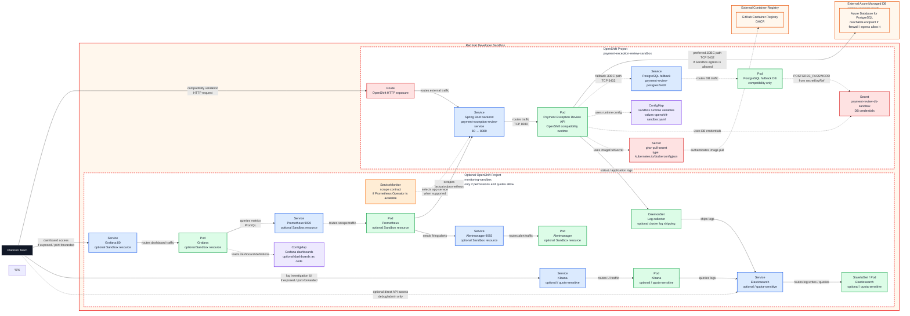

```mermaid
flowchart LR
  %% =========================================================
  %% STAGE 2 — OPENSHIFT SANDBOX COMPATIBILITY RUNTIME
  %% =========================================================
  %% Scope:
  %% - Runtime interactions only.
  %% - Validates the workload/platform contract on OpenShift Sandbox.
  %% - Sandbox is a side compatibility lab, not AKS dev/staging.
  %% - Does not prove Azure infrastructure portability.
  %% - Preferred DB proof is external Azure PostgreSQL when networking allows it.
  %% - Fallback DB proof is an in-project PostgreSQL pod or mocked DB contract.
  %% =========================================================

  PLATFORM_TEAM["Platform Team"]

  subgraph SANDBOX["Red Hat Developer Sandbox<br/>OpenShift shared compatibility lab"]
    direction TB

    subgraph PROJECT["OpenShift Project<br/>payment-exception-review-sandbox"]
      direction LR

      ROUTE["Route<br/>OpenShift HTTP exposure"]
      APP_SVC["Service<br/>Spring Boot backend<br/>payment-exception-review-service<br/>80 → 8080"]
      APP_POD["Pod<br/>Payment Exception Review API<br/>OpenShift compatibility runtime"]
      APP_CM["ConfigMap<br/>sandbox runtime variables<br/>values-openshift-sandbox.yaml"]
      APP_SECRET["Secret<br/>payment-review-db-sandbox<br/>DB credentials"]
      GHCR_PULL_SECRET["Secret<br/>ghcr-pull-secret<br/>type: kubernetes.io/dockerconfigjson"]

      PG_FALLBACK_SVC["Service<br/>PostgreSQL fallback<br/>payment-review-postgres:5432"]
      PG_FALLBACK_POD["Pod<br/>PostgreSQL fallback DB<br/>compatibility only"]
    end

    subgraph MONITORING_PROJECT["Optional OpenShift Project<br/>monitoring-sandbox<br/>only if permissions and quotas allow"]
      direction LR

      SERVICE_MONITOR["ServiceMonitor<br/>scrape contract<br/>if Prometheus Operator is available"]
      PROM_SVC["Service<br/>Prometheus:9090<br/>optional Sandbox resource"]
      PROM_POD["Pod<br/>Prometheus<br/>optional Sandbox resource"]
      GRAFANA_SVC["Service<br/>Grafana:80<br/>optional Sandbox resource"]
      GRAFANA_POD["Pod<br/>Grafana<br/>optional Sandbox resource"]
      DASH_CM["ConfigMap<br/>Grafana dashboards<br/>optional dashboards as code"]
      ALERT_SVC["Service<br/>Alertmanager:9093<br/>optional Sandbox resource"]
      ALERT_POD["Pod<br/>Alertmanager<br/>optional Sandbox resource"]
      LOG_AGENT["DaemonSet<br/>Log collector<br/>optional cluster log shipping"]
      ELASTIC_SVC["Service<br/>Elasticsearch<br/>optional / quota-sensitive"]
      ELASTIC_POD["StatefulSet / Pod<br/>Elasticsearch<br/>optional / quota-sensitive"]
      KIBANA_SVC["Service<br/>Kibana<br/>optional / quota-sensitive"]
      KIBANA_POD["Pod<br/>Kibana<br/>optional / quota-sensitive"]
    end
  end

  subgraph AZURE_DB["External Azure Managed DB<br/>optional stronger proof"]
    direction TB

    AZ_PG["Azure Database for PostgreSQL<br/>reachable endpoint if firewall / egress allow it"]
  end

  subgraph REGISTRY["External Container Registry"]
    direction TB

    GHCR["GitHub Container Registry<br/>GHCR"]
  end

  %% =========================================================
  %% Runtime request flows
  %% =========================================================

  PLATFORM_TEAM -->|"compatibility validation<br/>HTTP request"| ROUTE
  ROUTE -->|"routes external traffic"| APP_SVC
  APP_SVC -->|"routes traffic<br/>TCP 8080"| APP_POD
  PLATFORM_TEAM -->|"dashboard access<br/>if exposed / port-forwarded"| GRAFANA_SVC
  PLATFORM_TEAM -->|"log investigation UI<br/>if exposed / port-forwarded"| KIBANA_SVC
  PLATFORM_TEAM -.->|"optional direct API access<br/>debug/admin only"| ELASTIC_SVC

  %% =========================================================
  %% Preferred database path
  %% =========================================================

  APP_POD ---->|"preferred JDBC path<br/>TCP 5432<br/>if Sandbox egress is allowed"| AZ_PG

  %% =========================================================
  %% Fallback database path
  %% =========================================================

  APP_POD -.->|"fallback JDBC path<br/>TCP 5432"| PG_FALLBACK_SVC
  PG_FALLBACK_SVC -.->|"routes DB traffic"| PG_FALLBACK_POD

  %% =========================================================
  %% Configuration / secret dependencies
  %% Dashed lines = non-network dependency
  %% =========================================================

  APP_POD -.->|"uses runtime config"| APP_CM
  APP_POD -.->|"uses DB credentials"| APP_SECRET
  APP_POD -.->|"uses imagePullSecret"| GHCR_PULL_SECRET
  GHCR_PULL_SECRET -.->|"authenticates image pull"| GHCR
  PG_FALLBACK_POD -.->|"POSTGRES_PASSWORD<br/>from secretKeyRef"| APP_SECRET

  %% =========================================================
  %% Observability compatibility flows
  %% =========================================================

  SERVICE_MONITOR -.->|"selects app service<br/>when supported"| APP_SVC
  PROM_SVC -->|"routes scrape traffic"| PROM_POD
  PROM_POD -->|"scrapes<br/>/actuator/prometheus"| APP_SVC
  GRAFANA_SVC -->|"routes dashboard traffic"| GRAFANA_POD
  GRAFANA_POD -->|"queries metrics<br/>PromQL"| PROM_SVC
  GRAFANA_POD -.->|"loads dashboard definitions"| DASH_CM
  PROM_POD -->|"sends firing alerts"| ALERT_SVC
  ALERT_SVC -->|"routes alert traffic"| ALERT_POD
  APP_POD -->|"stdout / application logs"| LOG_AGENT
  LOG_AGENT -->|"ships logs"| ELASTIC_SVC
  ELASTIC_SVC -->|"routes log writes / queries"| ELASTIC_POD
  KIBANA_SVC -->|"routes UI traffic"| KIBANA_POD
  KIBANA_POD -->|"queries logs"| ELASTIC_SVC

  %% =========================================================
  %% Architecture notes
  %% =========================================================
  %% OpenShift Sandbox is not dev, staging, certification, or prod.
  %% It is a side compatibility lab for OpenShift behavior.
  %%
  %% This diagram validates:
  %% - Project / Route / Service / Pod runtime shape
  %% - ConfigMap and Secret runtime contract
  %% - OpenShift Secret of type kubernetes.io/dockerconfigjson for GHCR pulls
  %% - non-root / securityContext compatibility direction
  %% - metrics and log hooks where Sandbox allows them
  %% - OpenShift pod logs through platform tooling / oc CLI, without modeling
  %%   oc logs as a runtime component
  %%
  %% This diagram does not validate:
  %% - GHCR itself as an OpenShift component
  %% - AKS Terraform
  %% - Azure networking
  %% - Azure PostgreSQL provisioning
  %% - Azure Storage Terraform backend
  %% - Azure OIDC / Microsoft Entra federation
  %% - AKS lifecycle scripts
  %%
  %% Preferred DB proof:
  %% OpenShift Sandbox -> external Azure PostgreSQL when firewall, DNS, and
  %% Sandbox egress allow it.
  %%
  %% Fallback DB proof:
  %% OpenShift Sandbox -> PostgreSQL pod or mocked DB contract when external
  %% connectivity is blocked or too noisy.
  %%
  %% Every component inside the Sandbox boundary should be an OpenShift or
  %% Kubernetes runtime resource. Do not model user actions such as oc logs,
  %% permissions, or policy decisions as runtime components.
  %%
  %% The optional monitoring-sandbox project represents the fuller Stage 2
  %% observability stack only if Sandbox permissions and quotas allow it:
  %% - Prometheus
  %% - Grafana
  %% - Alertmanager
  %% - log collector
  %% - Elasticsearch
  %% - Kibana
  %% - dashboard ConfigMaps
  %%
  %% If the Sandbox does not allow a separate project, install only the minimal
  %% allowed observability resources in the application project or omit the
  %% fuller stack from the Sandbox proof.
  %%
  %% Elasticsearch and Kibana are quota-sensitive. Keep them optional unless
  %% memory and storage quotas make them practical.

  %% =========================================================
  %% Styles
  %% =========================================================

  classDef actor fill:#111827,stroke:#ffffff,color:#ffffff,stroke-width:2px;
  classDef openshift fill:#fff7ed,stroke:#ee0000,color:#172033,stroke-width:2px;
  classDef project fill:#ffffff,stroke:#ee0000,color:#172033,stroke-width:2px,stroke-dasharray: 6 4;
  classDef route fill:#fee2e2,stroke:#dc2626,color:#172033,stroke-width:2px;
  classDef service fill:#dbeafe,stroke:#2563eb,color:#172033,stroke-width:2px;
  classDef pod fill:#dcfce7,stroke:#16a34a,color:#172033,stroke-width:2px;
  classDef db fill:#fff7ed,stroke:#ea580c,color:#172033,stroke-width:2px;
  classDef config fill:#ede9fe,stroke:#7c3aed,color:#172033,stroke-width:2px;
  classDef secret fill:#fee2e2,stroke:#dc2626,color:#172033,stroke-width:2px;
  classDef observability fill:#ffedd5,stroke:#f97316,color:#172033,stroke-width:2px;

  class PLATFORM_TEAM actor;
  class SANDBOX openshift;
  class PROJECT,MONITORING_PROJECT project;
  class ROUTE route;
  class APP_SVC,PG_FALLBACK_SVC,PROM_SVC,GRAFANA_SVC,ALERT_SVC,ELASTIC_SVC,KIBANA_SVC service;
  class APP_POD,PG_FALLBACK_POD,PROM_POD,GRAFANA_POD,ALERT_POD,LOG_AGENT,ELASTIC_POD,KIBANA_POD pod;
  class AZURE_DB,AZ_PG db;
  class REGISTRY,GHCR db;
  class APP_CM,DASH_CM config;
  class APP_SECRET,GHCR_PULL_SECRET secret;
  class SERVICE_MONITOR observability;
```
