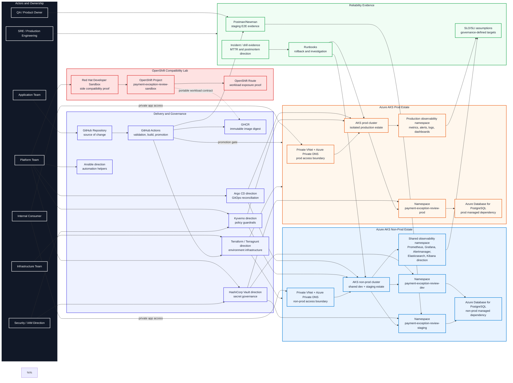

# Stage 2 High-Level Solution Architecture

This diagram is the human-facing overview of Stage 2.

It shows the major actors, environments, platform boundaries, delivery systems,
runtime targets, compatibility lab, data dependency, and observability surface.
Detailed runtime, admission, promotion, control-plane, secrets, and operations
flows stay in their dedicated diagrams.

