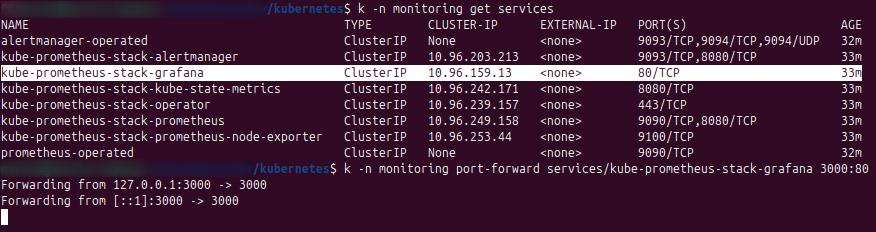
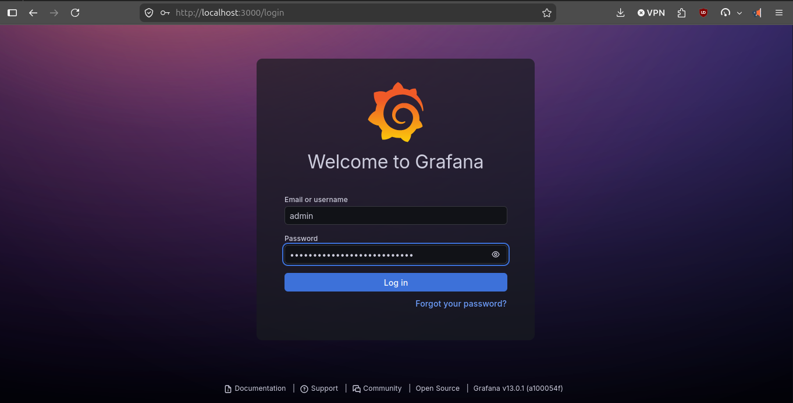
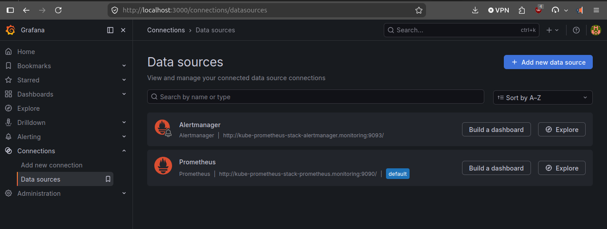

# Local Platform And App Validation

This guide validates the platform and application layers locally without
creating Azure resources.

Use this path when you want to:

- save cloud cost
- save provisioning time
- validate the platform and application contracts on a local Kubernetes cluster

This guide is intentionally local-only. It does not use:

- Azure infrastructure provisioning
- Azure OIDC
- remote Terraform backend

## Scope

This local path validates:

- platform namespace and runtime boundary creation
- runtime secret injection
- local PostgreSQL inside the local Kubernetes cluster
- shared observability stack installation
- application image build and deployment through Helm
- local Prometheus scraping through `ServiceMonitor`

## Prerequisites

- Docker
- kubectl
- helm
- a local Kubernetes cluster

You can use any local Kubernetes distribution you prefer, for example:

- kind
- minikube
- k3d
- Docker Desktop Kubernetes
- Rancher Desktop Kubernetes

This repository does not require kind specifically.

What it actually expects is:

- a reachable local Kubernetes cluster
- a working `kubectl` context that points to that cluster
- Docker access for the local application image build

## First local cluster setup

For a first run, create or start your local Kubernetes cluster before using the
local platform and application scripts.

The examples below use kind because it is lightweight and easy to reproduce,
but you can use another local Kubernetes option if you prefer.

### Example with kind

Create a local cluster:

```bash
kind create cluster --name local-dev
```

That creates a `kubectl` context named:

```bash
kind-local-dev
```

Verify it:

```bash
kubectl config get-contexts
kubectl config use-context kind-local-dev
kubectl config current-context
kubectl get nodes
```

### If you use another local Kubernetes distribution

Make sure you know the exact context name:

```bash
kubectl config get-contexts
```

If your local context is not `kind-local-dev`, export it before running the
local scripts:

```bash
export LOCAL_KUBE_CONTEXT="<your-local-context-name>"
```

Example:

```bash
export LOCAL_KUBE_CONTEXT="minikube"
```

The local platform and application scripts will use that context value.

## Check the local context

```bash
kubectl config get-contexts
kubectl config use-context "${LOCAL_KUBE_CONTEXT:-kind-local-dev}"
kubectl config current-context
```

## Required local configuration

At the repository root:

```bash
cp .env.example .env
```

For this local path, the important values are:

- `POSTGRES_ADMIN_PASSWORD`
- `GRAFANA_ADMIN_PASSWORD`

Optional:

- `GRAFANA_ADMIN_USER`
  Defaults to `admin` if unset.

If you are not using kind, you can also set:

- `LOCAL_KUBE_CONTEXT`

## One-command local create flow

From the repository root:

```bash
./create_local_platform_and_app.sh
```

What it does:

1. calls the platform-local child script under `platform/kubernetes-resources/`
2. calls the application-local child script under `application/payment-exception-review-service/`

That keeps the root script as an orchestrator and avoids duplicating platform
and application logic in multiple places.

## Verify the local platform and app

### Platform and workload objects

```bash
kubectl get ns
kubectl get deploy,svc,pods -n payment-exception-review-local
kubectl get deploy,svc,pods -n monitoring
```

### Application access

```bash
kubectl -n payment-exception-review-local port-forward svc/payment-exception-review-service 8080:80
```

Then in another terminal:

```bash
curl http://localhost:8080/actuator/health
curl http://localhost:8080/actuator/prometheus
curl http://localhost:8080/api/payment-exceptions/service-status
curl http://localhost:8080/api/payment-exceptions/payexc-100045/status
```

Expected results:

- `/actuator/health` returns `{"status":"UP","groups":["liveness","readiness"]}`
- `/actuator/prometheus` returns Prometheus-formatted metrics
- `/api/payment-exceptions/payexc-100045/status` returns the seeded review with `PENDING_REVIEW`

### Grafana access

```bash
kubectl -n monitoring port-forward svc/kube-prometheus-stack-grafana 3000:80
```

Port-forward example:



Then open Grafana at:

- `http://localhost:3000`

Login example:



### Prometheus access

```bash
kubectl -n monitoring port-forward svc/kube-prometheus-stack-prometheus 9090:9090
```

Then open Prometheus at:

- `http://localhost:9090`

Check that the application target is scraped through the `ServiceMonitor`.

Useful verification endpoints:

- `http://localhost:9090/targets`
- `http://localhost:9090/api/v1/targets`

Expected result:

- the `payment-exception-review-service` scrape target appears
- the target state is `UP`

### Grafana datasource verification

After logging into Grafana:

- open the default Prometheus datasource
- confirm it already exists
- do not create a duplicate datasource manually

Default datasource example:



Expected configuration:

- datasource URL: `http://kube-prometheus-stack-prometheus.monitoring:9090`
- test query: `up`

## Real troubleshooting encountered locally

### Symptom: shared observability install fails with `context deadline exceeded`

During a real local run, the platform part completed:

- platform runtime boundary
- runtime secret injection
- local PostgreSQL deployment

but the observability step failed with:

```text
Error: context deadline exceeded
ERROR: Shared observability stack installation failed
```

At the same time, most monitoring pods were already healthy and only Grafana
was still starting.

Example:

```bash
kubectl get pods -n monitoring
```

```text
alertmanager-kube-prometheus-stack-alertmanager-0           2/2     Running
kube-prometheus-stack-grafana-...                           0/3     PodInitializing
kube-prometheus-stack-kube-state-metrics-...                1/1     Running
kube-prometheus-stack-operator-...                          1/1     Running
kube-prometheus-stack-prometheus-node-exporter-...          1/1     Running
prometheus-kube-prometheus-stack-prometheus-0               2/2     Running
```

### Diagnosis

This was not a real configuration failure.

The local cluster was still pulling and starting the Grafana image, so Helm
timed out before Grafana became ready.

In this real run:

- Prometheus became healthy
- Alertmanager became healthy
- the operator became healthy
- Grafana was simply slower to initialize

### How to confirm it

Watch the monitoring pods:

```bash
kubectl get pods -n monitoring -w
```

Inspect events:

```bash
kubectl get events -n monitoring
```

If needed, inspect the Grafana pod:

```bash
kubectl describe pod -n monitoring <grafana-pod-name>
```

In the real run, the events showed Grafana still pulling:

- `docker.io/grafana/grafana:13.0.1`

and the pod eventually became healthy:

```text
kube-prometheus-stack-grafana-...   3/3   Running
```

### Recovery

Once the monitoring stack becomes healthy, continue with the application step:

```bash
./application/payment-exception-review-service/create_local_app_with_helm.sh -s
```

That worked successfully in the real local validation run because:

- the namespace already existed
- the secret already existed
- local PostgreSQL was already running
- the monitoring stack was already healthy by then

### Practical interpretation

For the first local run, `context deadline exceeded` during observability
installation does not automatically mean the platform setup is broken.

If Grafana is still initializing while the rest of the stack is healthy:

1. wait for the monitoring pods to settle
2. confirm Grafana reaches `Running`
3. continue with the local application deployment

This is primarily a local cluster timing issue, not an application or Helm
chart design issue.

### Symptom: Grafana datasource validation is confusing

During local validation, it was easy to assume a manual Prometheus datasource
had to be added in Grafana.

In practice, the default Prometheus datasource was already provisioned by the
shared `kube-prometheus-stack`.

So the correct action was:

- use the existing datasource
- remove the manually added duplicate datasource

The right datasource URL remains:

```text
http://kube-prometheus-stack-prometheus.monitoring:9090
```

The right Prometheus API validation remains:

```bash
curl 'http://127.0.0.1:9090/api/v1/query?query=up'
```

## One-command local teardown

From the repository root:

```bash
./destroy_local_platform_and_app.sh
```

What it does:

1. calls the application-local teardown script
2. calls the platform-local teardown script

That keeps the root teardown path aligned with the same ownership boundaries as
the cloud-oriented scripts.

## Local verification pitfall encountered

During a real local validation run, the correct application endpoint worked:

```bash
curl http://localhost:8080/api/payment-exceptions/payexc-100045/status
```

but this endpoint returned `404`:

```bash
curl http://localhost:8080/api/payment-exceptions/payexc-100045/service-status
```

That `404` is expected because the valid service metadata endpoint is:

```bash
curl http://localhost:8080/api/payment-exceptions/service-status
```

So the verified local endpoint set is:

- `/actuator/health`
- `/actuator/prometheus`
- `/api/payment-exceptions/service-status`
- `/api/payment-exceptions/payexc-100045/status`

## Related docs

- [Main platform document](./README.md)
- [Platform Kubernetes resources](../platform/kubernetes-resources/docs/README.md)
- [Observability troubleshooting](../platform/kubernetes-resources/observability/troubleshooting.md)
- [Application docs](../application/docs/README.md)
- [Helm chart](../application/payment-exception-review-service/helm/README.md)
