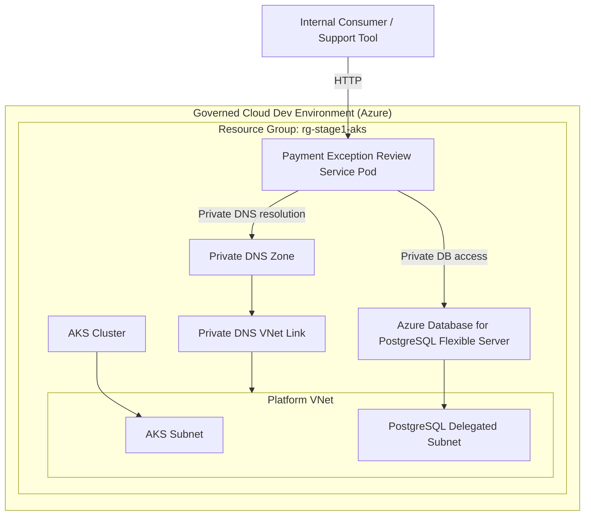

# Azure Networking Design

This document explains the intended private-network layout for the Stage 1 Azure foundation.

It complements the ADRs by capturing the concrete network shape used by the infrastructure Terraform.

## Goal

The goal is to support this cloud access model:

- AKS runs inside the governed platform network
- Azure Database for PostgreSQL Flexible Server is private
- the application reaches PostgreSQL through the private runtime path
- developers do not connect directly from a laptop to the cloud database as a normal workflow

## Diagram

## Main components

### Platform virtual network

The Azure foundation creates one shared VNet for the Stage 1 cloud environment.

Purpose:

- provide one private network boundary for the platform
- host the AKS subnet
- host the PostgreSQL delegated subnet
- host the private DNS resolution path

### AKS subnet

The AKS cluster is attached to a dedicated subnet in the platform VNet.

Purpose:

- place the cluster inside the governed private network
- allow workloads to reach private dependencies through the VNet
- keep AKS separated from PostgreSQL at the subnet level

### PostgreSQL delegated subnet

Azure Database for PostgreSQL Flexible Server uses its own delegated subnet.

Purpose:

- reserve a dedicated private subnet for the managed PostgreSQL service
- let Azure place the Flexible Server using the supported delegated-subnet model
- avoid mixing application workloads and managed database placement in the same subnet

### Private DNS zone

A private DNS zone is created for PostgreSQL and linked to the platform VNet.

Purpose:

- resolve the PostgreSQL hostname to a private address inside the VNet
- let AKS workloads use normal database hostnames without public DNS dependence

## Expected Terraform shape

The private-network implementation is expected to include:

- one `azurerm_virtual_network`
- one `azurerm_subnet` for AKS
- one `azurerm_subnet` for PostgreSQL with Flexible Server delegation
- one `azurerm_private_dns_zone`
- one `azurerm_private_dns_zone_virtual_network_link`

## Validation model

Cloud database validation should happen through:

- the deployed Spring Boot application
- an in-cluster debug pod
- `kubectl exec` or another trusted internal path

Cloud database validation should not normally depend on:

- public firewall rules for a developer laptop
- direct `psql` access from the internet

For the operational runbook and common mistakes encountered during in-cluster PostgreSQL validation, see:

- [Scenario 3 - Private PostgreSQL connectivity validation from AKS](../../../application/docs/failure-scenarios/scenario-3-private-postgresql-connectivity-validation-from-aks.md)

## Relationship to local development

The local developer workflow remains separate:

- local Spring Boot runtime
- local PostgreSQL instance

This keeps local work fast and cheap while preserving a stricter cloud-side design.
