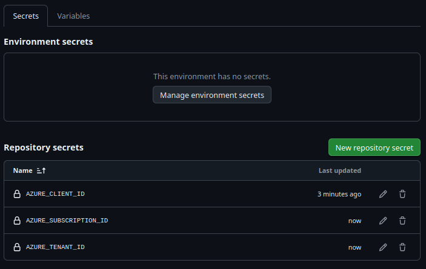
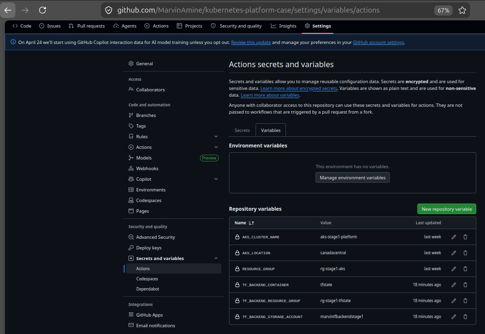

# Infrastructure documentation

> This folder is reserved for the infrastructure team. In highly regulated compagnies, this folder would usually live in its own repository and be accessible by the infrastructure team.

## FIRST USAGE?

Follow the instructions given on the [main README.md](../../README.md)

## Azure

### Requirements steps (if not already done):

#### Install the AZ command line on linux:
```bash
curl -sL https://aka.ms/InstallAzureCLIDeb | sudo bash
az version
```

#### Interactive login
```bash
az login
```

#### If you have multiple subscriptions
```bash
# identify the right subscription
az account list --output table
az account set --subscription "<YOUR_SUBSCRIPTION_NAME_OR_ID>"
```

#### Register the required resource providers
```bash
az provider register --namespace Microsoft.ContainerService
az provider register --namespace Microsoft.Compute
az provider register --namespace Microsoft.Network
```

#### Shared environment file
```bash
cp infrastructure/.env.example infrastructure/.env
```

Fill `infrastructure/.env` before running the infrastructure scripts.

#### Bootstrap the Terraform backend to ensure constant synchronization of the states between each local, bootstrap and GitHub Actions configuration state file

> The remote backend should be created once, before using Terraform.

To do so, you can run 
```bash
# From the root directory
cd infrastructure/terraform-backend/terraform


```

### Local manual tests 

#### Create Azure resources with Terraform
```bash
# From the root directory
cd infrastructure/azure
./create_azure_resources.sh
```

#### Create the AKS cluster and connect the kubectl to it:
```bash
# From the root directory
cd infrastructure/azure
./scripts/create_aks_cluster_and_connect_with_kubectl.sh
```

#### Delete Azure resources after the simulation to avoid additional fees
```bash
# From the root directory
cd infrastructure/azure
./destroy_azure_resources.sh
```

#### Delete the Azure resources group manually
```bash
# From the root directory
cd infrastructure/azure
./script/delete_azure_resource_group_manually.sh
```

#### Alternative to delete the Azure resource group manually to avoid any additional fees, after the simulation
```bash
az group delete --name "$RESOURCE_GROUP" --yes --no-wait
```

## Terraform

### Azure terraform layer
Initialize and validate the Azure Terraform files:
```bash
# From the root directory
cd infrastructure/azure/terraform

export TF_VAR_subscription_id="<your-subscription-id>"

terraform init \
-backend-config="resource_group_name=<tf-backend-rg>" \
-backend-config="storage_account_name=<tf-backend-storage-account>" \
-backend-config="container_name=tfstate" \
-backend-config="key=azure/terraform.tfstate" \
-backend-config="use_azuread_auth=true"

terraform validate
```
Because key-based authentication is disabled on the backend storage account, local `terraform init` must include `use_azuread_auth=true`.

`terraform init` initializes the backend and provider plugins such as `hashicorp/azuerm`. It also creates the `.terraform.lock.hcl` file.

Show the changes required by the current configuration:
```bash
terraform plan
```

Create or update Azure infrastructure:
```
terraform apply
```

### Kubernetes resources Terraform layer
Initialize and validate the Kubernetes resources Terraform files:
```bash
# From the root directory
cd infrastructure/kubernetes-resources/terraform

terraform init \
-backend-config="resource_group_name=<tf-backend-rg>" \
-backend-config="storage_account_name=<tf-backend-storage-account>" \
-backend-config="container_name=tfstate" \
-backend-config="key=kubernetes-resources/terraform.tfstate" \
-backend-config="use_azuread_auth=true"

terraform validate
```
Because key-based authentication is disabled on the backend storage account, local `terraform init` must include `use_azuread_auth=true`.


`terraform init` initializes the backend and provider plugins such as `hashicorp/kubernetes`. It also creates the `.terraform.lock.hcl` file.

Show changes required by the current configuration. Create the `.terraform.tfstate.lock.info` file:
```bash
terraform plan
```

Create or update infrastructure
```bash
terraform apply
```

Verify the kubernetes resources (here is the official documentation [Terraform_ArchiCorp_Kubernetes_provider](https://registry.terraform.io/providers/hashicorp/kubernetes/latest/docs/data-sources/namespace))
```bash
kubectl get ns payment-exception-review-stage1
```
```bash
NAME                         STATUS   AGE
payment-exception-review-stage1   Active   24m
```

```bash
kubectl get serviceaccounts -n payment-exception-review-stage1 
```
```bash
NAME             AGE
app-runtime-sa   50s
```

```bash
k get roles.rbac.authorization.k8s.io -n payment-exception-review-stage1
```
```bash
NAME               CREATED AT
app-runtime-role   2026-04-05T19:45:05Z
```

```bash
k -n payment-exception-review-stage1 get rolebindings.rbac.authorization.k8s.io 
```
```bash
NAME             ROLE                    AGE
app-runtime-rb   Role/app-runtime-role   26s
```

```bash
kubectl auth can-i list configmaps  --as=system:serviceaccount:payment-exception-review-stage1:app-runtime-sa   -n payment-exception-review-stage1
```
```bash
yes
```

```bash
kubectl auth can-i list pods  --as=system:serviceaccount:payment-exception-review-stage1:app-runtime-sa   -n payment-exception-review-stage1
```
```bash
yes
```

```bash
k -n payment-exception-review-stage1 get configmaps 
```
```bash
NAME                       DATA   AGE
kube-root-ca.crt           1      3h17m
platform-baseline-config   3      42s
```

## Set GitHub Actions secrets and variables


