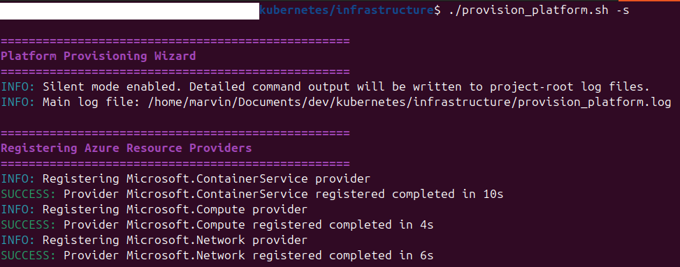
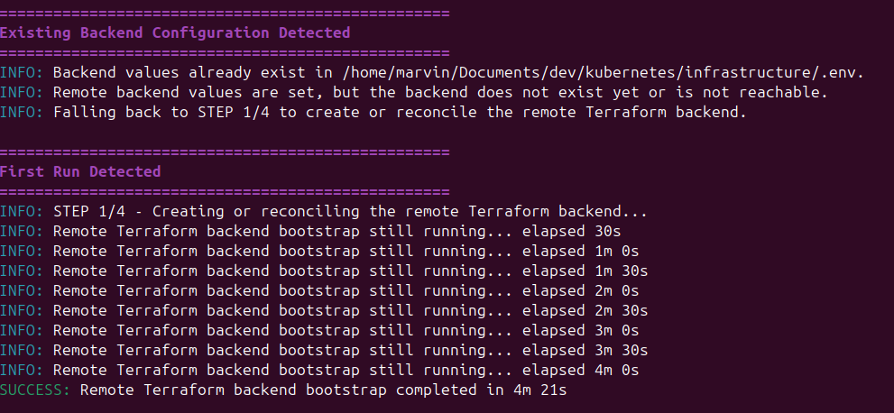
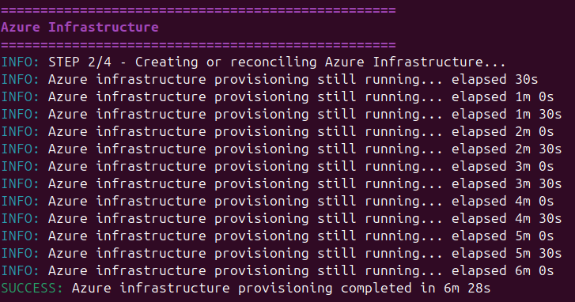
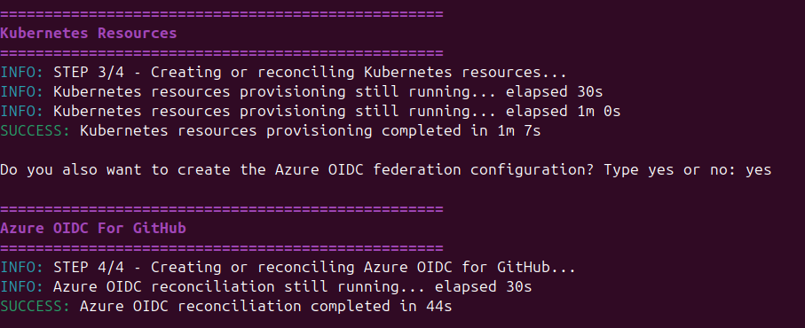
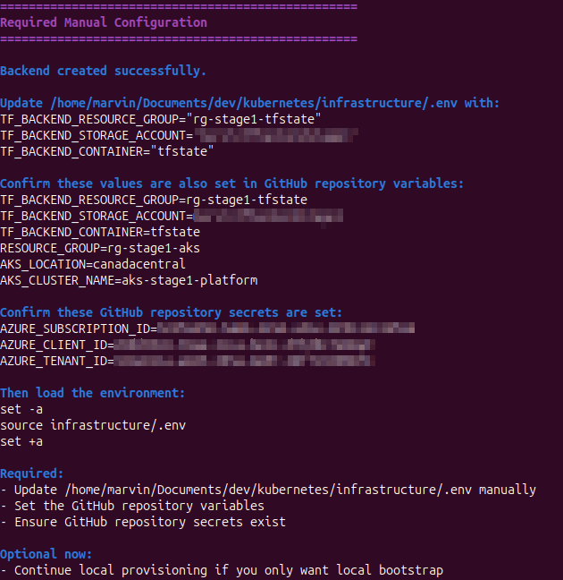
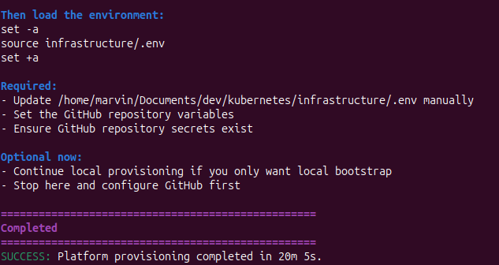

# PROVISION PLATFORM SCREENSHOOTS
## How to run it

## Creates the Terraform remote state backend
 
## Creates the AKS Resource Groupe and Cluster 

## Creates the kubernetes resources
  
## Follow these instructions to configure the environment variables manually

## The process takes around 20mins to complete 
