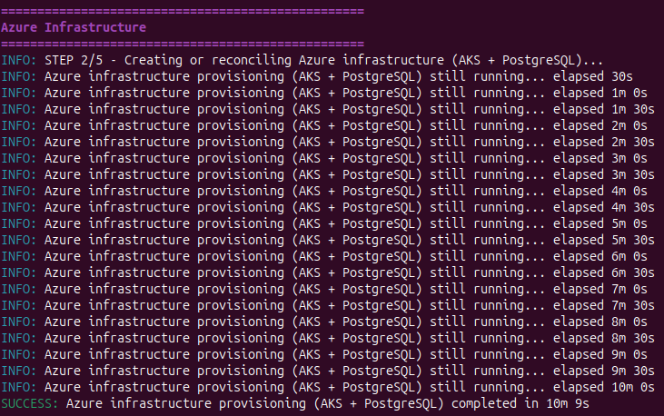
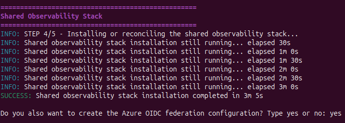

# PROVISION PLATFORM SCREENSHOOTS
## How to run it

## Creates the Terraform remote state backend
 
## Creates the AKS Resource Groupe, Cluster and PostgreSQL

## Creates the kubernetes resources
  
## Creates the Observability Stack (Prometheus and Grafana)

## Follow these instructions to configure the environment variables manually

## The process takes around 20mins to complete 
