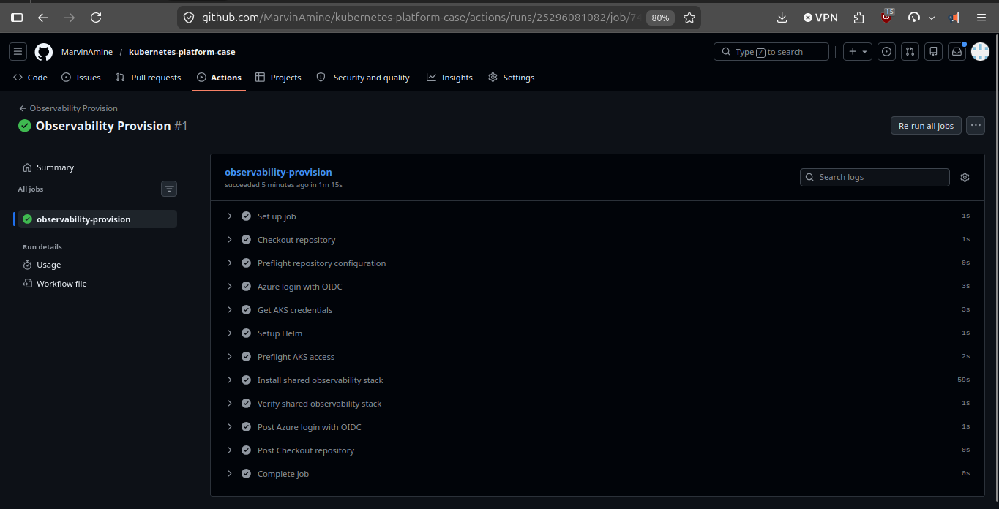

# Shared Observability Stack

This folder documents the shared platform observability stack for the governed
Kubernetes environment.

The repository uses a split directory structure to make the technology stack
explicit in the tree for new visitors:

- `observability/prometheus/`
- `observability/grafana/`
- `observability/alertmanager/`
- `observability/scripts/cluster/`

That split is mainly for readability and onboarding.

Operationally, the first implementation still uses a shared integrated Helm
stack:

- `kube-prometheus-stack`

This means:

- Prometheus
- Grafana
- Alertmanager

are installed together through one platform-owned release even though the
documentation is split by technology.

## Script model

This folder also follows the same execution model as the rest of the
repository:

- `install_local_observability_stack.sh`
- `destroy_local_observability_stack.sh`
- `install_dev_observability_stack.sh`
- `destroy_dev_observability_stack.sh`

Those are environment-specific wrappers.

The shared implementation lives under:

- `scripts/cluster/install_shared_observability_stack.sh`
- `scripts/cluster/destroy_shared_observability_stack.sh`

The GitHub Actions automation entrypoints are:

- `.github/workflows/observability-provision.yml`
- `.github/workflows/observability-destroy.yml`

Provision workflow example:



So a new visitor can understand quickly:

- `local` wrappers target the local kind validation path
- `dev` wrappers target the AKS / cloud-opinionated validation path
- `scripts/cluster/` contains the reusable Kubernetes logic

## Ownership

The platform team owns this shared observability layer.

Application teams do not install their own Prometheus or Grafana instances by
default. They onboard to the shared stack through metrics exposure and
`ServiceMonitor` registration.

## Why the folders are split

The split exists to make the stack obvious in the repository tree for readers,
recruiters, and hiring managers:

- Prometheus is visible
- Grafana is visible
- the observability domain is visible

That improves discoverability without changing the operating model:

- one shared platform monitoring stack
- not one monitoring stack per application

## Runtime secret note

The planned Grafana installation path expects:

- `GRAFANA_ADMIN_USER`
- `GRAFANA_ADMIN_PASSWORD`

Those values should come from:

- local `.env` for local platform operations
- GitHub repository secrets for CI/CD later if the observability stack is
  automated through workflows

## Real troubleshooting encountered locally

During a real local validation run, the shared observability install returned:

```text
Error: context deadline exceeded
```

This happened while:

- Prometheus was already healthy
- Alertmanager was already healthy
- the operator was already healthy
- Grafana was still initializing

The practical meaning was:

- not a broken chart by default
- not a broken platform boundary by default
- usually a local timing issue while Grafana is still pulling and starting

The correct diagnostic sequence is:

```bash
kubectl get pods -n monitoring -w
kubectl get events -n monitoring
kubectl describe pod -n monitoring <grafana-pod-name>
```

In the real run, waiting a bit longer showed Grafana eventually becoming:

```text
3/3 Running
```

After that, the local application deployment succeeded normally.

## Next reading

- [Prometheus notes](./prometheus/README.md)
- [Grafana notes](./grafana/README.md)
- [Alertmanager notes](./alertmanager/README.md)
- [Observability troubleshooting](./troubleshooting/README.md)
- [Kubernetes portability note](../../../docs/kubernetes-portability.md)
- [Platform Kubernetes resources README](../docs/README.md)
