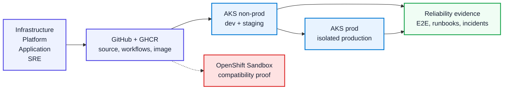
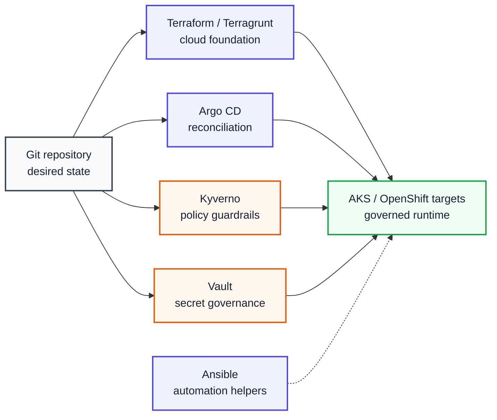

# Stage 2 Presentation Diagrams

These diagrams are intentionally simplified for presentation, video, LinkedIn,
and future draw.io conversion.

They are not replacements for the detailed architecture diagrams. They are the
human-facing layer used to explain the work quickly.

Rule:

```text
Mermaid architecture files = technical evidence
Presentation diagrams = fast human understanding
```

## 1. Stage 2 Overview

Key message: Stage 2 evolves Stage 1 from one governed AKS delivery path into a
shared-platform model with environment separation, governance, and operational
evidence.



## 2. Promotion Flow

Key message: Stage 2 avoids environment-specific rebuilds. One image is built,
validated, and promoted with evidence.

```mermaid
flowchart LR
  PR["Pull Request<br/>review + checks"]
  BUILD["Build once<br/>GitHub Actions"]
  IMAGE["GHCR image digest<br/>immutable artifact"]
  DEV["Deploy to dev"]
  STAGING["Promote to staging"]
  E2E["Postman/Newman<br/>staging evidence"]
  APPROVAL["Production approval"]
  PROD["Promote same image<br/>to prod"]
  ROLLBACK["Rollback path<br/>known-good image"]

  PR --> BUILD
  BUILD --> IMAGE
  IMAGE --> DEV
  DEV --> STAGING
  STAGING --> E2E
  E2E --> APPROVAL
  APPROVAL --> PROD
  PROD -.-> ROLLBACK

  classDef gate fill:#fff7ed,stroke:#ea580c,color:#172033,stroke-width:2px;
  classDef artifact fill:#ecfeff,stroke:#0891b2,color:#172033,stroke-width:2px;
  classDef env fill:#e8f3ff,stroke:#0078d4,color:#172033,stroke-width:2px;
  classDef safety fill:#fee2e2,stroke:#dc2626,color:#172033,stroke-width:2px;

  class PR,BUILD,E2E,APPROVAL gate;
  class IMAGE artifact;
  class DEV,STAGING,PROD env;
  class ROLLBACK safety;
```



## 3. Platform Control Plane

Key message: Tooling is organized by responsibility. Stage 2 adds governance
without forcing every tool into the runtime path.



## 4. Operational Loop

Key message: Stage 2 reliability is not only dashboards. It creates a loop from
signal to recovery evidence.

```mermaid
flowchart LR
  SIGNAL["Runtime signal<br/>metrics + logs"]
  ALERT["Alert<br/>symptom detected"]
  TRIAGE["Triage<br/>Grafana + Kibana"]
  RUNBOOK["Runbook<br/>diagnose + mitigate"]
  RECOVERY["Rollback / recovery"]
  MTTR["MTTR measured"]
  POSTMORTEM["Postmortem<br/>corrective action"]
  PREVENTION["Prevention<br/>test, policy, automation"]

  SIGNAL --> ALERT
  ALERT --> TRIAGE
  TRIAGE --> RUNBOOK
  RUNBOOK --> RECOVERY
  RECOVERY --> MTTR
  MTTR --> POSTMORTEM
  POSTMORTEM --> PREVENTION
  PREVENTION -.-> SIGNAL

  classDef signal fill:#e8f3ff,stroke:#0078d4,color:#172033,stroke-width:2px;
  classDef incident fill:#fee2e2,stroke:#dc2626,color:#172033,stroke-width:2px;
  classDef evidence fill:#eef2ff,stroke:#4f46e5,color:#172033,stroke-width:2px;
  classDef improve fill:#f0fdf4,stroke:#16a34a,color:#172033,stroke-width:2px;

  class SIGNAL signal;
  class ALERT,TRIAGE,RUNBOOK,RECOVERY incident;
  class MTTR,POSTMORTEM evidence;
  class PREVENTION improve;
```



## Draw.io Simplification Rule

When converting these diagrams to draw.io:

- keep the same boxes
- keep the same arrow direction
- use fewer words inside each box
- use icons sparingly
- add one sentence above the diagram explaining the key message
- do not add low-level Kubernetes objects unless the diagram is specifically a
  runtime or admission diagram
